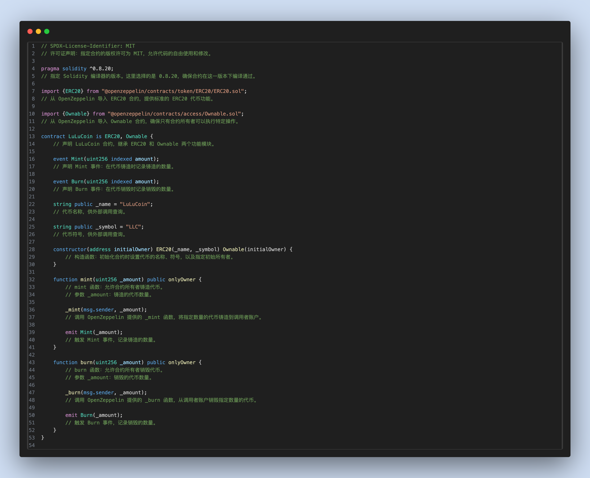
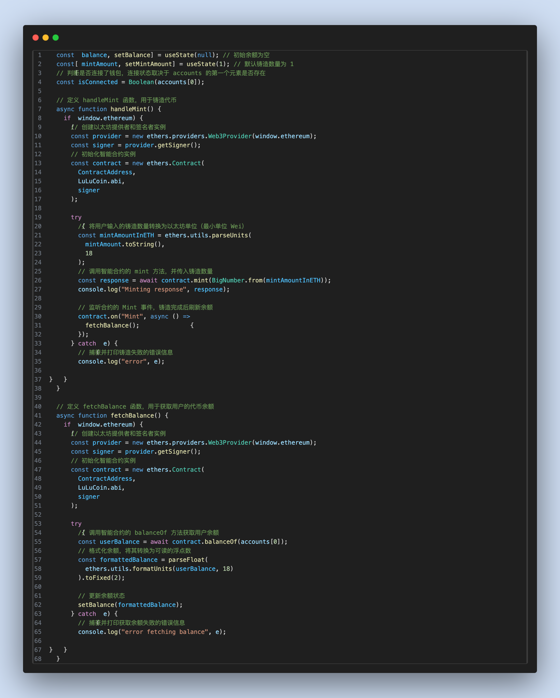

# 01 ERC20 Mint（erc20）

## 项目定位与边界
- 这是教程的 ERC20 起点项目：用 `Foundry + Next.js` 跑通“部署合约 -> 前端写链 -> 链上读数”最小闭环。
- 合约边界非常明确：`mint` 和 `burn` 都是 `onlyOwner`，普通用户只做读取。
- 目标是教学可验证，不覆盖生产级特性（如 Permit、多角色权限、升级代理）。

## 角色与核心对象
| 角色 | 职责 | 关键对象 |
| --- | --- | --- |
| Owner（部署者） | 部署 `LuLuCoin`，执行 `mint/burn` | `OWNER_PRIVATE_KEY`、`OWNER_ADDRESS` |
| User（前端连接钱包） | 读取余额与总供应量，观察状态变化 | 钱包地址、`balanceOf` |
| 合约 `LuLuCoin` | 维护 ERC20 状态与权限 | `Mint/Burn` 事件、`totalSupply` |

## 5 分钟跑通
```bash
cd 01_Erc20
cp contracts/.env.example contracts/.env
make dev
```
- `make dev` 会执行：`restart-anvil -> deploy -> frontend`。
- 启动后打开 `http://localhost:3000`，钱包切到 `Anvil 31337`。
- 快速自检：页面触发 mint 后，`Owner` 余额与 `totalSupply` 同步增长。

## 业务主流程
1. 用户打开页面并连接钱包。
2. 前端读取合约地址（`frontend/.env.local`）和 ABI。
3. Owner 点击铸造按钮，前端发起 `mint(uint256)` 交易。
4. 合约校验 `onlyOwner`，通过后 `_mint(msg.sender, amount)`。
5. 链上状态变化：`totalSupply` 增加，Owner 余额增加，触发 `Mint` 事件。
6. 前端等待回执并重新读取 `balanceOf` / `totalSupply`。
7. 页面回显新余额，完成“用户动作 -> 链上变化 -> 前端回显”闭环。

## 合约接口与状态
| 接口/事件 | 调用方 | 输入 | 状态变化 | 失败条件 | 前端触发入口 |
| --- | --- | --- | --- | --- | --- |
| `mint(uint256)` | Owner | `amount` | 增加 `totalSupply` 与 Owner 余额 | 非 Owner 调用 | `components/erc20mint.js` |
| `burn(uint256)` | Owner | `amount` | 减少 `totalSupply` 与 Owner 余额 | 非 Owner / 余额不足 | 脚本或控制台 |
| `balanceOf(address)` | 任意读 | `account` | 无 | 无 | 页面读链逻辑 |
| `Mint(uint256)` | 合约发出 | `amount` | 事件日志 | 无 | 交易后可用于索引 |
| `Burn(uint256)` | 合约发出 | `amount` | 事件日志 | 无 | 交易后可用于索引 |

## 代码架构与调用链
| 页面/模块 | 主要职责 | 下游调用 |
| --- | --- | --- |
| `frontend/app/page.js` | 首页容器，组合 Navbar/Footer/交互组件 | `components/erc20mint.js` |
| `frontend/components/erc20mint.js` | 钱包连接、读余额、发起 mint | `ethers` -> `LuLuCoin` 合约 |
| `frontend/LuLuCoin.json` | 合约 ABI | 提供给前端合约实例 |
| `contracts/src/LuLuCoin.sol` | ERC20 权限与状态核心 | OpenZeppelin `ERC20/Ownable` |
| `contracts/test/LuLuCoinTest.t.sol` | 核心行为回归测试 | `forge test` |

## 命令与环境变量
**推荐命令（项目根目录）**
```bash
make help
make dev
make deploy
make web
make build-contracts
make test
make anvil
make clean
```

**关键环境变量（`contracts/.env`）**
- `OWNER_PRIVATE_KEY` / `OWNER_ADDRESS`：部署与 owner 铸造账户。
- `USER1_PRIVATE_KEY` / `USER1_ADDRESS`：可选测试用户。
- `CONTRACT_ADDRESS`：可选，手动调试时填入已部署地址。

## 验收与排错
| 症状 | 可能原因 | 修复命令/动作 |
| --- | --- | --- |
| 页面提示合约地址缺失 | 未执行部署或 `.env.local` 未写入 | `make deploy` |
| 钱包已连但按钮仍不可用 | 链 ID 不对 | 切到 `31337` |
| `mint` 回滚 | 当前钱包不是 owner | 切回 `OWNER_ADDRESS` |
| 前端起不来 | 前端依赖未安装 | `cd frontend && npm install` |
| RPC 无响应 | Anvil 未运行或端口冲突 | `make restart-anvil` |

## Demo 展示




## 作者
- `lllu_23`
