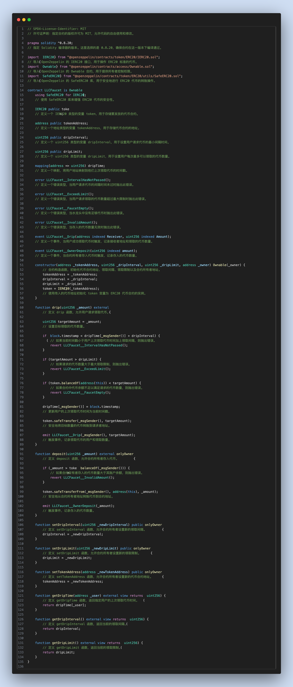
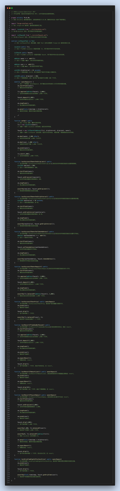
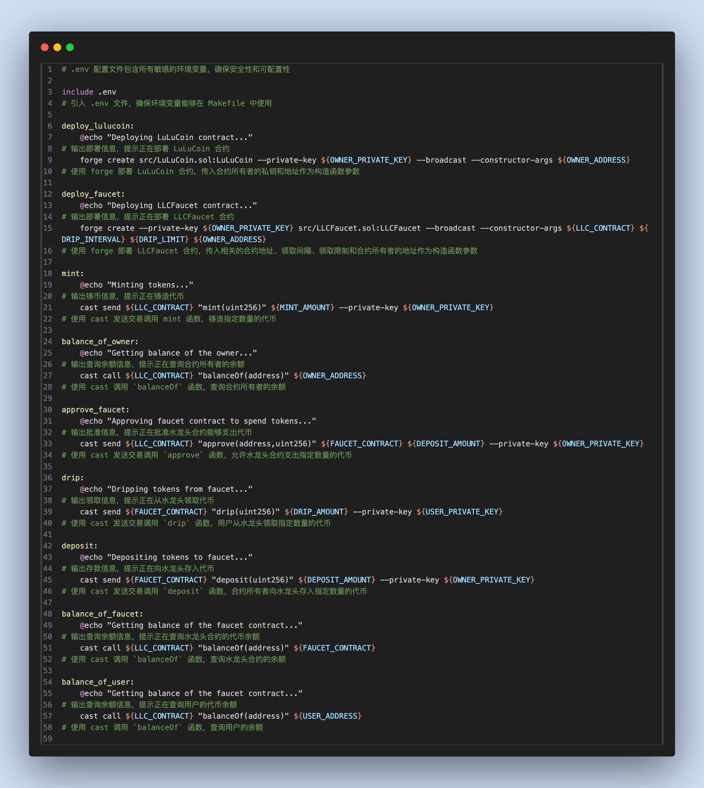
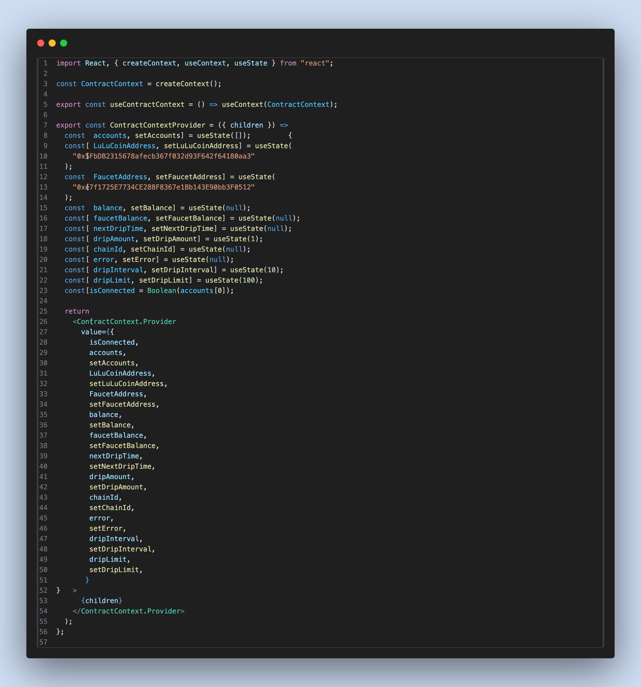
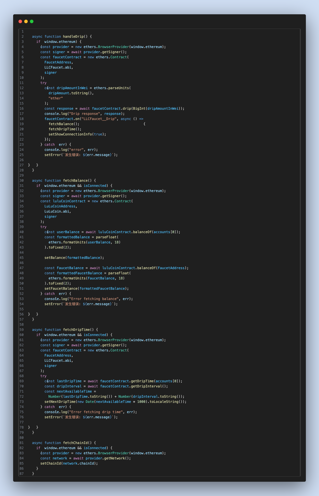

# 02 ERC20 Faucet（faucet）
## 项目介绍
这是一个使用 `Nextjs15` 以及 `Foundry` 框架制作的ERC20代币水龙头领取网页

**水龙头首页**

**管理员编辑弹窗**

**管理员详情弹窗**


# 文档汇总
- 前端部分
  1. [Nextjs15 官方文档](https://nextjs.org/)
  2. [TailwindCSS 官方文档](https://tailwindcss.com/)
  3. [ethers@6.13.5 官方文档](https://docs.ethers.org/v6/)
   
- 合约部分
  1. [Foundry 官方文档](https://book.getfoundry.sh/)
  2. [Solidity 官方文档](https://docs.soliditylang.org/en/latest/)
  3. [以太坊单位转换器](https://eth-converter.com/)

# 环境配置
## 前端部分
`NextJs`的版本为`15.1.4`
   - 初始化项目的指令: `npx create-next-app@latest`
`ethers.js`的版本为`6.13.5`
   - 安装 `ethers v6`的指令: `npm install ethers@6.13.5`


## 合约部分
`Foundry` 版本为`0.3.0`
   - 初始化项目的指令: `forge init`, 如果项目不为空文件夹这需要加上`--force`,初始化项目时，不进行 Git 提交需要加上`--no-commit`
   - 安装 `OpenZeppelin` 的指令为: `forge install OpenZeppelin/openzeppelin-contracts` 

# 环境变量（contracts/.env）
复制示例文件后再填写实际值：
`cp contracts/.env.example contracts/.env`

变量说明：
- `OWNER_PRIVATE_KEY` / `OWNER_ADDRESS`：部署与管理合约账户（默认 Anvil Account #0）。
- `USER_PRIVATE_KEY` / `USER_ADDRESS`：领取水龙头的普通用户（默认 Anvil Account #1）。
- `LLC_CONTRACT` / `FAUCET_CONTRACT`：部署后填入的合约地址。
- `MINT_AMOUNT` / `DEPOSIT_AMOUNT` / `DRIP_AMOUNT`：金额参数（建议用 wei）。
- `DRIP_INTERVAL` / `DRIP_LIMIT`：领取间隔与单次上限。

# 代码展示
## `LLCFaucet` 代币水龙头合约
**合约实现（LLCFaucet.sol）**


## `LLCFaucetTest` 测试合约
**测试合约（LLCFaucetTest.t.sol）**


## `Makefile`指令
**Makefile 指令说明**


## 新增的`context`组件
**前端 Context 组件**



## 使用 `ethers` 获取链上数据
**ethers 链上交互代码**



# 本次教程中使用到的和合约交互的指令
* 编译合约
`forge compile`

* 测试合约
`forge test`

* 测试指定测试合约中过的函数
`forge test --mt ${函数名称} -vvvvv `

* 函数选择器
`forge selectors find`


- 使用 makefile指令完成与合约的交互
`make deploy_lulucoin`: 部署 LuLuCoin ERC20 代币合约
`make deploy_faucet`: 部署水龙头代币合约
`make mint`: 使用 `Owner` 账户进行 ERC20 代币的铸造
`make approve_faucet`: 使用 `Owner` 账户对 `LLCFaucet` 合约进行授权
`make deposit`: 使用 `Owner` 账户向水龙头合约中进行转账


# 根目录 Makefile 使用说明（新增）
- 使用根目录 Makefile 一键运行项目
`make start`: 一键部署合约并启动前端开发服务器
`make` 或 `make run`: 仅启动前端开发服务器（默认目标）
`make dev`: 同上，开发模式启动
`make contracts-setup`: 合约端初始化流程（部署/铸币/授权/存入）
`make frontend-build`: 构建前端生产包
`make frontend-start`: 启动前端生产服务器
`make frontend-lint`: 前端代码检查
`make clean-frontend`: 清理前端依赖
`make help`: 查看全部指令说明

- 注意事项
`contracts/.env` 为必需文件，请从 `contracts/.env.example` 复制后再填写
`make start` 会触发链上交易（部署/铸币/授权/存入），请确认使用测试网或准备好 Gas

## 标准化命令（统一模板）
```bash
make help
make dev
make deploy
make web
make build-contracts
make test
make anvil
make clean
```
