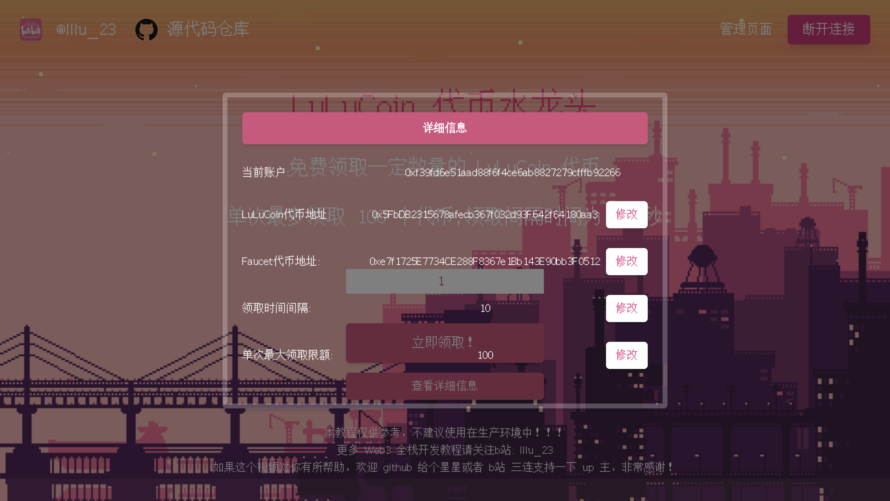
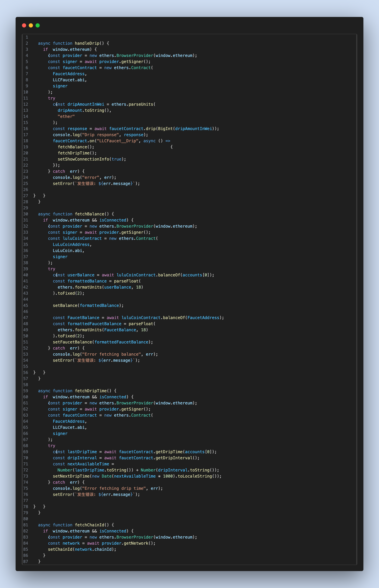

# 02 ERC20 Faucet（faucet）

## 项目定位与边界
- 本项目在 ERC20 基础上增加“可配置水龙头”业务：管理员存入代币，普通用户按规则领取。
- 业务边界：只做本地链教学，不做生产级风控（黑名单、风控分层、限流服务端）。
- 合约核心是“领取间隔 + 单次上限 + 资金池余额校验”。

## 角色与核心对象
| 角色 | 职责 | 核心对象 |
| --- | --- | --- |
| Owner/Admin | 部署、铸币、授权、向 Faucet 充值、调参数 | `LLCFaucet`、`LuLuCoin` |
| User | 调用 `drip` 领取 | `dripTime[user]` |
| Faucet 合约 | 执行领取策略和余额检查 | `dripInterval`、`dripLimit`、`token` |

**水龙头策略矩阵**
| 策略 | 合约字段/函数 | 谁配置 | 用户侧影响 |
| --- | --- | --- | --- |
| 领取间隔 | `dripInterval` / `setDripInterval` | Owner | 冷却期内不可重复领 |
| 单次上限 | `dripLimit` / `setDripLimit` | Owner | 超限直接回滚 |
| 资金池来源 | `deposit` + ERC20 `approve` | Owner | 余额不足时领取失败 |
| 代币绑定 | `tokenAddress` / `setTokenAddress` | Owner | 切换 token 后领取对象变化 |

## 5 分钟跑通
```bash
cd 02_Faucet
cp contracts/.env.example contracts/.env
make dev
```
- `make dev` 会执行：`restart-anvil -> deploy -> frontend-dev`。
- `deploy` 阶段自动完成：部署 `LuLuCoin + LLCFaucet`、`mint`、`approve`、`deposit`。
- 打开 `http://localhost:3000`，连接 `Anvil 31337` 后即可测试领取。

## 业务主流程
1. 管理员部署代币与水龙头，前端拿到最新地址。
2. 管理员 `mint` 代币并 `approve` 水龙头可扣款。
3. 管理员执行 `deposit`，把代币注入 Faucet 资金池。
4. 用户点击领取，前端提交 `drip(amount)`。
5. 合约依次校验：冷却期、单次上限、资金池余额。
6. 校验通过后更新 `dripTime[user]` 并转账。
7. 前端刷新用户余额、Faucet 余额、下一次可领取时间。

**失败场景（重点）**
- `LLCFaucet__IntervalHasNotPassed`：冷却期未到。
- `LLCFaucet__ExceedLimit`：超出单次上限。
- `LLCFaucet__FaucetEmpty`：资金池余额不足。
- `LLCFaucet__InvalidAmount`：管理员 `deposit` 数量非法。

## 合约接口与状态
| 接口/事件 | 调用方 | 输入 | 状态变化 | 失败条件 | 前端触发入口 |
| --- | --- | --- | --- | --- | --- |
| `drip(uint256)` | User | 领取数量 | 更新 `dripTime`、转账给用户 | 冷却未到/超限/池子空 | `components/faucet.js` |
| `deposit(uint256)` | Owner | 存入数量 | 增加 Faucet 代币余额 | 金额非法/未授权 | 管理端操作 |
| `setDripInterval(uint256)` | Owner | 秒数 | 更新策略参数 | 非 Owner | 管理端设置 |
| `setDripLimit(uint256)` | Owner | 上限 | 更新策略参数 | 非 Owner | 管理端设置 |
| `LLCFaucet__Drip` | 合约发出 | 接收人、金额 | 事件日志 | 无 | 前端可监听刷新 |

## 代码架构与调用链
| 页面/模块 | 主要职责 | 下游调用 |
| --- | --- | --- |
| `frontend/app/page.js` | 首页与弹窗容器 | `components/faucet.js` 等 |
| `frontend/components/context.js` | 全局钱包与链上状态共享 | `ethers` Provider |
| `frontend/components/faucet.js` | 领取、余额查询、状态回显 | `LLCFaucet` 读写 |
| `frontend/components/managementRow.js` | 管理员参数/充值入口 | `setDrip*`、`deposit` |
| `contracts/src/LLCFaucet.sol` | 水龙头策略核心 | ERC20 `SafeERC20` |

## 命令与环境变量
**推荐命令（项目根目录）**
```bash
make help
make dev
make deploy
make web
make build-contracts
make test
make anvil
make clean
```
- `make test` 会在 `frontend/node_modules` 缺失时自动执行 `npm ci --no-audit --no-fund`，可以直接用于干净环境回归。

**关键环境变量（`contracts/.env`）**
- `OWNER_PRIVATE_KEY` / `OWNER_ADDRESS`：管理员。
- `USER_PRIVATE_KEY` / `USER_ADDRESS`：领取用户。
- `LLC_CONTRACT` / `FAUCET_CONTRACT`：部署后地址。
- `MINT_AMOUNT` / `DEPOSIT_AMOUNT` / `DRIP_AMOUNT`。
- `DRIP_INTERVAL` / `DRIP_LIMIT`。

## 验收与排错
| 症状 | 可能原因 | 修复命令/动作 |
| --- | --- | --- |
| 领取按钮报冷却错误 | 上次领取间隔未到 | 等待或降低 `DRIP_INTERVAL` |
| 领取失败提示余额不足 | Faucet 没有足够代币 | 重新 `make deploy` 或执行 `deposit` |
| 管理员充值失败 | 未先 `approve` | 执行 `make approve_faucet` |
| 页面地址为空 | 未写入前端 env | `make deploy` |
| RPC/交易超时 | Anvil 未就绪 | `make restart-anvil` |

## Demo 展示




## 作者
- `lllu_23`
