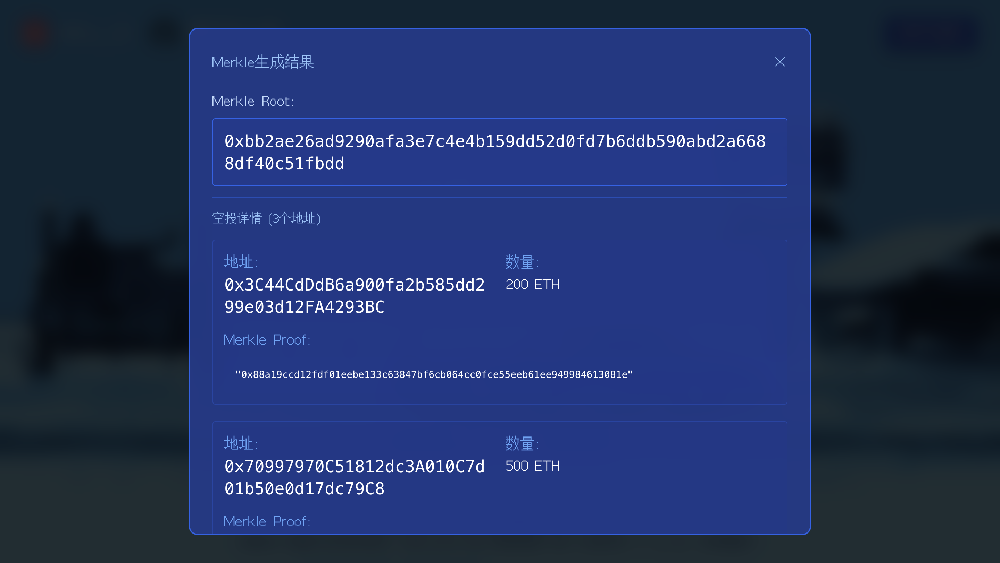
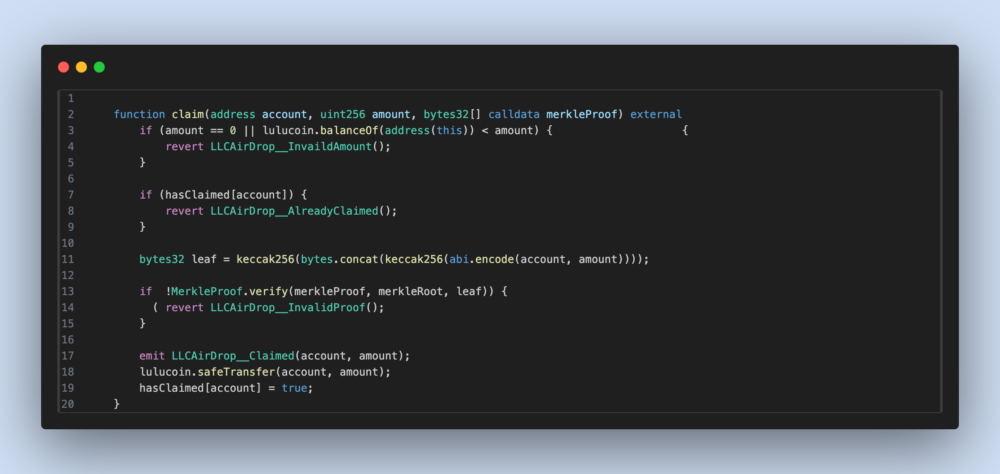
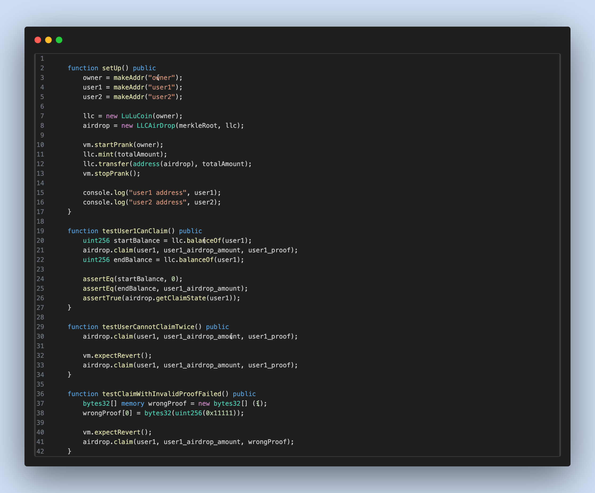
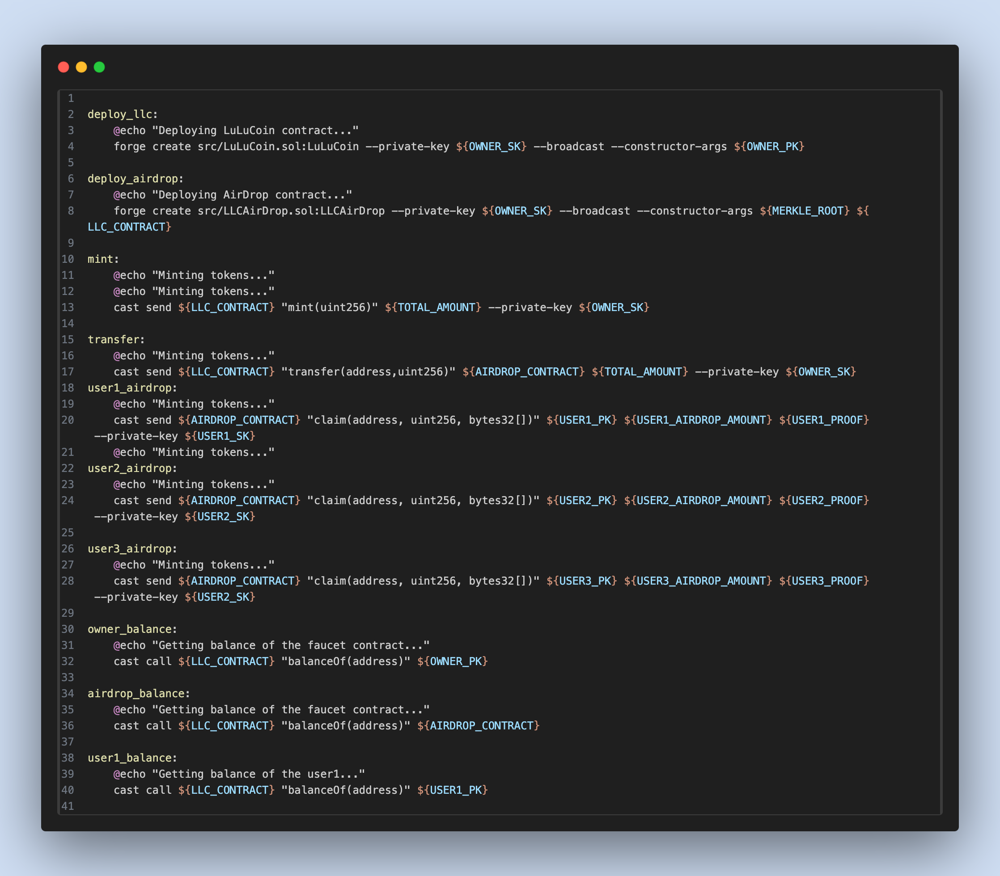
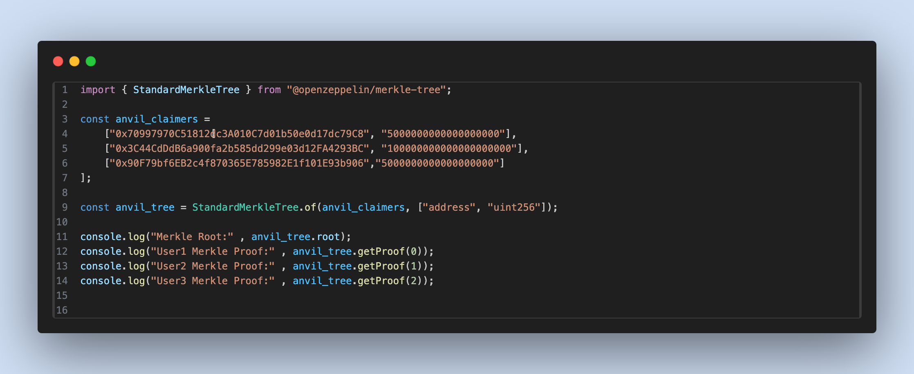

# 03 Merkle AirDrop（merkle-airdrop）
## 项目介绍
这是一个使用 `Nextjs15` 以及 `Foundry` 框架以及`MerkleTree`制作的 AirDrop 空投领取项目

**空投首页**

**配置空投名单**

**Merkle 生成结果**

**领取表单**

**账户详情**


# 文档汇总
- 前端部分
  1. [Nextjs15 官方文档](https://nextjs.org/)
  2. [TailwindCSS 官方文档](https://tailwindcss.com/)
  3. [ethers@6.13.5 官方文档](https://docs.ethers.org/v6/)
   
- 合约部分
  1. [Foundry 官方文档](https://book.getfoundry.sh/)
  2. [Solidity 官方文档](https://docs.soliditylang.org/en/latest/)
  3. [以太坊单位转换器](https://eth-converter.com/)

# 环境配置
## 前端部分
`NextJs`的版本为`15.1.7`
   - 初始化项目的指令: `npx create-next-app@latest`
`ethers.js`的版本为`6.13.5`
   - 安装 `ethers v6`的指令: `npm install ethers@6.13.5`


## 合约部分
`Foundry` 版本为`0.3.0`
   - 初始化项目的指令: `forge init`, 如果项目不为空文件夹这需要加上`--force`,初始化项目时，不进行 Git 提交需要加上`--no-commit`
   - 安装 `OpenZeppelin` 的指令为: `forge install OpenZeppelin/openzeppelin-contracts` 

## 本节课程还需要按照`OpenZeppelin`的`MerkleTree`库
   - 安装指令：`npm install @openzeppelin/merkle-tree`
   - github 链接：https://github.com/OpenZeppelin/merkle-tree

# 环境变量（contracts/.env）
复制示例文件后再填写实际值：
`cp contracts/.env.example contracts/.env`

变量说明：
- `OWNER_PK` / `OWNER_SK`：部署账户地址与私钥（默认 Anvil Account #0）。
- `USER1_PK/USER1_SK` 等：空投领取用户地址与私钥（默认 Anvil Account #1~#3）。
- `MERKLE_ROOT` / `USER*_PROOF`：Merkle 根与证明（数组格式）。
- `LLC_CONTRACT` / `AIRDROP_CONTRACT`：部署后填入的合约地址。
- `TOTAL_AMOUNT` / `USER*_AIRDROP_AMOUNT`：空投额度（建议用 wei）。

# 一键启动
在根目录执行：
- `make start`：同时启动合约本地链（anvil）与前端开发服务器

前置条件：
- 已安装 Foundry 且 `anvil` 可在命令行直接运行
- 前端依赖已安装：`cd frontend && npm install`

退出方式：
- 在运行终端中按 `Ctrl + C` 结束对应进程

# 代码展示
## `LLCAirDrop` 默克尔树合约
**合约实现（LLCAirDrop.sol）**


## `LLCAirDrop` 测试合约
**测试合约（LLCAirDropTest.t.sol）**


## `Makefile`指令
**Makefile 指令说明**


## 使用 `javascript` 编写的用于生成 `MerkleRoot & MerkleProof` 脚本
**生成 MerkleRoot & MerkleProof 脚本 1**

**生成 MerkleRoot & MerkleProof 脚本 2**


# 本次教程中使用到的和合约交互的指令
* 编译合约
`forge compile`

* 测试合约
`forge test`

* 测试指定测试合约中过的函数
`forge test --mt ${函数名称} -vvvvv `

* 函数选择器
`forge selectors find`

- 使用 makefile指令完成与合约的交互
`make deploy_llc`: 部署 LuLuCoin ERC20 代币合约
`make deploy_airdrop`: 部署空投合约
`make mint`: 使用 `Owner` 账户进行 ERC20 代币的铸造
`make transfer`: 使用 `Owner` 账户对 `AirDrop` 合约进行转账
`make user1_airdrop`: 使用`user1`领取空投
`make user1_balance`: 查看 `user1` 的账户余额
`make user1_claim_status`: 查看 `user1` 的空投领取状态

## 标准化命令（统一模板）
```bash
make help
make dev
make deploy
make web
make build-contracts
make test
make anvil
make clean
```
