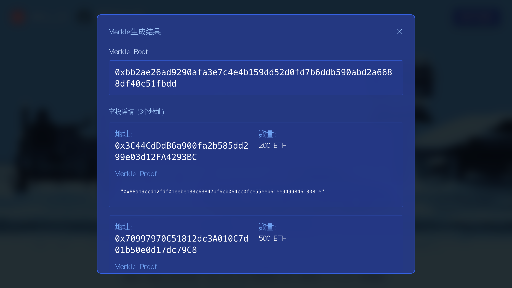

# 03 Merkle AirDrop（merkle-airdrop）

## 项目定位与边界
- 本项目演示标准 Merkle 空投闭环：离线生成白名单树，链上验证 `proof` 后领取代币。
- 教学边界：以本地链和静态名单为主，不包含生产级签名授权、分批窗口、争议处理。
- 核心价值：把“列表很大时不全量上链”的常见工程思路讲透。

## 角色与核心对象
| 角色 | 职责 | 核心对象 |
| --- | --- | --- |
| Owner | 生成 root、部署合约、给空投池转币 | `MERKLE_ROOT`、`LLCAirDrop` |
| Claimer | 提交 `account + amount + proof` 领取 | `hasClaimed[account]` |
| Off-chain 脚本 | 生成 root/proof | `generate_anvil_merkle.js` |
| 空投合约 | 校验 proof 并转账 | `claim`、`MerkleProof.verify` |

## 5 分钟跑通
```bash
cd 03_MerkleAirDrop
cp contracts/.env.example contracts/.env
make dev
```
- `make dev` 会执行：`restart-anvil -> deploy -> frontend`。
- `deploy` 内部会先执行 `generate-merkle`，自动把 `MERKLE_ROOT/USER*_PROOF` 写入 `contracts/.env`。
- 打开 `http://localhost:3000`，连接 Anvil 钱包并测试 claim。

## 业务主流程
1. Owner 准备 allowlist（地址 + 额度）。
2. 脚本用 `StandardMerkleTree.of(data, ["address","uint256"])` 生成 `MerkleRoot` 与每个地址的 `Proof`。
3. 部署 `LLCAirDrop(merkleRoot, tokenAddress)`。
4. Owner 把代币转入 `LLCAirDrop` 合约资金池。
5. 用户提交 `claim(account, amount, proof)`。
6. 合约计算 leaf，执行 `MerkleProof.verify`，并检查 `hasClaimed`。
7. 通过后转账并标记已领取，前端刷新领取状态与余额。

**Allowlist -> MerkleRoot -> Claim 数据链路**
```text
allowlist[address, amount]
  -> StandardMerkleTree
  -> merkleRoot + proof
  -> claim(account, amount, proof)
  -> verify(root, leaf, proof)
  -> transfer + hasClaimed=true
```

**叶子哈希与 Proof 格式（必须一致）**
- 脚本输入类型：`["address", "uint256"]`。
- 合约 leaf：`keccak256(bytes.concat(keccak256(abi.encode(account, amount))))`。
- `proof` 形态：`bytes32[]`，`.env` 中示例写法 `['0x..','0x..']`。

## 合约接口与状态
| 接口/事件 | 调用方 | 输入 | 状态变化 | 失败条件 | 前端触发入口 |
| --- | --- | --- | --- | --- | --- |
| `claim(address,uint256,bytes32[])` | Claimer | 账户、额度、proof | 转账并置 `hasClaimed=true` | 金额非法/已领/proof 无效 | `components/merkleAirdrop.js` |
| `getMerkleRoot()` | 任意读 | 无 | 无 | 无 | 详情弹窗 |
| `getClaimState(address)` | 任意读 | 账户 | 无 | 无 | 账户详情 |
| `LLCAirDrop__Claimed` | 合约发出 | 账户、额度 | 事件日志 | 无 | 可用于索引刷新 |

## 代码架构与调用链
| 页面/模块 | 主要职责 | 下游调用 |
| --- | --- | --- |
| `frontend/app/page.js` | 空投主页容器 | `merkleAirdrop.js` |
| `frontend/components/generateMerkleProof.js` | 前端演示 proof 生成逻辑 | `@openzeppelin/merkle-tree` |
| `frontend/components/merkleAirdrop.js` | 提交 claim、读领取状态 | `LLCAirDrop` 合约 |
| `contracts/script/generate_anvil_merkle.js` | 生成 root/proof 并输出 | `.env` 注入流程 |
| `contracts/src/LLCAirDrop.sol` | 链上验证与转账 | `MerkleProof` |

## 命令与环境变量
**推荐命令（项目根目录）**
```bash
make help
make dev
make deploy
make web
make build-contracts
make test
make anvil
make clean
```

**关键环境变量（`contracts/.env`）**
- 地址/私钥：`OWNER_PK`、`OWNER_SK`、`USER1_PK`...`USER3_SK`。
- Merkle 数据：`MERKLE_ROOT`、`USER1_PROOF`...`USER3_PROOF`。
- 合约地址：`LLC_CONTRACT`、`AIRDROP_CONTRACT`。
- 额度：`TOTAL_AMOUNT`、`USER*_AIRDROP_AMOUNT`。

## 验收与排错
| 症状 | 可能原因 | 修复命令/动作 |
| --- | --- | --- |
| `InvalidProof` | leaf 计算方式或 proof 顺序不一致 | 重新执行 `make generate-merkle` |
| `InvaildAmount` | claim 金额为 0 或空投池余额不足 | 检查 `TOTAL_AMOUNT` 并重新转账 |
| `AlreadyClaimed` | 地址已领取过 | 更换测试账户 |
| 页面显示 root 不匹配 | `.env` 与前端状态不同步 | `make deploy` 重写配置 |
| 启动失败找不到脚本依赖 | contracts 依赖未安装 | `cd contracts && npm install` |

## Demo 展示



