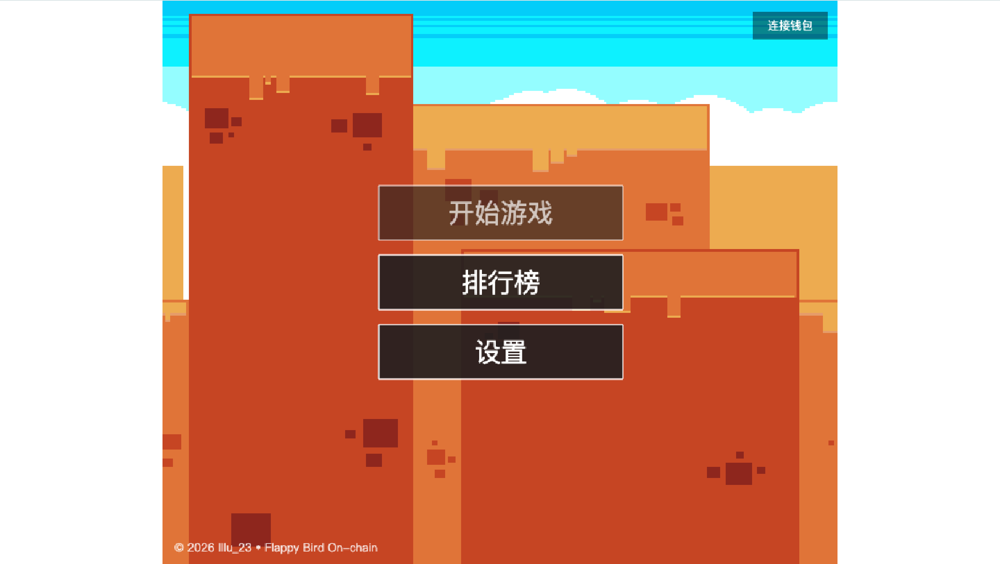
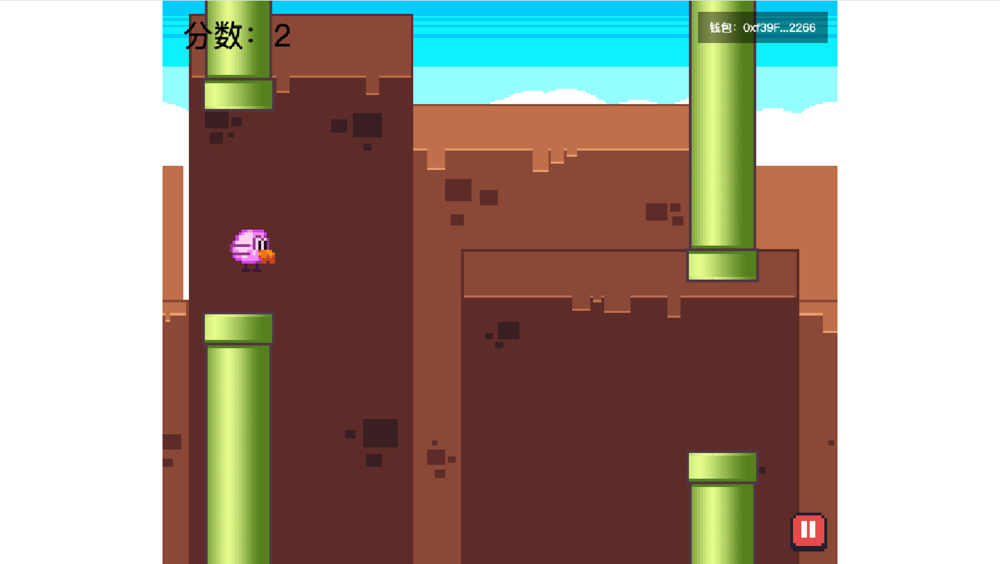
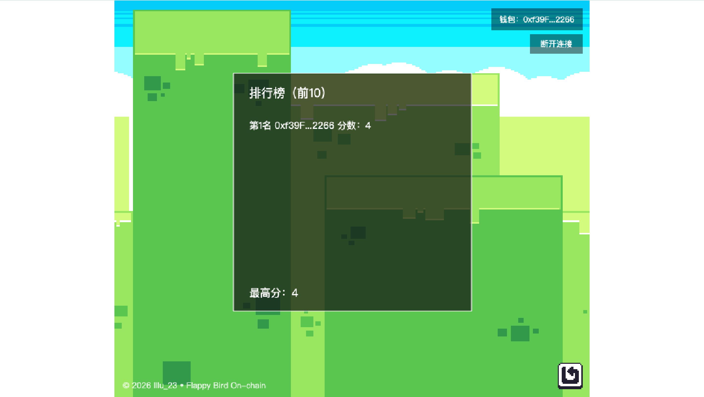
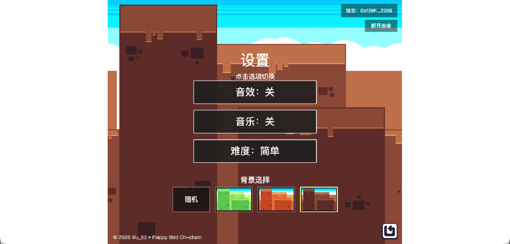

# 04 Flappy Bird On-chain（flappy-bird-onchain）
React + Phaser + Foundry

一个以 React 作为宿主、Phaser 作为游戏引擎的 Flappy Bird 变体，并集成了 wagmi 钱包连接与链上排行榜。前端位于 `frontend/`，合约工程独立在 `contracts/`（Foundry）。

## Demo 展示
**主菜单界面**

**游戏进行中界面**

**排行榜界面**

**设置界面**

**游戏结束界面**


## 技术栈

- 前端：React 18 + Vite
- 游戏：Phaser 3（Arcade Physics）
- Web3：wagmi + viem + @tanstack/react-query
- 合约：Foundry（`contracts/`）

## 快速开始（推荐）

确保已安装 Node.js（建议 18+）、npm 以及 Foundry（forge/anvil）。

```bash
make dev
```

`make dev` 会自动：
- 启动本地 anvil（RPC `http://127.0.0.1:8545`）
- 部署 `FlappyScoreboard`
- 写入 `frontend/.env.local`
- 同步 ABI/地址到前端
- 启动前端开发服务器

启动后访问 Vite 默认地址（通常是 `http://localhost:5173`）。

## 手动启动

```bash
make anvil
make deploy
make sync-contract
make frontend
```

或仅前端：

```bash
cd frontend
npm install
npm run dev
```

## 环境变量

复制示例文件后再填写实际值：
`cp frontend/.env.local.example frontend/.env.local`

- `VITE_FLAPPY_SCORE_ADDRESS`：合约地址（`make deploy` 会写入 `frontend/.env.local`）
- `VITE_ANVIL_RPC_URL`（可选）：自定义 RPC URL（默认 `http://127.0.0.1:8545`）

地址读取优先级：`VITE_FLAPPY_SCORE_ADDRESS` > `frontend/components/Web3/flappyScore.address.json`。

## 目录结构（核心）

```
.
├─ frontend/
│  ├─ components/
│  │  ├─ FlappyBird.jsx          # React 宿主组件，挂载 Phaser
│  │  └─ Web3/
│  │     ├─ config.js            # wagmi 配置（本地 anvil）
│  │     ├─ flappyScore.js       # ABI/地址统一出口
│  │     └─ WalletConnect.jsx    # 钱包连接逻辑（无 UI）
│  ├─ game/
│  │  ├─ gamecore.js             # Phaser Game 初始化与场景注册
│  │  ├─ chain/                  # 链上读写客户端
│  │  └─ scenes/                 # 各场景逻辑
│  ├─ public/assets/             # 游戏资源（鸟、管道、背景、音频）
│  └─ src/                       # React 入口
└─ contracts/                    # Foundry 合约项目（独立）
```

## 架构与流程

### 启动与渲染
1. `frontend/index.html` 提供 `#root`
2. `src/main.jsx` 启动 React，注入 Provider
3. `App.jsx` 组合 `WalletConnect` 与 `FlappyBird`
4. `FlappyBird.jsx` 创建 Phaser 实例并挂载到 `#game-container`

### 场景顺序（实际注册）
`Preload → Menu → Score → Settings → GameOverLoading → Play → Pause → GameOver`

### 关键交互
- 右上角按钮负责连接/断开钱包（UI 在 Phaser 内）
- 未连接钱包无法开始游戏（MenuScene 会提示）
- 游戏结束先进入 `GameOverLoadingScene`，等待钱包签名后进入 `GameOverScene`
- 链上排行榜每 8 秒自动刷新，并在交易确认后触发刷新事件

## 场景与核心逻辑

- **PreloadScene**：加载资源并进入主菜单
- **MenuScene**：菜单项为“开始/排行榜/设置”，开始游戏前要求连接钱包
- **PlayScene**：主循环、加分、难度曲线与暂停
  - 难度模式：`auto / easy / normal / hard`
  - `auto` 使用 smoothstep 插值 + 轻微抖动，随分数增加难度
- **ScoreScene**：展示链上 Top10，并显示榜首最高分
- **SettingsScene**：音效/音乐开关 + 难度选择
- **GameOverLoadingScene**：等待签名与提交成绩
- **GameOverScene**：显示结果并支持重开/菜单/设置

## 数据与持久化

- 本地最高分：`localStorage.bestScore`
- 设置项：`localStorage["flappy:settings"]`
- 链上排行榜：`FlappyScoreboard` 合约

## Web3 / 链上交互

- 读取排行榜：`game/chain/scoreboardClient.js` → `fetchLeaderboard()`
- 提交成绩：`submitScore()`（需要钱包签名）
- 钱包状态：`WalletConnect.jsx` 注入全局事件 `wallet:status` 供 Phaser 监听

合约概要（`contracts/src/FlappyScoreboard.sol`）：
- `MAX_LEADERBOARD = 10`
- `bestScore[address]`
- `getLeaderboard()` / `submitScore()` / `leaderboardLength()`

## 常用命令

根目录（Makefile）：
- `make dev`：一键启动（anvil + deploy + sync + frontend）
- `make anvil` / `make stop-anvil` / `make status`
- `make deploy`：部署合约并写入 `.env.local`
- `make sync-contract`：同步 ABI 与地址
- `make frontend`：启动前端

合约（Foundry）：
```bash
cd contracts
forge build
forge test
```

前端：
```bash
cd frontend
npm run dev
npm run build
npm run preview
npm run lint
```

## 排错指南

- **提示“请设置 VITE_FLAPPY_SCORE_ADDRESS”**
  - 运行 `make deploy` 或 `make sync-contract`
  - 或手动设置 `VITE_FLAPPY_SCORE_ADDRESS`
- **钱包无法连接**
  - 确保已安装浏览器钱包扩展
  - 本地链默认 ChainId 为 `31337`，RPC 为 `http://127.0.0.1:8545`
- **Anvil 无响应**
  - 运行 `make status` 检查
  - 确保已安装 Foundry 并可执行 `anvil`

## 标准化命令（统一模板）
```bash
make help
make dev
make deploy
make web
make build-contracts
make test
make anvil
make clean
```
