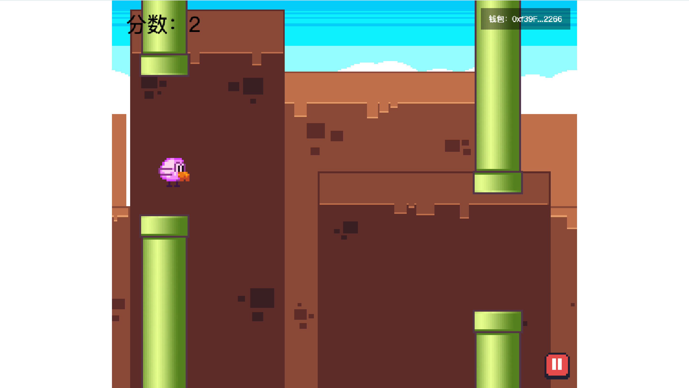
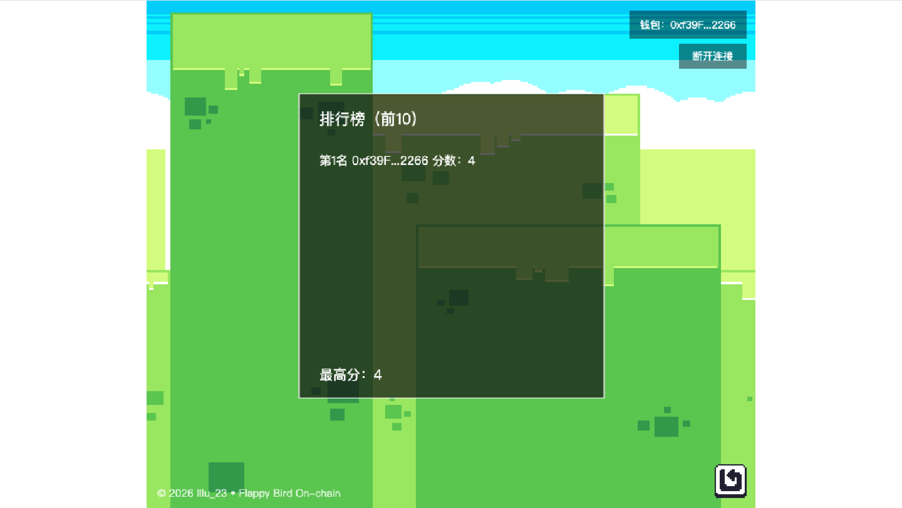
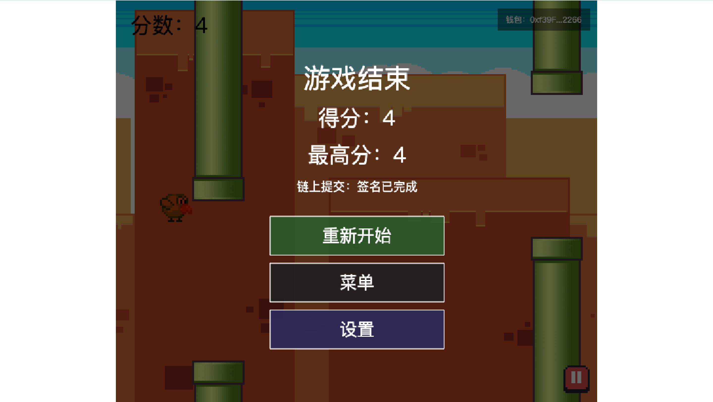

# 04 Flappy Bird On-chain（flappy-bird-onchain）

## 项目定位与边界
- 这是 Phaser 链游模板项目：前端负责实时渲染与输入，链上只记录最终成绩与排行榜。
- **边界声明**：不把每一帧/每一步上链，只在结算时提交 `submitScore`，避免高延迟和高 gas。
- 教学重点：React 宿主 + Phaser 场景流 + Web3 读写协作。

## 角色与核心对象
| 角色 | 职责 | 核心对象 |
| --- | --- | --- |
| 玩家 | 操作游戏并提交成绩 | 钱包地址、当前局分数 |
| 前端场景系统 | 渲染、菜单、结算、排行榜展示 | `Menu/Play/GameOver/Score` 场景 |
| 合约 `FlappyScoreboard` | 保存个人最佳与 Top10 | `bestScore`、`leaderboard` |

## 5 分钟跑通
```bash
cd 04_FlappyBird-Onchain
make dev
```
- `make dev` 会执行：`restart-anvil -> deploy -> sync-contract -> frontend`。
- 浏览器访问 Vite 地址（通常 `http://localhost:5173`），钱包切到 `31337`。
- 快速验证：打一局后排行榜页能看到链上成绩。

## 业务主流程
1. 用户连接钱包后进入菜单场景。
2. 开始游戏，Phaser 本地实时计算分数。
3. 游戏结束进入 `GameOverLoadingScene`，前端准备链上提交。
4. 用户签名后调用 `submitScore(score)`。
5. 合约更新 `bestScore[player]`，必要时更新 Top10。
6. 合约触发 `ScoreSubmitted` 事件。
7. 前端监听事件 + 定时刷新，更新排行榜和最佳分展示。

**Scene 与合约交互时序（简化）**
```text
PlayScene gameover
  -> GameOverLoadingScene submitScore
  -> FlappyScoreboard.ScoreSubmitted
  -> ScoreScene fetchLeaderboard
  -> UI 刷新
```

## 合约接口与状态
| 接口/事件 | 调用方 | 输入 | 状态变化 | 失败条件 | 前端触发入口 |
| --- | --- | --- | --- | --- | --- |
| `submitScore(uint256)` | 玩家 | 分数 | 更新个人最佳与榜单 | 无显式 require（低分可能不上榜） | `game/chain/scoreboardClient.js` |
| `getLeaderboard()` | 任意读 | 无 | 无 | 无 | `ScoreScene` |
| `leaderboardLength()` | 任意读 | 无 | 无 | 无 | 排行榜辅助读取 |
| `bestScore(address)` | 任意读 | 玩家地址 | 无 | 无 | 页面最佳分显示 |
| `ScoreSubmitted` | 合约发出 | 玩家、分数、时间等 | 事件日志 | 无 | 事件驱动刷新 |

## 代码架构与调用链
| 页面/场景 | 模块 | 下游调用 |
| --- | --- | --- |
| `src/main.jsx` / `src/App.jsx` | React 入口与 Provider 装配 | `components/FlappyBird.jsx` |
| `components/FlappyBird.jsx` | 挂载 Phaser 实例 | `game/gamecore.js` |
| `game/scenes/*.js` | 菜单/游玩/结算/排行榜逻辑 | `game/chain/scoreboardClient.js` |
| `components/Web3/WalletConnect.jsx` | 钱包状态与连接 | wagmi + viem |
| `contracts/src/FlappyScoreboard.sol` | 排行榜状态机 | 链上事件与存储 |

## 命令与环境变量
**推荐命令（项目根目录）**
```bash
make help
make dev
make deploy
make web
make build-contracts
make test
make anvil
make clean
```

**关键环境变量（`frontend/.env.local`）**
- `VITE_FLAPPY_SCORE_ADDRESS`：排行榜合约地址（`make deploy` 自动写入）。
- `VITE_ANVIL_RPC_URL`：本地 RPC（默认 `http://127.0.0.1:8545`）。

## 验收与排错
| 症状 | 可能原因 | 修复命令/动作 |
| --- | --- | --- |
| 菜单提示未连接钱包 | 钱包未连接或插件不可用 | 连接钱包扩展 |
| 提示缺少 `VITE_FLAPPY_SCORE_ADDRESS` | 未部署或未同步地址 | `make deploy` 或 `make sync-contract` |
| 排行榜不刷新 | 事件监听中断或 RPC 抖动 | 刷新页面并确认 anvil 在线 |
| 交易失败 | 链错误或账户无测试 ETH | 切到 `31337`，换 Anvil 账户 |
| 前端无法启动 | 依赖未安装 | `cd frontend && npm install` |

## Demo 展示



