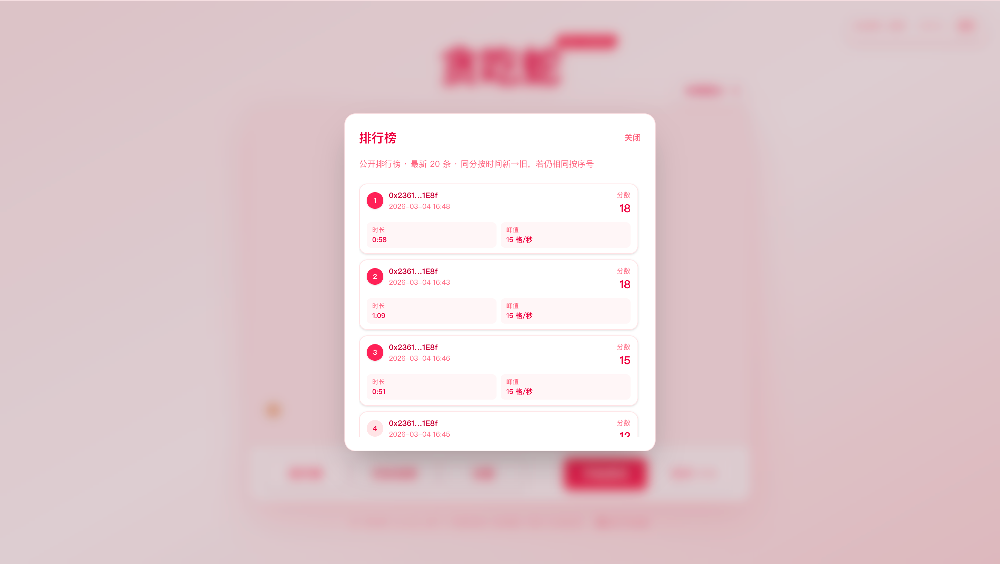
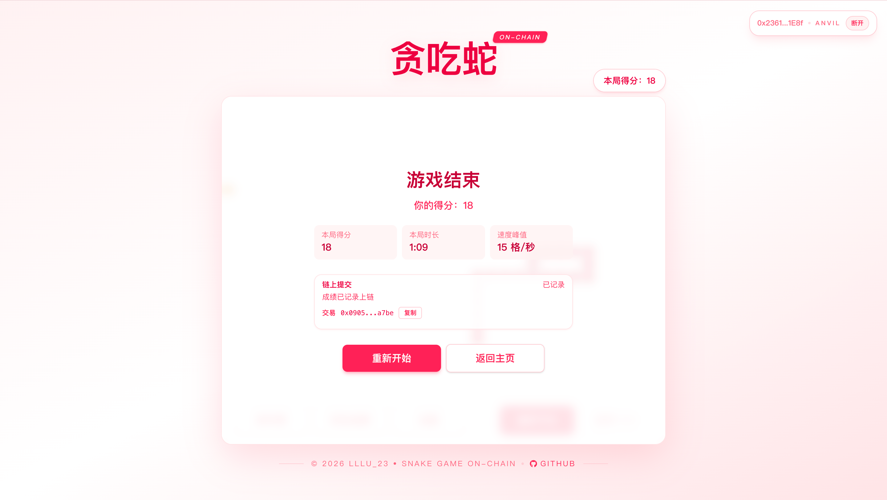

# 05 Snake Game On-chain（snake-game-on-chain）

## 项目定位与边界
- 本项目是 Next.js 宿主的链游教学模板：本地运行贪吃蛇，结算后提交链上成绩。
- 边界：只上链最终局结果，不把移动过程逐步上链。
- 教学重点：多维度成绩字段（`score/durationSec/speedPeak`）与链上排行榜/历史。

## 角色与核心对象
| 角色 | 职责 | 核心对象 |
| --- | --- | --- |
| 玩家 | 游戏操作与成绩提交 | 钱包地址、局内分数 |
| 前端 | 结算自动提交、历史分页展示 | `scoreboardClient.ts` |
| 合约 `SnakeScoreboard` | 维护全局榜和个人历史 | `MAX_RECORDS=20`、环形历史 |

## 5 分钟跑通
```bash
cd 05_SnakeGame-On-chain
make dev
```
- `make dev` 会执行：`restart-anvil -> deploy -> frontend`。
- 部署后自动同步 ABI、`frontend/public/contract-config.json` 和前端 env。
- `frontend/public/scoreboard.json` 仅保留兼容层；当前标准入口已切到 `contract-config.json`。
- 打开 `http://localhost:3000`，连接 Anvil 钱包即可游玩。

## 业务主流程
1. 前端启动时加载地址与 RPC 配置。
2. 玩家连接钱包并开始游戏（未连接时前端门禁拦截）。
3. 游戏本地实时计算 `score/durationSec/speedPeak`。
4. 结算后自动调用 `submitScore(score, durationSec, speedPeak)`。
5. 合约写入全局榜（Top20）和个人历史（环形缓冲）。
6. 交易确认后前端刷新排行榜与个人历史。
7. 用户可在弹窗中继续分页查看历史成绩。

**分数字段语义**
- `score`：本局得分，排行榜主排序字段。
- `durationSec`：本局持续秒数，写入历史记录。
- `speedPeak`：本局最高速度，用于教学展示多维指标。

**自动提交与失败重试路径**
- 自动触发：游戏结束后直接发交易。
- 失败场景：拒签、链错误、RPC 异常。
- 恢复方式：保持当前局结果，用户可重新触发提交。

## 合约接口与状态
| 接口/事件 | 调用方 | 输入 | 状态变化 | 失败条件 | 前端触发入口 |
| --- | --- | --- | --- | --- | --- |
| `submitScore(uint32,uint32,uint16)` | 玩家 | 分数/时长/峰值速度 | 更新全局榜 + 个人历史 | `score=0` 回滚 | `pages/index.tsx` |
| `getGlobalTop()` | 任意读 | 无 | 无 | 无 | 排行榜弹窗 |
| `getUserRecent(address)` | 任意读 | 用户地址 | 无 | 无 | 历史弹窗 |
| `getGlobalCount()/getUserCount()` | 任意读 | 可选地址 | 无 | 无 | 分页/状态判断 |
| `ScoreSubmitted` | 合约发出 | 玩家与成绩结构 | 事件日志 | 无 | 交易后刷新依据 |

## 代码架构与调用链
| 页面/模块 | 主要职责 | 下游调用 |
| --- | --- | --- |
| `frontend/pages/index.tsx` | 游戏主页面与提交流程 | `lib/scoreboardClient.ts` |
| `frontend/components/WalletStatus.tsx` | 钱包状态与门禁提示 | wagmi/viem |
| `frontend/lib/runtime-config.ts` | 统一运行时配置入口 | `scoreboardRuntime.ts` |
| `frontend/lib/scoreboardRuntime.ts` | 兼容新旧 runtime 配置读取 | `public/contract-config.json` / `public/scoreboard.json` |
| `frontend/lib/scoreboardClient.ts` | 合约读写封装 | `SnakeScoreboard` |
| `contracts/src/SnakeScoreboard.sol` | 排行榜与历史存储逻辑 | 事件与环形缓冲 |

**运行时地址优先级**
```text
frontend/public/contract-config.json
  > frontend/public/scoreboard.json (兼容层)
  > frontend/.env.local
  > frontend/lib/scoreboard.address.json
```

## 命令与环境变量
**推荐命令（项目根目录）**
```bash
make help
make dev
make deploy
make web
make build-contracts
make test
make anvil
make clean
```
- `make test` 会在 `frontend/node_modules` 缺失时自动执行 `npm ci --no-audit --no-fund`，无需手工先装依赖。

**关键环境变量（`frontend/.env.local`）**
- `NEXT_PUBLIC_ANVIL_RPC_URL`：默认 `http://127.0.0.1:8545`。
- `NEXT_PUBLIC_SCOREBOARD_ADDRESS`：部署后地址。

**部署与同步职责**
- `contracts/script/Deploy.s.sol`：唯一部署入口。
- `scripts/sync-contract.js`：同步 ABI、`contract-config.json` 与 `.env.local`。
- `Makefile`：只编排 `deploy -> sync-contract -> frontend`，不再内联写地址文件。

## 验收与排错
| 症状 | 可能原因 | 修复命令/动作 |
| --- | --- | --- |
| 游戏可玩但无法提交 | 钱包未连接或链不匹配 | 连接钱包并切到 `31337` |
| 提示地址无效 | 地址未同步 | `make deploy` |
| 排行榜为空 | 尚未有成功上链提交 | 完成一局并签名提交 |
| 历史不更新 | 交易未确认或 RPC 波动 | 等待回执后重试查询 |
| 启动失败 | 前端依赖缺失 | 直接执行 `make web` 或 `make test`，命令会自动准备前端依赖 |

## Demo 展示




## 作者
- `lllu_23`
