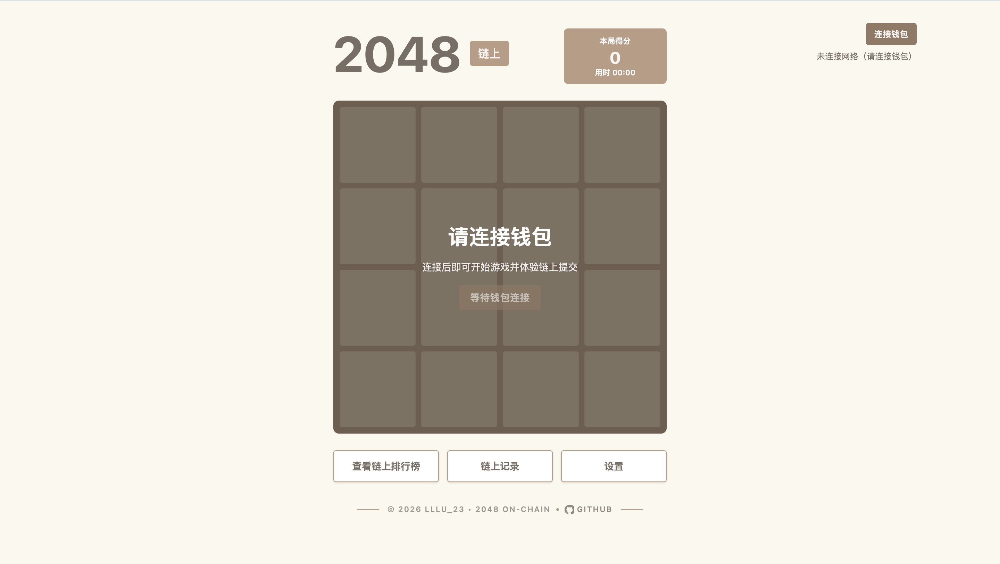
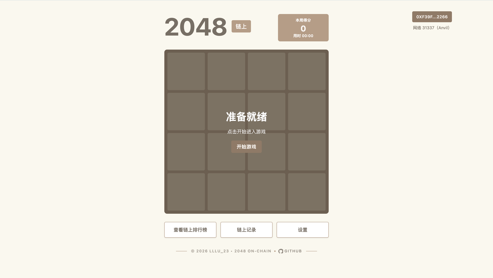
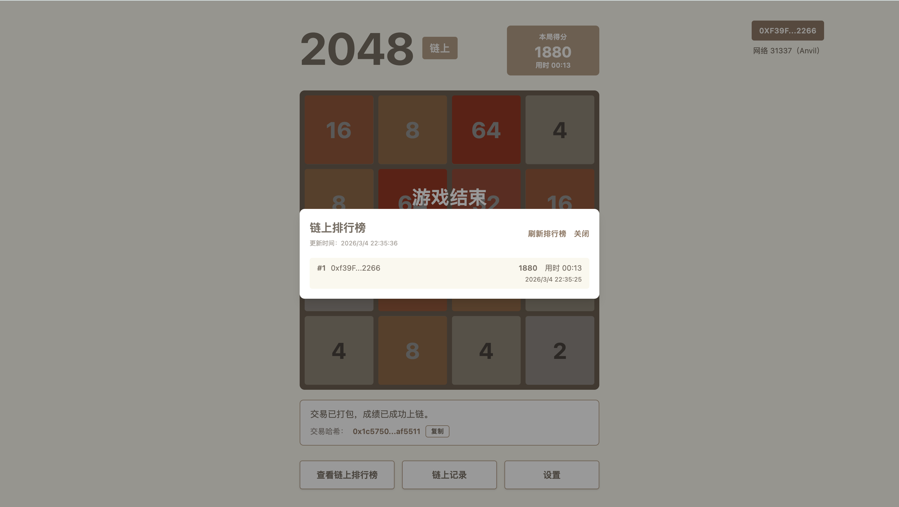

# 06 2048 Game On-chain（2048-game-on-chain）
Anvil demo

This is a teaching demo: the 2048 gameplay runs entirely on the client, and **only the final score is submitted on-chain**. The smart contract stores a simple Top 10 leaderboard, so you get a web3 flow without laggy gameplay or frequent transactions.

## Demo 展示

**未连接钱包界面**


**游戏主界面（已连接，准备开始）**


**游戏结束（上链等待签名）**


**链上排行榜弹窗**


**链上记录弹窗**


## Features
- Smooth local gameplay (no on-chain moves)
- Submit final score after the game ends
- On-chain Top 10 leaderboard
- On-chain per-player game history (paginated + capped)
- Real-time leaderboard/history refresh via contract events
- Runs on a local Anvil testnet

## Stack
- Next.js + React
- Wagmi + Viem
- Solidity
- Foundry + Anvil (local chain)

## Quick Start
### One-command (deploy + run)
```bash
make dev
```
This starts Anvil (if not already running), deploys the contract with the default Anvil private key, writes `frontend/.env.local`, then starts the frontend.

### Reset demo data (restart Anvil)
```bash
make reset-anvil
```
This stops the local Anvil process and clears the in-memory chain state (history and leaderboard).

### 1) Install dependencies
```bash
cd frontend
npm install
```

### 2) Start Anvil
```bash
anvil
```
Anvil uses chain ID `31337` by default and prints funded test accounts + private keys.

### 3) Deploy the contract
The Foundry project lives in `contracts/`. Use an Anvil private key to deploy:
```bash
cd contracts
forge create \
  --rpc-url http://127.0.0.1:8545 \
  --private-key 0xac0974bec39a17e36ba4a6b4d238ff944bacb478cbed5efcae784d7bf4f2ff80 \
  src/OnChain2048Scores.sol:OnChain2048Scores
```
Copy the example file and fill in values:
```bash
cp frontend/.env.local.example frontend/.env.local
```

Set values in `frontend/.env.local`:
```bash
NEXT_PUBLIC_SCORE_CONTRACT_ADDRESS=0xYourContractAddress
NEXT_PUBLIC_RPC_URL=http://127.0.0.1:8545
```

### 4) Run the frontend
```bash
cd frontend
npm run dev
```
Open http://localhost:3000

### 5) Connect a wallet
- Use MetaMask (or any injected wallet)
- Add the local Anvil network (Chain ID 31337)
- Import a private key printed by Anvil

## Contract Interface
Contract: `contracts/src/OnChain2048Scores.sol`
- `submitScore(score, duration)` submits the final score + time spent
- `getLeaderboard()` returns the Top 10 list (duplicates allowed)
- `getPlayerHistoryCount(address)` returns history count (capped)
- `getPlayerHistory(address, offset, limit)` returns paginated history (newest first)
- `bestScores(address)` returns a player's best score

Leaderboard rules:
- Top 10 only
- Duplicates allowed (multiple runs by the same address can appear)
- Higher scores replace the lowest entry

History rules:
- Per-player history is capped (ring buffer)
- Pagination reads newest → older

## Architecture Notes
To keep UX smooth:
1. All gameplay runs locally
2. Only the final score is submitted
3. On-chain storage keeps scores + leaderboard only

## From Zero to Running (step-by-step)
1) Install dependencies  
   `cd frontend && npm install`
2) Start Anvil  
   `anvil`
3) Deploy contract  
   `cd contracts && forge create --rpc-url http://127.0.0.1:8545 --private-key 0xac0974bec39a17e36ba4a6b4d238ff944bacb478cbed5efcae784d7bf4f2ff80 src/OnChain2048Scores.sol:OnChain2048Scores`
4) Write `.env.local` (from example)  
   `cp frontend/.env.local.example frontend/.env.local`  
   `NEXT_PUBLIC_SCORE_CONTRACT_ADDRESS=0x...`  
   `NEXT_PUBLIC_RPC_URL=http://127.0.0.1:8545`
5) Run frontend  
   `cd frontend && npm run dev`
6) Connect MetaMask to Anvil (Chain ID 31337)
7) Play a full game → auto-submit → see leaderboard/history update

## Common Errors & Fixes
- **WagmiProviderNotFoundError**  
  Ensure components that use wagmi hooks are rendered *inside* `Web3Provider`.
- **交易回滚 / 无法提交**  
  Check you redeployed the contract after ABI changes, and restarted the frontend.
- **排行榜为空**  
  Submit at least one score and ensure the contract address is correct in `.env.local`.
- **无法连接本地 RPC**  
  Confirm Anvil is running and RPC URL is `http://127.0.0.1:8545`.
- **网络不匹配**  
  Switch wallet network to chain ID `31337`.

## Teaching Milestone Script (recording outline)
1) **Local 2048**  
   Goal: Pure client gameplay, no Web3.  
   Result: 2048 board works smoothly.
2) **Wallet connect**  
   Goal: Add wagmi + injected wallet.  
   Result: Connect button shows address + chain.
3) **Submit final score**  
   Goal: Call `submitScore(score, duration)` after game ends.  
   Result: Transaction sent, on-chain score stored.
4) **Leaderboard & history**  
   Goal: Fetch `getLeaderboard()` and paginated `getPlayerHistory`.  
   Result: Top 10 + per-wallet history shown.
5) **Real-time refresh**  
   Goal: Subscribe to `ScoreSubmitted` event.  
   Result: Leaderboard/history update without manual refresh.
6) **Data scaling**  
   Goal: Explain capped history + pagination.  
   Result: Predictable storage/gas costs.

## Important Note: Contract Upgrades
If the contract ABI changes (e.g. new parameters or new functions), you **must redeploy** and **restart the frontend** so `.env.local` is updated and the new ABI is loaded.

## Recording Talking Points
- **Why submit only the final score?**  
  Each move on-chain would be slow and expensive. Submitting only the final score preserves smooth gameplay while still demonstrating a real Web3 transaction.
- **Why event subscription?**  
  Listening to `ScoreSubmitted` lets the UI refresh immediately after a successful transaction, eliminating manual refresh clicks.
- **Why history pagination + cap?**  
  Without limits, per-player history grows forever. A capped ring buffer + pagination keeps storage predictable and UI fast.

## Repo Structure
```
contracts/  # Foundry project (Solidity)
frontend/   # Next.js app
```

## Troubleshooting
**Score submission fails?**
- Confirm `.env.local` has the deployed address
- Ensure MetaMask is on the Anvil network (31337)
- Keep Anvil running
 - Redeploy if the contract ABI changed

**Leaderboard empty?**
- Submit a score, or wait for event refresh if enabled.

## 标准化命令（统一模板）
```bash
make help
make dev
make deploy
make web
make build-contracts
make test
make anvil
make clean
```
