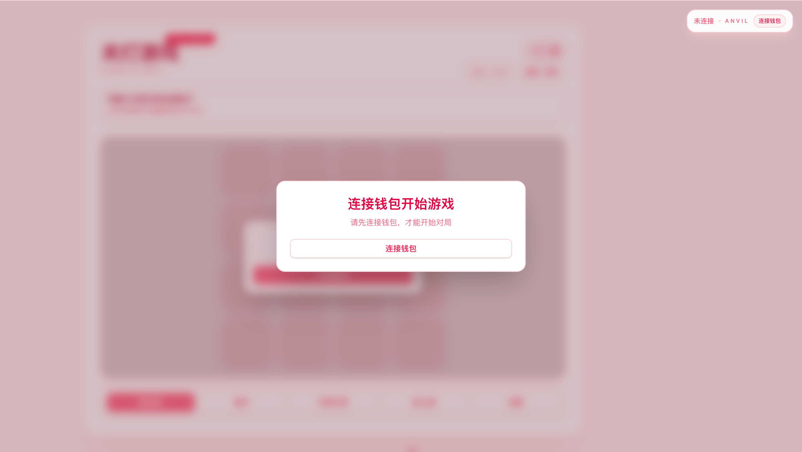
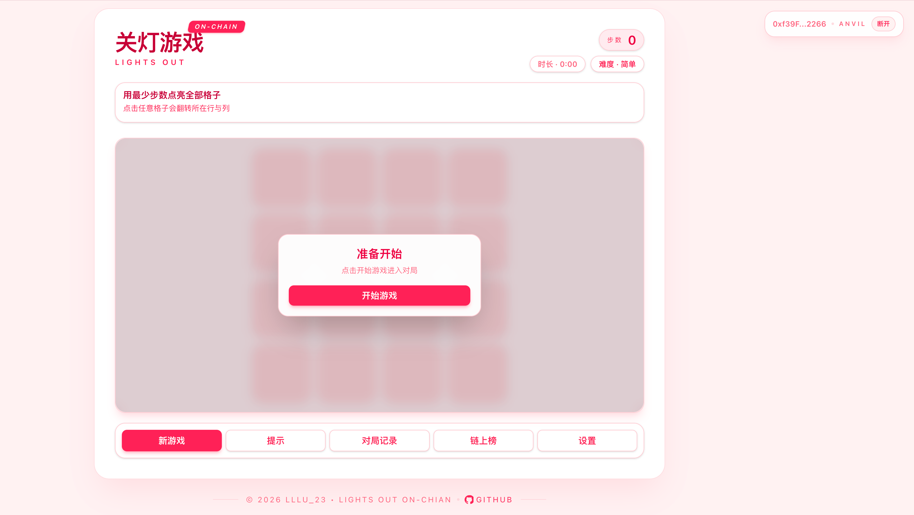
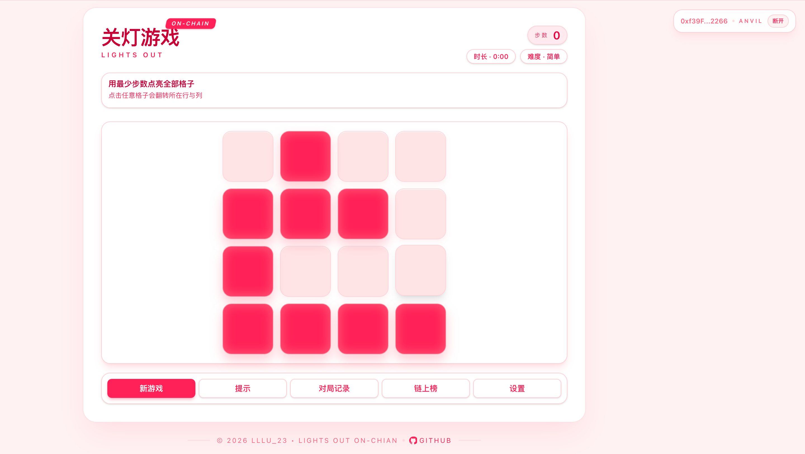
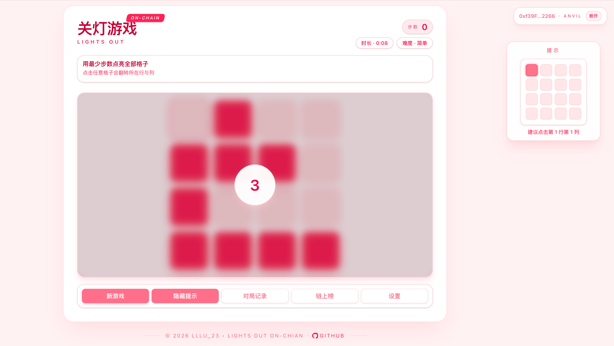
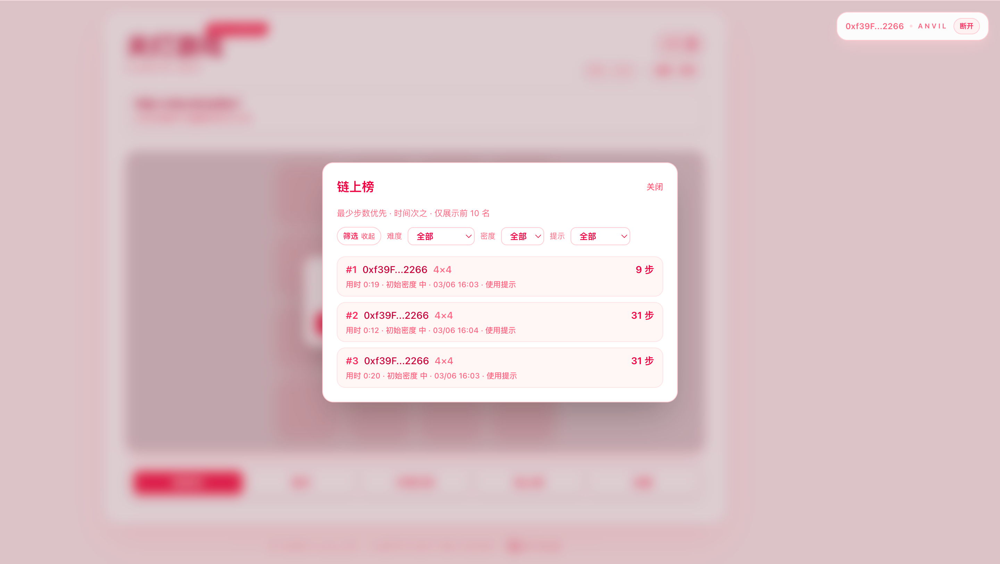
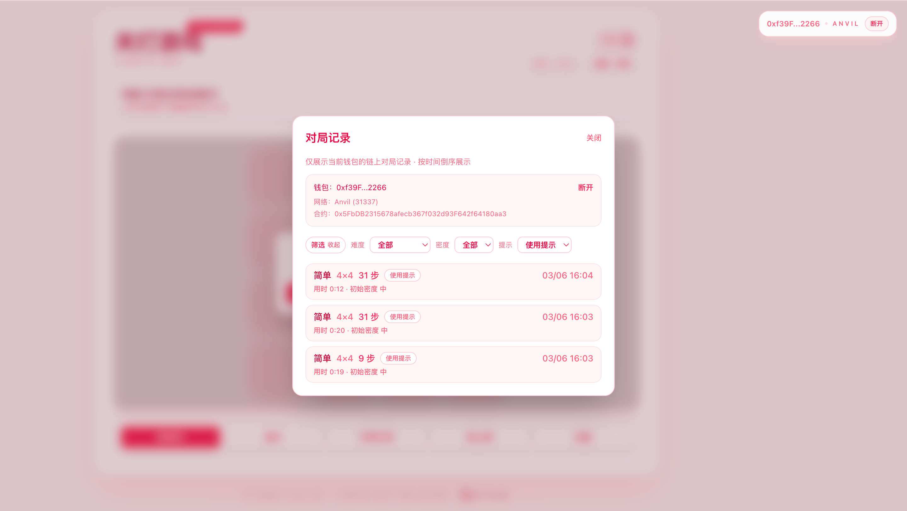
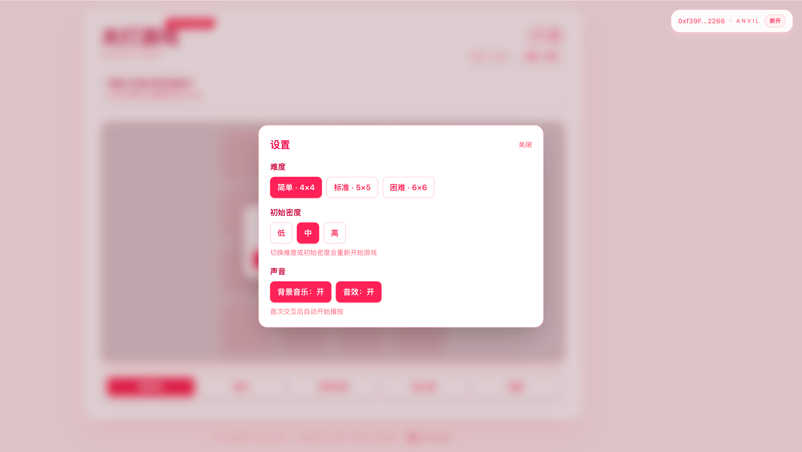

# 07 LightOut Game On-chain（lightout-game-on-chain）

This repo contains the LightOut (0n0FF) puzzle frontend rebuilt with **Next.js + TailwindCSS** and state managed by **Zustand**.

## Demo 展示

**未连接钱包界面**


**游戏主界面（已连接，准备开始）**


**游戏进行中**


**提示面板**


**游戏结束（上链等待签名）**


**链上排行榜弹窗**


**链上记录弹窗**


**设置弹窗**


## 环境变量
合约部署（如需手动部署）：
`cp contracts/.env.example contracts/.env`
- `PRIVATE_KEY`：部署账户私钥（默认 Anvil Account #0：`0xac0974...`，仅本地测试）。

前端地址配置：
`cp frontend/.env.local.example frontend/.env.local`
- `NEXT_PUBLIC_LIGHTS_OUT_ADDRESS`：部署后的合约地址（`make dev` 会自动写入）。

## 📁 Project Structure

- `frontend/` — Next.js app (current active frontend)

## 🚀 Getting Started

```bash
cd frontend
npm install
npm run dev
```

Open [http://localhost:3000](http://localhost:3000) in your browser.

## 标准化命令（统一模板）
```bash
make help
make dev
make deploy
make web
make build-contracts
make test
make anvil
make clean
```
