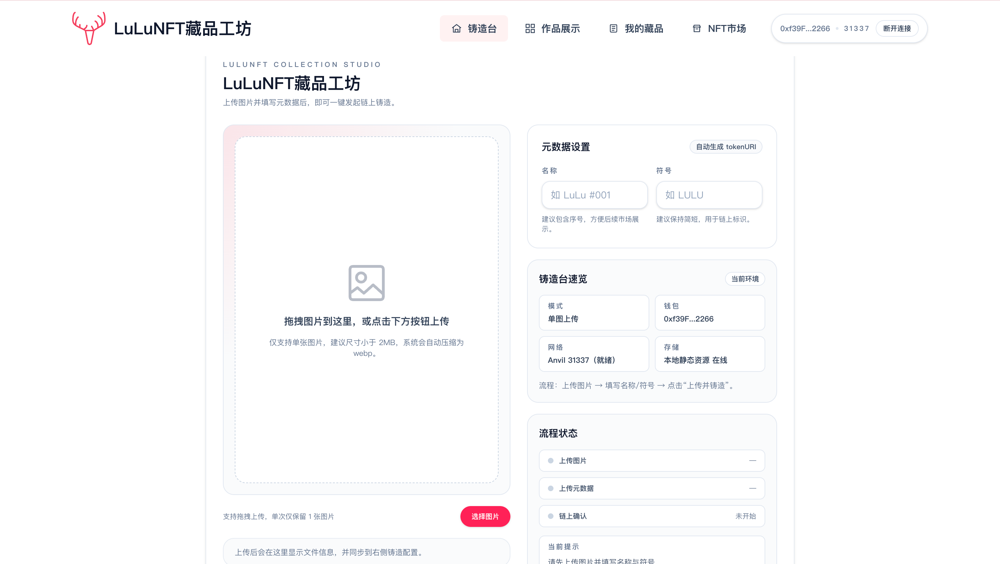
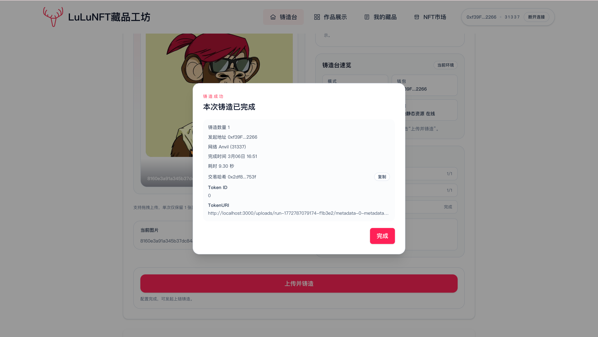
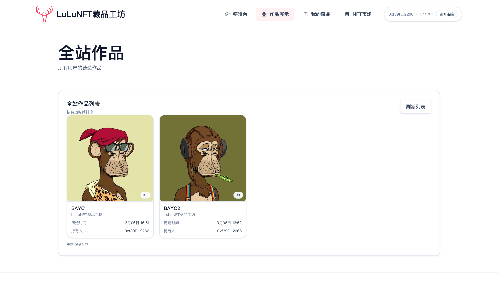
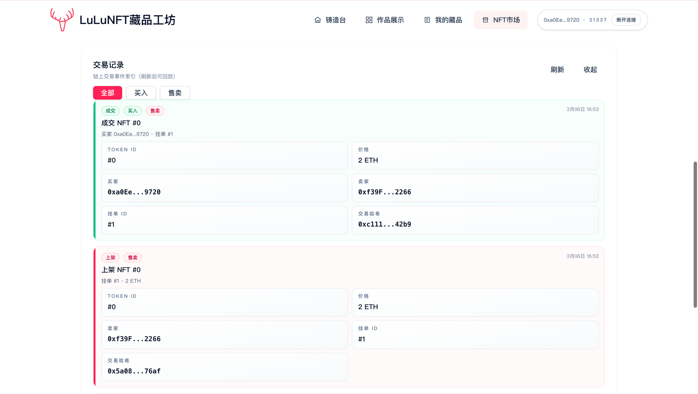

# LuLuNFT藏品工坊

本项目提供一个本地 ERC721 铸造与固定价交易的完整示例：用户可铸造 NFT、上架自己的 NFT、浏览并购买他人挂单，购买后 NFT 自动进入买家钱包，买家可继续二次售卖。

## Demo 展示

**铸造台（空状态）**


**铸造台（已上传待铸造）**


**铸造成功弹窗**


**全站作品页**


**我的藏品管理页**


**NFT 市场挂单页**


**市场交易记录面板**


## 功能概览
- 铸造：支持单个与批量 mint（含 tokenURI）
- 展示：社区展示页 + 我的藏品页
- 交易：固定价上架、取消、购买、失效挂单清理
- 闭环：购买后可再次上架，支持二次售卖
- 活动记录：统一展示授权 / 上架 / 取消 / 购买 / 清理状态

## 技术栈
- 合约：Foundry + OpenZeppelin ERC721
- 前端：Next.js + wagmi/viem
- 存储：HTTP 静态资源 + metadata JSON（`public/uploads`）

## 页面路由
- `/`：铸造台
- `/explore`：全站作品展示
- `/collection`：我的藏品（上架 / 取消上架 / 销毁）
- `/market`：NFT 市场（搜索、筛选、排序、购买）

## 依赖
- Foundry（`anvil`, `forge`）
- Node.js + npm

## 快速开始
1. 在项目根目录创建 `.env` 并配置私钥：
   ```bash
   PRIVATE_KEY=0x...
   ```
2. 一键启动：
   ```bash
   make dev
   ```

`make dev` 会自动：
- 启动本地 Anvil（`http://127.0.0.1:8545`）
- 部署 `MyNFT` 与 `FixedPriceMarket`
- 写入前端 `frontend/.env.local`
- 启动 Next.js 前端

## 常用命令
```bash
make help
make build-contracts
make deploy
make web
make test
make dev
make anvil
make clean
```

## 合约说明
- `contracts/src/MyNFT.sol`
  - 基于 `ERC721URIStorage`
  - 支持 `mint`、`mintWithURI`、`mintBatchWithURI`
- `contracts/src/FixedPriceMarket.sol`
  - 仅支持绑定的 `MyNFT` 合约
  - 非托管挂单（NFT 保留在卖家钱包）
  - 同一 token 同时仅允许 1 个有效挂单
  - 禁止卖家自买
  - `invalidate` 支持清理失效挂单
  - 无平台手续费

## 环境变量
- 根目录 `.env`
  - `PRIVATE_KEY` / `DEPLOYER_PRIVATE_KEY`：部署私钥

- `frontend/.env.local`
  - `NEXT_PUBLIC_RPC_URL`
  - `NEXT_PUBLIC_NFT_ADDRESS`
  - `NEXT_PUBLIC_MARKET_ADDRESS`
  - `STORAGE_PUBLIC_DIR`（可选，默认 `uploads`）
  - `NEXT_PUBLIC_ASSET_BASE_URL`（可选，用于覆盖 tokenURI 基准域名）

## 交易流程（示例）
1. 用户 A 在 `/` 铸造 NFT  
2. 用户 A 在 `/collection` 一键上架（自动授权 + 挂单）  
3. 用户 B 在 `/market` 浏览并购买  
4. 购买成功后 NFT 进入用户 B 钱包  
5. 用户 B 可在 `/collection` 再次上架完成二次售卖

## 资源存储说明
- 推荐方案：HTTP 静态资源 + metadata JSON（教学默认）
- 图片可放在：
  - `frontend/public/uploads/...`（本地最小闭环）
  - 对象存储（R2 / S3 / OSS），并通过 `NEXT_PUBLIC_ASSET_BASE_URL` 指向公网域名
- 合约内 `tokenURI` 使用 HTTP 地址（metadata JSON URL）
- metadata 中 `image` 字段同样为 HTTP 静态资源地址
- 优点：最稳、最容易讲清楚、调试成本最低
- 缺点：中心化（依赖单点存储与服务可用性）

## 前端手动启动
```bash
cd frontend
cp .env.local.example .env.local
npm install
npm run dev
```

## 测试
```bash
make test
```

## 排错指南
- 提示未配置市场地址：检查 `NEXT_PUBLIC_MARKET_ADDRESS`
- 按钮禁用提示网络错误：切换钱包到 `31337`
- 购买失败提示挂单失效：刷新市场或执行挂单清理
- RPC 无响应：确认 anvil 正在运行（`make anvil`）
