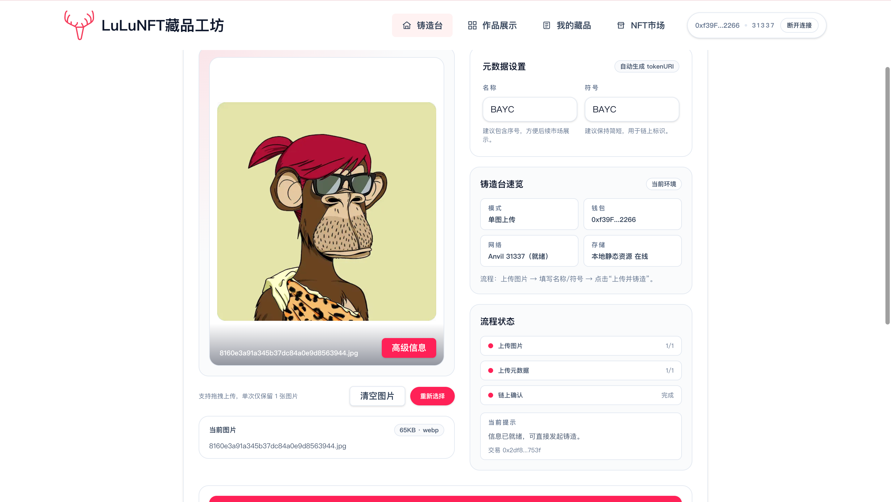
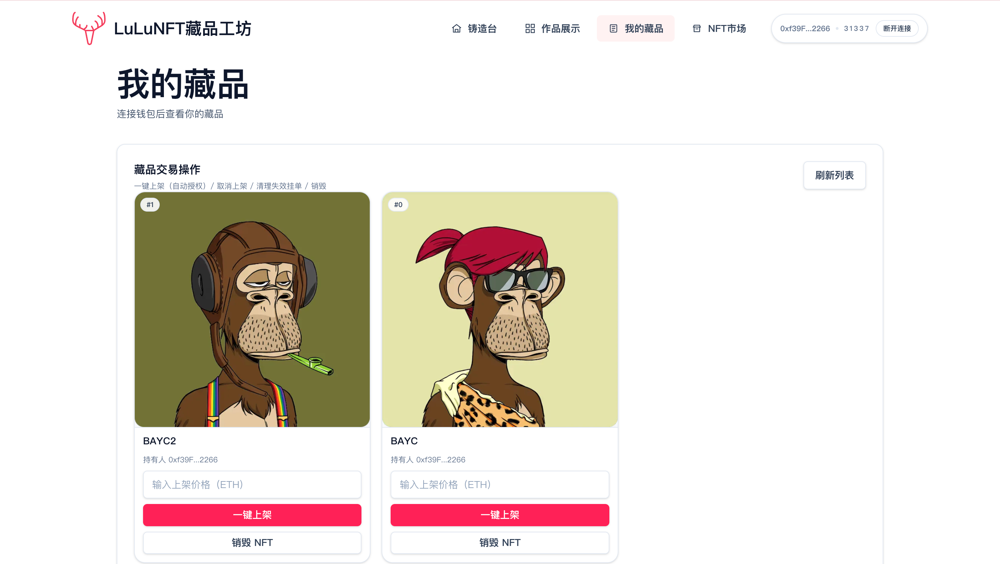

# 08 LuLuNFT Minter（lulu-nft-minter）

## 项目定位与边界
- 本项目是 ERC721 + 固定价市场教学闭环：铸造、上架、购买、二次上架。
- 市场采用**非托管挂单**：NFT 始终在卖家钱包，成交时直接转给买家。
- 教学边界：无手续费、无撮合、无竞价，聚焦最小交易闭环与状态一致性。

## 角色与核心对象
| 角色 | 职责 | 核心对象 |
| --- | --- | --- |
| NFT 持有人 | 铸造并管理自己的 token | `MyNFT`、`tokenURI` |
| 卖家 | 授权市场并创建挂单 | `list/cancel` |
| 买家 | 支付固定价购买 NFT | `buy` |
| 市场合约 | 校验挂单有效性并成交 | `activeListingByToken` |

**NFT 生命周期（主链路）**
```text
mint -> approve(setApprovalForAll) -> list -> buy -> 新持有人可再次 list
```

**非托管挂单语义与风险**
- 挂单期间 NFT 不转入市场合约。
- 若卖家转走 NFT 或撤销授权，挂单会变成 stale。
- 任何人可调用 `invalidate` 清理失效挂单。

## 5 分钟跑通
```bash
cd 08_LuLuNFT-Minter
cp .env.example .env
make dev
```
- `.env` 至少填写 `PRIVATE_KEY`。
- `make dev` 会重启 Anvil、部署 `MyNFT + FixedPriceMarket`、写入前端地址并启动网页。
- 打开 `http://localhost:3000`，钱包切到 `31337`。

## 业务主流程
1. 用户在铸造页调用 `mintWithURI` 或 `mintBatchWithURI`。
2. 在藏品页执行授权（`setApprovalForAll`）并 `list(tokenId,price)`。
3. 市场页读取有效挂单并展示。
4. 买家发起 `buy(listingId)` 并支付精确价格。
5. 合约校验挂单仍有效（所有权 + 授权 + 非自买）。
6. 合约更新挂单状态，NFT 从卖家转给买家，ETH 打给卖家。
7. 买家在 `/collection` 再次上架，完成二次售卖闭环。

## 合约接口与状态
| 接口/事件 | 调用方 | 输入 | 状态变化 | 失败条件 | 前端触发入口 |
| --- | --- | --- | --- | --- | --- |
| `mintWithURI(string)` | 任意用户 | metadata URI | 新增 NFT | 无 | `MintPanel` |
| `mintBatchWithURI(string[])` | 任意用户 | URI 列表 | 批量新增 NFT | `empty` / `too many` | `MintPanel` |
| `list(uint256,uint256)` | 卖家 | tokenId, price | 新增有效挂单 | 非 owner/未授权/重复挂单 | `CollectionMarketPanel` |
| `buy(uint256)` | 买家 | listingId + ETH | 挂单失效、NFT 转移、卖家收款 | 价格不符/挂单失效/自买 | `MarketBoard` |
| `invalidate(uint256)` | 任意地址 | listingId | 清理失效挂单 | 挂单仍有效 | 市场维护操作 |

**关键不变量**
- 同一 `tokenId` 同时最多 1 个有效挂单（`activeListingByToken`）。
- 成交前再次校验实时 owner/approval，避免 stale 挂单误成交。
- 市场无平台抽成，成交款全额支付卖家。

## 代码架构与调用链
| 页面/模块 | 主要职责 | 下游调用 |
| --- | --- | --- |
| `frontend/src/app/page.tsx` | 铸造台入口 | `components/MintPanel.tsx` |
| `frontend/src/app/collection/page.tsx` | 我的藏品与上架管理 | `CollectionMarketPanel` |
| `frontend/src/app/market/page.tsx` | 市场浏览与购买 | `MarketBoard` |
| `frontend/src/lib/contracts.ts` | NFT/Market 合约读写封装 | wagmi/viem |
| `contracts/src/MyNFT.sol` / `FixedPriceMarket.sol` | 资产与交易状态核心 | 链上事件与映射 |

## 命令与环境变量
**推荐命令（项目根目录）**
```bash
make help
make dev
make deploy
make web
make build-contracts
make test
make anvil
make clean
```
- `make test` 会在 `frontend/node_modules` 缺失时自动执行 `npm ci --no-audit --no-fund`，无需手工先装前端依赖。

**关键环境变量**
- 根目录 `.env`：`PRIVATE_KEY`（或 `DEPLOYER_PRIVATE_KEY`）。
- `frontend/.env.local`：
  - `NEXT_PUBLIC_RPC_URL`
  - `NEXT_PUBLIC_NFT_ADDRESS`
  - `NEXT_PUBLIC_MARKET_ADDRESS`
  - `STORAGE_PUBLIC_DIR`（默认 `uploads`）
  - `NEXT_PUBLIC_ASSET_BASE_URL`（可选）

## 验收与排错
| 症状 | 可能原因 | 修复命令/动作 |
| --- | --- | --- |
| 上架按钮失败 | 未授权市场合约 | 先执行授权 |
| 购买回滚 `bad price` | 发送 ETH 与挂单价不一致 | 按挂单价精确支付 |
| 购买回滚 `stale owner/approval` | 卖家已转走 NFT 或撤销授权 | 刷新挂单，必要时 `invalidate` |
| 页面提示地址未配置 | 未部署或 env 未同步 | `make deploy` |
| RPC 无响应 | 本地链未启动 | `make dev` 或 `make anvil` |

## Demo 展示




## 作者
- `lllu_23`
