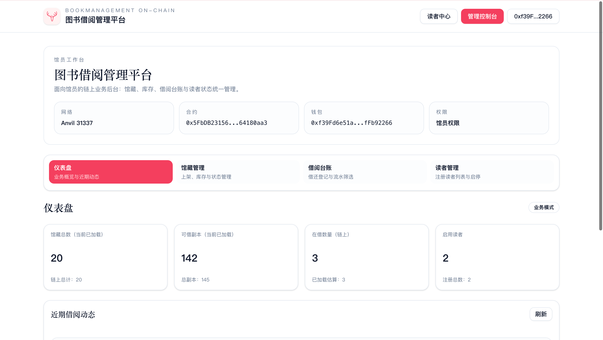
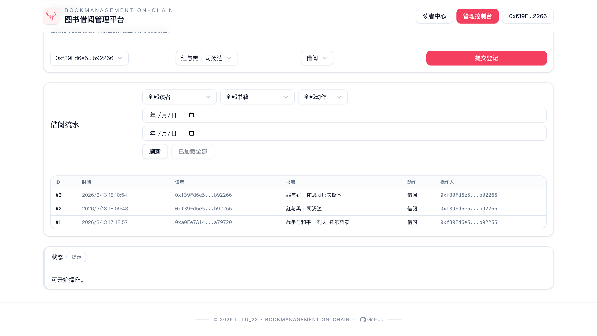
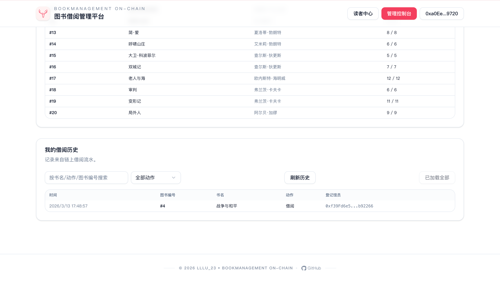

# 09 BookManagement On-chain（book-management-on-chain）

## 项目定位与边界
- 这是链上图书借阅管理教学项目，覆盖“馆员后台 + 读者中心”双端流程。
- 数据边界：链上保存哈希摘要与借阅状态，不存图书明文全文。
- 教学目标：把权限模型、库存约束、借还台账三类业务状态讲清楚。

## 角色与核心对象
**角色权限矩阵**
| 角色 | 关键权限 | 典型函数 |
| --- | --- | --- |
| Owner | 管理操作员、转移 owner | `setOperator`、`transferOwnership` |
| Operator（馆员） | 馆藏与读者管理、借还登记 | `registerBook`、`borrowBook`、`returnBook` |
| Reader（读者） | 自助注册、查询记录 | `registerReader`、只读接口 |

**核心实体模型**
| 实体 | 关键字段 | 说明 |
| --- | --- | --- |
| `Book` | `contentHash/metaHash/policyHash/totalCopies/availableCopies` | 馆藏与库存状态 |
| `ReaderState` | `registered/active/registeredAt` | 读者账号状态 |
| `BorrowRecord` | `reader/bookId/isBorrow/timestamp/operator` | 借还流水日志 |

## 5 分钟跑通
```bash
cd 09_BookManagement-On-chain
cp .env.example .env
cp frontend/.env.local.example frontend/.env.local
make dev
```
- `make dev` 会执行：`restart-anvil -> deploy -> web`。
- 部署后自动写入 `NEXT_PUBLIC_CONTRACT_ADDRESS` 并同步 ABI。
- 打开 `http://localhost:3000`，连接 `31337`。
- `make deploy` 现在会自动确保本地 Anvil 可用，不再默认依赖外部先启动 `127.0.0.1:8545`。

## 业务主流程
**馆员链路**
1. Owner 设置/维护 operator。
2. Operator 上架图书并设置库存。
3. Operator 启停读者状态。
4. Operator 执行借阅登记 `borrowBook`。
5. Operator 执行归还登记 `returnBook`。
6. 前端台账页读取 `BorrowRecord` 并实时回显。

**读者链路**
1. 读者钱包自助 `registerReader`。
2. 读者在前端查询馆藏与个人借阅状态。
3. 借还由馆员登记后，读者页自动读到链上最新数据。

## 合约接口与状态
| 接口/事件 | 调用方 | 输入 | 状态变化 | 失败条件 | 前端触发入口 |
| --- | --- | --- | --- | --- | --- |
| `registerBook(...)` / `registerBooks(...)` | Operator | 哈希 + 库存 | 新增馆藏 | 哈希为空/库存为 0 | 管理端馆藏页 |
| `setBookTotalCopies` | Operator | bookId, newTotal | 调整库存 | 新库存低于在借量 | 管理端馆藏页 |
| `borrowBook(reader,bookId)` | Operator | 读者 + 图书 | 可借库存 -1、写借阅流水 | 读者未激活/无库存/重复借阅 | 借阅台账页 |
| `returnBook(reader,bookId)` | Operator | 读者 + 图书 | 可借库存 +1、写归还流水 | 当前未在借 | 借阅台账页 |
| `registerReader()` | Reader | 无 | 读者注册并激活 | 重复注册 | 读者端入口 |

## 代码架构与调用链
| 页面/模块 | 主要职责 | 下游调用 |
| --- | --- | --- |
| `frontend/src/app/(admin)/admin/page.tsx` | 馆员工作台入口 | `tabs/catalog/loans/readers` |
| `frontend/src/app/(public)/reader/page.tsx` | 读者中心入口 | 借阅记录查询 hooks |
| `frontend/src/hooks/use-borrow-records.ts` | 借阅流水读取 | `getBorrowRecordCount/getBorrowRecordAt` |
| `frontend/src/hooks/use-admin-access.ts` | 权限门禁 | `owner/operators` 读链 |
| `contracts/src/BookManagement.sol` | 权限、库存、借还状态核心 | 事件驱动前端刷新 |

## 命令与环境变量
**推荐命令（项目根目录）**
```bash
make help
make dev
make deploy
make web
make web-preview
make build-contracts
make test
make anvil
make clean
```
- `make deploy` 会在本地链未就绪时自动拉起 Anvil，然后再执行部署与同步。

**关键环境变量**
- 根目录 `.env`：`RPC_URL`、`PRIVATE_KEY`、`CHAIN_ID`。
- 前端 `frontend/.env.local`：`NEXT_PUBLIC_CHAIN_ID`、`NEXT_PUBLIC_RPC_URL`、`NEXT_PUBLIC_CONTRACT_ADDRESS`。

## 验收与排错
| 症状 | 可能原因 | 修复命令/动作 |
| --- | --- | --- |
| 管理端写操作失败 | 当前钱包不是 owner/operator | 切换授权账号 |
| 读者无法借阅 | 读者未注册或被停用 | 检查 `registerReader` 与 `setReaderActive` |
| 库存调整报错 | 新库存小于当前在借量 | 先归还部分图书再调整 |
| 页面提示缺少合约地址 | 未部署或 env 未写入 | `make deploy` |
| 3000 端口占用 | 本地已有服务占用 | `make dev WEB_PORT=3001` |

## Demo 展示




## 作者
- `lllu_23`
