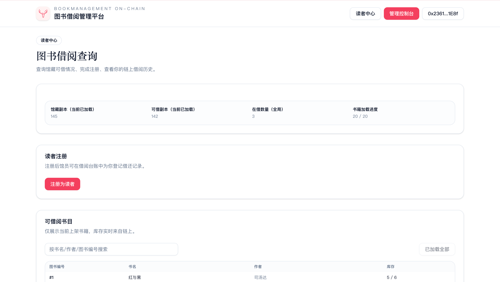
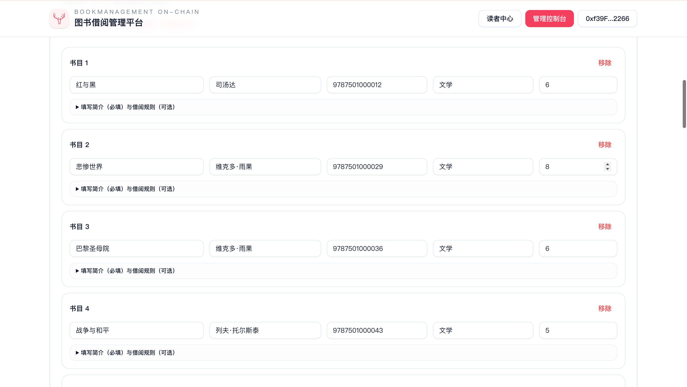
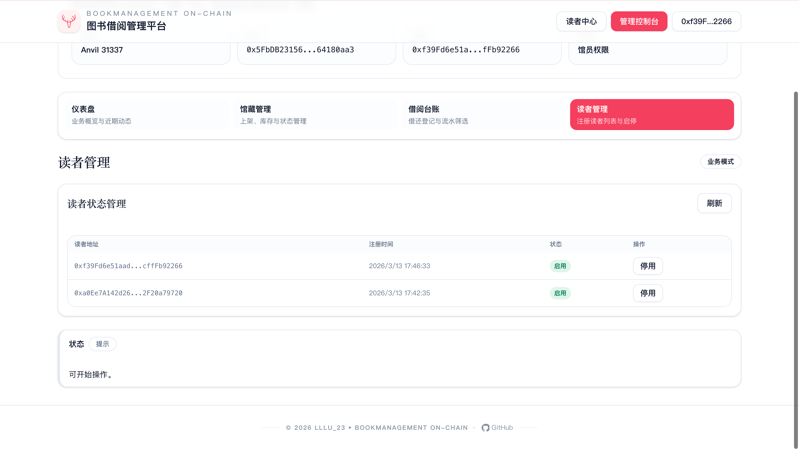

# 09_BookManagement-On-chain

## 项目简介
一个面向校内场景的链上图书借阅管理平台，已重构为无 ZK 架构：
- 馆员端：馆藏管理、库存调整、借阅台账、读者管理
- 读者端：钱包注册、书目查询、个人借阅历史查询

## 技术栈
- Contracts: Foundry / Solidity 0.8.x
- Frontend: Next.js 16 + React 19 + Tailwind 4
- Web3: wagmi + viem
- Local Chain: Anvil (chainId 31337)

## 快速开始
```bash
cd 09_BookManagement-On-chain
make dev
```

`make dev` 会执行：
1. 重启本地 Anvil（`chainId=31337`）
2. 部署 `BookManagement` 合约
3. 同步 ABI 到前端
4. 写入 `frontend/.env.local` 的 `NEXT_PUBLIC_CONTRACT_ADDRESS`
5. 启动前端开发服务器

## 目录结构（核心）
```text
09_BookManagement-On-chain/
├── Makefile
├── README.md
├── .env.example
├── docs-assets/                 # Demo 图片目录
├── contracts/
│   ├── src/
│   ├── test/
│   └── .env.example
└── frontend/
    ├── src/
    ├── public/
    └── .env.local.example
```

## 标准化命令（统一模板）
```bash
make help
make dev
make deploy
make web
make web-preview
make build-contracts
make test
make anvil
make clean
```

## 环境变量模板
根目录 `.env.example`：
- `RPC_URL=http://127.0.0.1:8545`
- `PRIVATE_KEY=<anvil-account-private-key>`
- `CHAIN_ID=31337`

前端 `frontend/.env.local.example`：
- `NEXT_PUBLIC_CHAIN_ID=31337`
- `NEXT_PUBLIC_RPC_URL=http://127.0.0.1:8545`
- `NEXT_PUBLIC_CONTRACT_ADDRESS=0x0000000000000000000000000000000000000000`

## 核心链路
用户操作 -> 钱包签名 -> 链上事件 -> 前端回显

业务主路径：
1. 馆员上架书籍：`registerBook`（含库存）
2. 馆员维护书籍状态：`setBookActive`
3. 馆员维护库存：`setBookTotalCopies`
4. 读者注册：`registerReader`
5. 馆员启停读者：`setReaderActive`
6. 馆员借阅登记：`borrowBook(reader, bookId)`
7. 馆员归还登记：`returnBook(reader, bookId)`
8. 查询链上借阅流水：`getBorrowRecordCount/getBorrowRecordAt`

## 验收与排错
最低验收清单：
```bash
cd contracts && forge test
cd frontend && npm run check
cd frontend && npx tsc --noEmit
cd frontend && npm run build
```

常见排错：
1. 管理端提示“缺少 NEXT_PUBLIC_CONTRACT_ADDRESS”：先执行 `make deploy` 或 `make dev`。
2. 管理端写操作失败：确认钱包网络为 `31337` 且地址是 owner/operator。
3. 读者无法借阅：确认读者已注册且处于启用状态。
4. 库存调整失败：新库存不能小于当前在借数量。
5. 启动报 `EADDRINUSE ... :3000`：可使用 `make dev WEB_PORT=3001`。
6. 前端 typecheck/build 卡住：清理 `frontend/.next` 后重试，并核对 Node/npm 与锁文件是否一致。

更详细回归参考：[REGRESSION_CHECKLIST.md](./REGRESSION_CHECKLIST.md)。

## UI 组件同步约定
- 优先复用 `frontend/src/components/ui` 现有基础组件，不进行全库扫描式重拷贝。
- 新增业务组件时，先在业务目录组合已有组件；仅在缺基础能力时再新增 `ui` 原子组件。
- 样式变量与交互态保持与现有后台工作台一致，避免引入平行设计体系。

## Demo 展示
### 首页


### 读者中心总览


### 读者借阅历史


### 管理端 - 仪表盘


### 管理端 - 馆藏管理


### 管理端 - 借阅台账


### 管理端 - 读者管理

