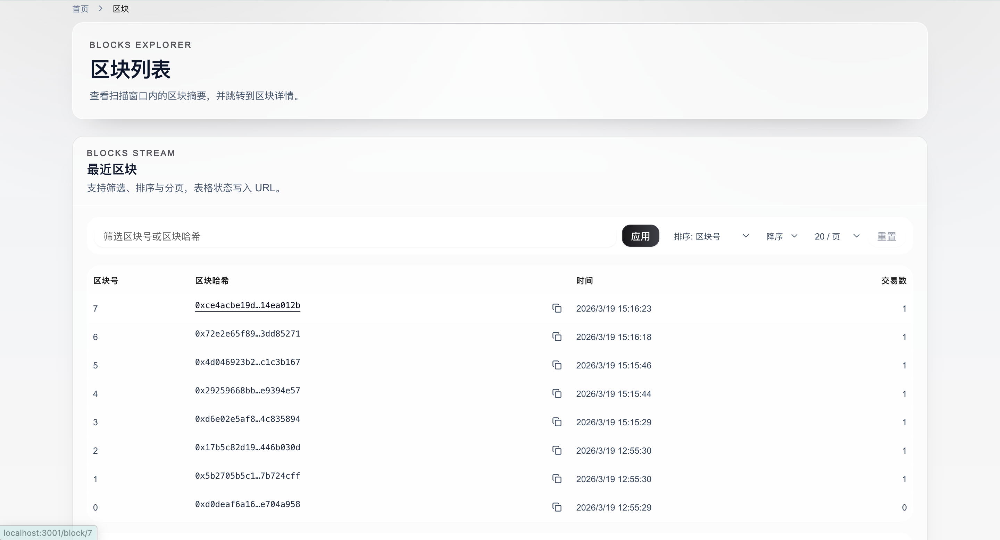
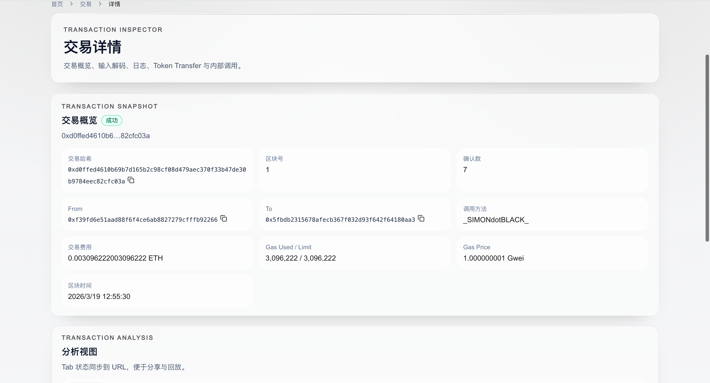

# 10 AnvilExplorer（anvil-explorer）

## 项目定位与边界
- 这是本地 Anvil 测试链浏览器教学版，目标是给学习过程提供“可观测性”与“调试面板”。
- 项目由前端 + indexer + RPC 组成，支持 indexer 优先与 RPC 回退。
- 边界：只面向本地开发链，不提供生产级归档检索、权限审计或多链治理。

## 角色与核心对象
| 角色 | 职责 | 核心对象 |
| --- | --- | --- |
| 开发者 | 查区块/查交易/查地址/调试 RPC | 首页、详情页、Cast 控制台 |
| Indexer 服务 | 增量同步区块并落库 | SQLite（`.data/explorer.db`） |
| 前端数据源层 | 在 indexer 与 RPC 之间做策略切换 | `auto/indexer/rpc` |

**系统拓扑**
```text
Frontend (Next.js)
  -> Next API(/api/cast)
  -> Indexer API(/v1/*)
  -> RPC(Anvil)
Indexer
  -> RPC 拉块/回执
  -> SQLite 持久化
```

## 5 分钟跑通
```bash
cd 10_AnvilExplorer
cp frontend/.env.local.example frontend/.env.local
make dev
```
- `make dev` 会执行：启动 anvil + indexer + frontend。
- 前端默认地址 `http://localhost:3000`，indexer 默认 `http://127.0.0.1:8787`。

## 业务主流程
1. 前端读取数据源模式（`auto/indexer/rpc`）。
2. 首页请求最近区块和交易。
3. 若模式允许，优先调用 indexer `/v1/*` 读取聚合数据。
4. indexer 异常时按策略回退 RPC 直连读取。
5. 用户进入区块/交易/地址详情页做深度排查。
6. 需要调试时通过 Cast 控制台走 `/api/cast` 或 debug route。
7. 前端按刷新间隔持续更新链状态。

## 合约接口与状态
> 本项目无业务合约；此处对应“服务接口与数据状态”。

| 接口 | 调用方 | 输入 | 状态变化/返回 | 失败条件 | 前端入口 |
| --- | --- | --- | --- | --- | --- |
| `GET /v1/blocks` | 前端 | 分页/排序参数 | 返回区块摘要 | indexer 不可用 | 首页区块表 |
| `GET /v1/transactions` | 前端 | 区块区间/游标 | 返回交易列表 | indexer 不可用 | 首页交易表 |
| `GET /v1/transactions/:hash` | 前端 | tx hash | 返回 tx+receipt+trace(best-effort) | hash 无效/不存在 | 交易详情页 |
| `POST /api/cast` | 前端 | 只读 RPC method/action | 统一 `{ok,result,error}` | method 不在白名单 | Cast 控制台 |
| `POST /v1/debug/*` | 前端/调试脚本 | snapshot/time/impersonate 等 | 本地链调试结果 | 参数非法/非本地链能力 | 调试工具链 |

## 代码架构与调用链
| 页面/模块 | 主要职责 | 下游调用 |
| --- | --- | --- |
| `frontend/app/page.tsx` | 首页总览 | `lib/data.ts` |
| `frontend/lib/data-source.ts` | 数据源策略与回退控制 | `indexer-client.ts` / `rpc.ts` |
| `frontend/app/api/cast/route.ts` | Cast 网关与只读白名单 | Indexer debug RPC / RPC |
| `services/indexer/src/sync/*` | 增量同步与 reorg 处理 | Anvil RPC |
| `services/indexer/src/api/routes/*` | 读取与调试 API | SQLite + RPC |

**`auto/indexer/rpc` 回退策略**
- `rpc`：强制只走 RPC，不访问 indexer。
- `indexer`：优先 indexer，是否回退取决于 `NEXT_PUBLIC_RPC_FALLBACK`。
- `auto`：优先 indexer，失败后自动回退 RPC。

## 命令与环境变量
**推荐命令（项目根目录）**
```bash
make help
make dev
make start
make web
make anvil
make indexer
make deploy
make build-contracts
make test
make clean
```

**关键环境变量（`frontend/.env.local`）**
- `NEXT_PUBLIC_DATA_SOURCE=auto|indexer|rpc`
- `NEXT_PUBLIC_RPC_FALLBACK=true|false`
- `NEXT_PUBLIC_RPC_URL`、`NEXT_PUBLIC_INDEXER_URL`、`NEXT_PUBLIC_CHAIN_ID`
- `NEXT_PUBLIC_SCAN_BLOCKS`、`NEXT_PUBLIC_REFRESH_MS`

## 验收与排错
| 症状 | 可能原因 | 修复命令/动作 |
| --- | --- | --- |
| 页面无数据 | anvil 或 indexer 未启动 | `make dev` |
| indexer 数据滞后 | 同步落后或异常 | 看 `services/indexer` 日志，重启 `make indexer` |
| Cast 请求被拒绝 | method 不在白名单 | 改用允许的只读 method |
| 地址详情加载很慢 | 扫描窗口过大 | 降低 `NEXT_PUBLIC_SCAN_BLOCKS` |
| 强制直连 RPC 仍失败 | RPC URL 错误或节点未就绪 | 检查 `NEXT_PUBLIC_RPC_URL` 与 anvil 状态 |

## Demo 展示



