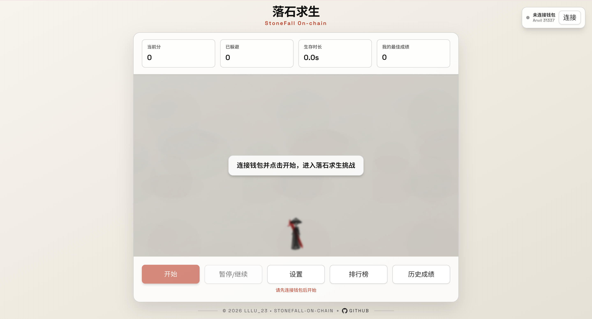
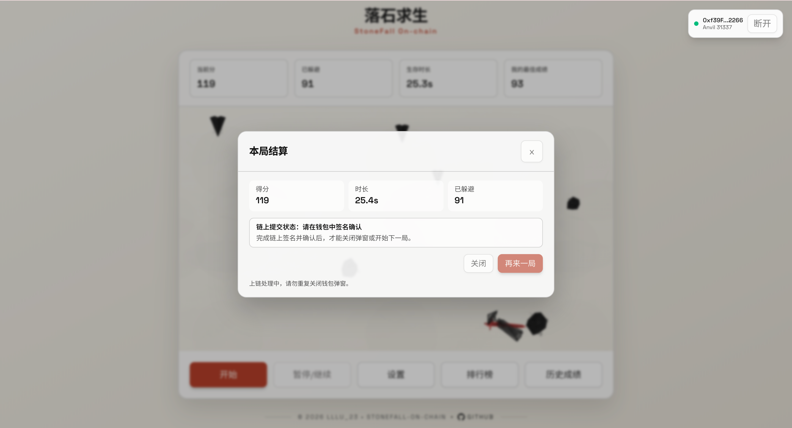
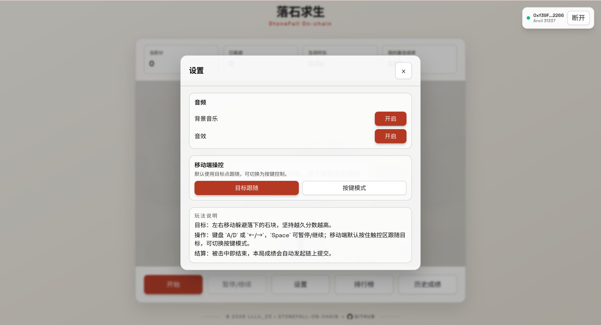
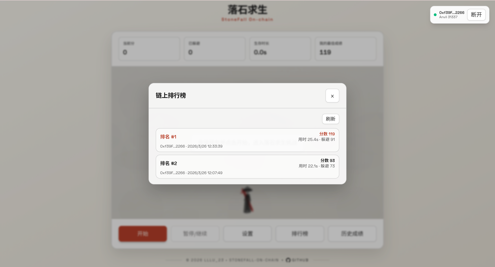
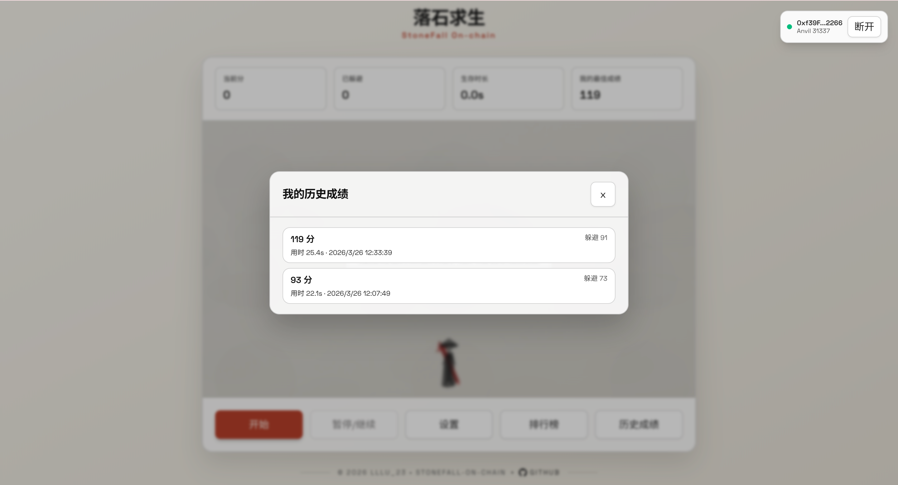

# 12 StoneFall On-chain（stonefall-on-chain）

## 项目定位与边界
- 这是 Phaser 横版躲避链游教学项目：游戏循环在本地，结算后提交链上成绩。
- 保留 Vite（非 Next.js）是本项目的明确例外，用于保持 Phaser 开发体验。
- 教学重点：本地实时渲染 + 链上排行榜/历史 + 自动提交状态机。

## 角色与核心对象
| 角色 | 职责 | 核心对象 |
| --- | --- | --- |
| 玩家 | 躲避障碍并上链提交成绩 | `score/survivalMs/totalDodged` |
| 前端控制器 | 同步 Phaser 事件、交易状态、查询刷新 | `App.tsx` + `GameScene` |
| 合约 `StoneFallScoreboard` | 保存 Top10、历史、最佳分 | `bestScoreOf`、`getUserHistory` |

## 5 分钟跑通
```bash
cd 12_StoneFall-On-chain
cp .env.example .env
cp frontend/.env.local.example frontend/.env.local
make dev
```
- `make dev` 会执行：`restart-anvil -> deploy -> web`。
- `make deploy` 会先确保本地 Anvil 可用，再调用 `contracts/script/Deploy.s.sol`，并通过 `scripts/sync-contract.js` 同步 ABI、`contract-config.json` 与前端 env。
- 打开 Vite 地址（通常 `http://localhost:5173`），连接 `31337`。

## 业务主流程
1. 玩家连接钱包并开始游戏。
2. Phaser `GameScene` 本地实时计算分数、用时、躲避数。
3. `gameover` 事件把局结果推给 React 状态层。
4. 前端自动调用 `submitScore(score,survivalMs,totalDodged)`。
5. 合约更新最佳分、排行榜、历史环形缓冲。
6. `ScoreSubmitted` 事件触发前端失效查询并刷新弹窗数据。
7. 如事件丢失，前端轮询做兜底刷新。

**计分维度与结算字段**
- `score`：主排行分数。
- `survivalMs`：同分时的第二排序字段。
- `totalDodged`：躲避总数，写入历史供复盘展示。

## 合约接口与状态
| 接口/事件 | 调用方 | 输入 | 状态变化 | 失败条件 | 前端触发入口 |
| --- | --- | --- | --- | --- | --- |
| `submitScore(uint32,uint32,uint32)` | 玩家 | 分数、用时、躲避数 | 更新最佳分/榜单/历史 | `score=0` 回滚 | 自动提交逻辑 |
| `getLeaderboard()` | 任意读 | 无 | 无 | 无 | 排行榜弹窗 |
| `getUserHistory(player,offset,limit)` | 任意读 | 分页参数 | 无 | 越界返回空 | 历史弹窗 |
| `getUserHistoryCount(player)` | 任意读 | 地址 | 无 | 无 | 分页判断 |
| `ScoreSubmitted` | 合约发出 | 成绩字段 | 事件日志 | 无 | 事件刷新 |

## 代码架构与调用链
| 页面/模块 | 主要职责 | 下游调用 |
| --- | --- | --- |
| `frontend/src/game/scenes/GameScene.ts` | 本地玩法、计分、gameover 输出 | `TypedEventBus` |
| `frontend/src/features/game/GameCanvas.tsx` | 挂载 Phaser 实例 | `createStoneFallGame` |
| `frontend/src/App.tsx` | 钱包门禁、自动提交、链上查询 | `lib/contract.ts` |
| `frontend/src/features/ui/modals/*` | 排行榜/历史/结算 UI | React Query 数据 |
| `contracts/src/StoneFallScoreboard.sol` | 链上成绩状态核心 | 排序 + 环形缓冲 |

**Phaser -> 合约调用链（简化）**
```text
GameScene onGameOver
  -> App pendingSubmission
  -> submitScoreOnchain()
  -> StoneFallScoreboard.submitScore
  -> ScoreSubmitted event
  -> invalidateQueries + UI 刷新
```

**运行时配置优先级**
```text
frontend/public/contract-config.json
  > frontend/.env.local
  > 默认值
```

## 命令与环境变量
**推荐命令（项目根目录）**
```bash
make help
make dev
make deploy
make web
make build-contracts
make test
make anvil
make clean
```
- `make test` 会在 `frontend/node_modules` 缺失时自动执行 `npm ci --no-audit --no-fund`，并继续跑 `lint + typecheck + test + build`。

**关键环境变量**
- 根目录 `.env`：`PRIVATE_KEY`、`RPC_URL`、`CHAIN_ID`。
- 前端 `frontend/.env.local`：
  - `VITE_CHAIN_ID=31337`
  - `VITE_RPC_URL=http://127.0.0.1:8545`
  - `VITE_STONEFALL_ADDRESS=0x...`
  - `VITE_E2E_BYPASS_WALLET=false`
  - `VITE_E2E_TEST_PRIVATE_KEY=`

**部署与同步职责**
- `contracts/script/Deploy.s.sol`：唯一部署入口。
- `scripts/sync-contract.js`：同步 ABI、`contract-config.json` 和 `.env.local`。
- `frontend/src/lib/runtime-config.ts`：浏览器优先读取 runtime config，再回退 env/default。

**E2E 绕钱包边界**
- `VITE_E2E_BYPASS_WALLET=true` 仅用于自动化测试，不用于教学主流程。
- 开启后由测试私钥直接签名，跳过浏览器钱包弹窗。

## 验收与排错
| 症状 | 可能原因 | 修复命令/动作 |
| --- | --- | --- |
| 开始按钮灰置 | 钱包未连/链错误/地址未同步 | 连接钱包并执行 `make deploy` |
| 结算后未自动提交 | 钱包拒签或交易错误 | 查看弹窗错误并重试提交 |
| 排行榜不更新 | 事件漏触发或查询缓存未失效 | 等待轮询或手动刷新弹窗 |
| E2E 模式报测试钱包缺失 | 未配置测试私钥 | 设置 `VITE_E2E_TEST_PRIVATE_KEY` |
| `make dev` 失败 | 缺少 `anvil/forge/node` | 安装依赖后重试 |

## Demo 展示







## 作者
- `lllu_23`
