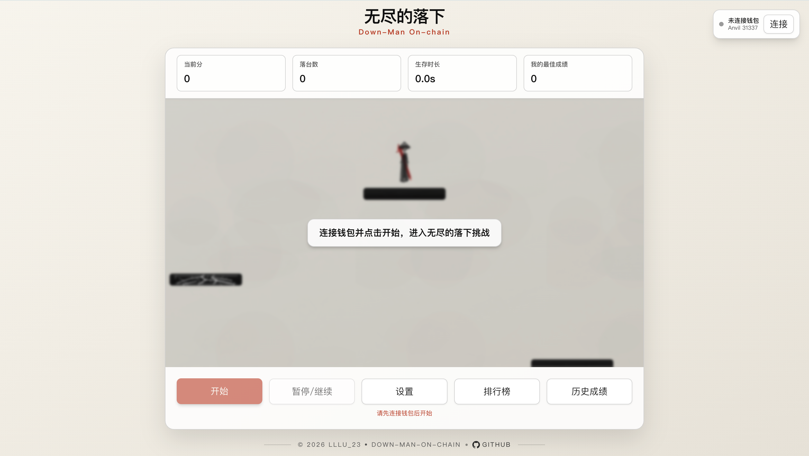
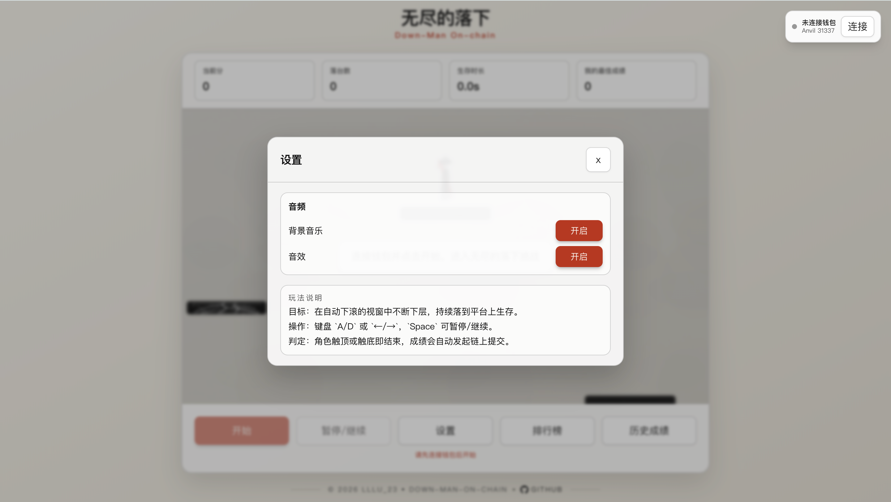
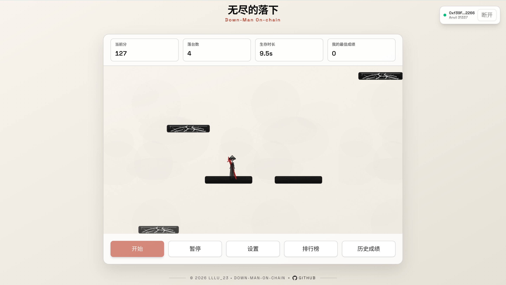
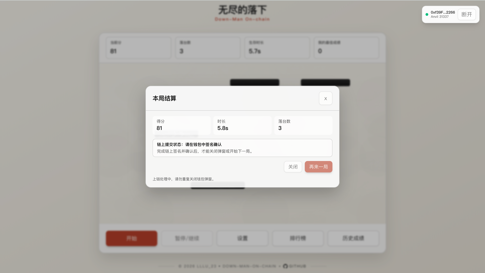
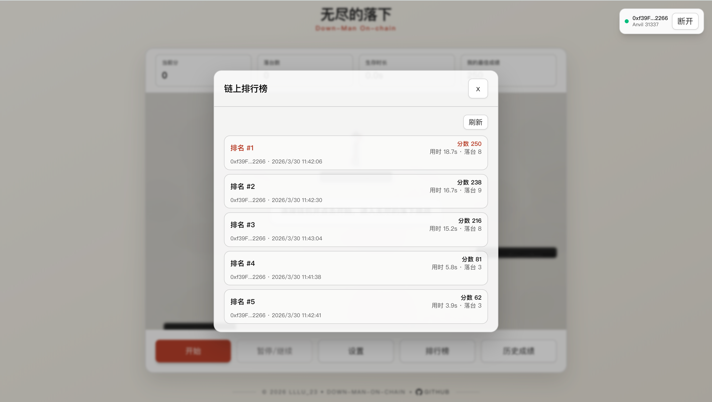
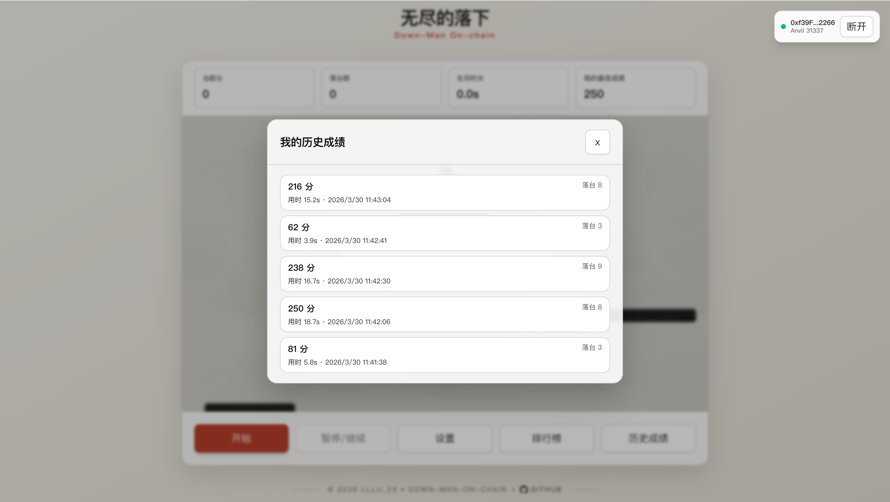

# 13 Down-Man On-chain（down-man-on-chain）

## 项目定位与边界
- 这是 Phaser 下落生存链游教学项目：本地实时游戏，结算提交链上。
- 与 StoneFall 同构，但玩法指标不同：强调“落台次数 + 生存时长”的下落策略。
- 教学重点：高频 HUD 与低频链上查询分离、事件刷新 + 主动轮询双保险。

## 角色与核心对象
| 角色 | 职责 | 核心对象 |
| --- | --- | --- |
| 玩家 | 控制角色下落、落台、生存并结算 | `score/survivalMs/totalLandings` |
| 前端状态层 | 处理自动提交、重试、查询失效节流 | `App.tsx` 提交状态机 |
| 合约 `DownManScoreboard` | 排行榜、历史、最佳分 | `bestScoreOf`、`ScoreSubmitted` |

## 5 分钟跑通
```bash
cd 13_Down-Man-On-chain
cp .env.example .env
cp frontend/.env.local.example frontend/.env.local
make dev
```
- `make dev` 会执行：`restart-anvil -> deploy -> web`。
- `make deploy` 会先确保本地 Anvil 可用，再调用 `contracts/script/Deploy.s.sol`，并通过 `scripts/sync-contract.js` 同步 ABI、`contract-config.json` 与前端 env。
- 启动后访问 Vite 地址（通常 `http://localhost:5173`），连接 `31337`。

## 业务主流程
1. 玩家连接钱包并开局。
2. 本地 `GameScene` 计算生存时长与落台数据，实时更新 HUD。
3. 游戏结束触发自动提交。
4. 前端把 `totalLandings` 映射为合约字段 `totalDodged` 调用 `submitScore`。
5. 合约更新 Top10、个人历史、最佳分。
6. 前端监听 `ScoreSubmitted` 精准刷新相关查询。
7. 页面可见且弹窗打开时，轮询作为兜底补刷新。

**玩法特有指标映射**
| 前端语义 | 合约字段 | 说明 |
| --- | --- | --- |
| `score` | `score` | 主排名字段 |
| `survivalMs` | `survivalMs` | 同分次排序字段 |
| `totalLandings` | `totalDodged` | 兼容旧接口命名，提交边界做映射 |

## 合约接口与状态
| 接口/事件 | 调用方 | 输入 | 状态变化 | 失败条件 | 前端触发入口 |
| --- | --- | --- | --- | --- | --- |
| `submitScore(uint32,uint32,uint32)` | 玩家 | 分数/用时/落台映射值 | 更新最佳分、榜单、历史 | `score=0` 回滚 | 自动结算提交流程 |
| `getLeaderboard()` | 任意读 | 无 | 无 | 无 | 排行榜弹窗 |
| `getUserHistory(player,offset,limit)` | 任意读 | 分页参数 | 无 | 越界返回空 | 历史弹窗 |
| `getUserHistoryCount(player)` | 任意读 | 地址 | 无 | 无 | 分页判断 |
| `ScoreSubmitted` | 合约发出 | 玩家与成绩字段 | 事件日志 | 无 | 事件驱动刷新 |

## 代码架构与调用链
| 页面/模块 | 主要职责 | 下游调用 |
| --- | --- | --- |
| `frontend/src/game/scenes/GameScene.ts` | 下落玩法主循环与统计 | `onGameOver` 输出 |
| `frontend/src/features/ui/LiveGameHud.tsx` | 高频 HUD（仅本地） | 订阅 controller 状态 |
| `frontend/src/App.tsx` | 自动提交、重试、链上查询 | `lib/contract.ts` |
| `frontend/src/features/ui/modals/*` | 链上排行榜/历史展示 | React Query |
| `contracts/src/DownManScoreboard.sol` | 排行榜与历史状态核心 | 环形缓冲 + 排序 |

**排行榜与历史刷新策略**
- 事件优先：监听 `ScoreSubmitted` 后按目标查询 key 精准失效。
- 主动拉取兜底：页面可见且弹窗打开时定时轮询，避免漏事件。

**运行时配置优先级**
```text
frontend/public/contract-config.json
  > frontend/.env.local
  > 默认值
```

## 命令与环境变量
**推荐命令（项目根目录）**
```bash
make help
make dev
make deploy
make web
make build-contracts
make test
make anvil
make clean
```
- `make test` 会在 `frontend/node_modules` 缺失时自动执行 `npm ci --no-audit --no-fund`，并继续跑 `lint + typecheck + test + build`。

**关键环境变量**
- 根目录 `.env`：`PRIVATE_KEY`、`RPC_URL`、`CHAIN_ID`。
- 前端 `frontend/.env.local`：
  - `VITE_CHAIN_ID=31337`
  - `VITE_RPC_URL=http://127.0.0.1:8545`
  - `VITE_DOWNMAN_ADDRESS=0x...`
  - `VITE_E2E_BYPASS_WALLET=false`
  - `VITE_E2E_TEST_PRIVATE_KEY=`

**部署与同步职责**
- `contracts/script/Deploy.s.sol`：唯一部署入口。
- `scripts/sync-contract.js`：同步 ABI、`contract-config.json` 和 `.env.local`。
- `frontend/src/lib/runtime-config.ts`：浏览器优先读取 runtime config，再回退 env/default。

## 验收与排错
| 症状 | 可能原因 | 修复命令/动作 |
| --- | --- | --- |
| 自动提交反复失败 | 拒签、链错误或 RPC 抖动 | 依据弹窗提示重试，确认链为 `31337` |
| 最佳分不更新 | 交易未确认或查询未失效 | 等待回执并刷新查询 |
| 历史分页无数据 | 当前地址尚未有上链记录 | 先完成至少一局提交 |
| E2E 模式无法提交 | 测试私钥未配置 | 设置 `VITE_E2E_TEST_PRIVATE_KEY` |
| `make dev` 启动失败 | 本地依赖缺失 | 安装 `anvil/forge/node` 后重试 |

## Demo 展示







## 作者
- `lllu_23`
