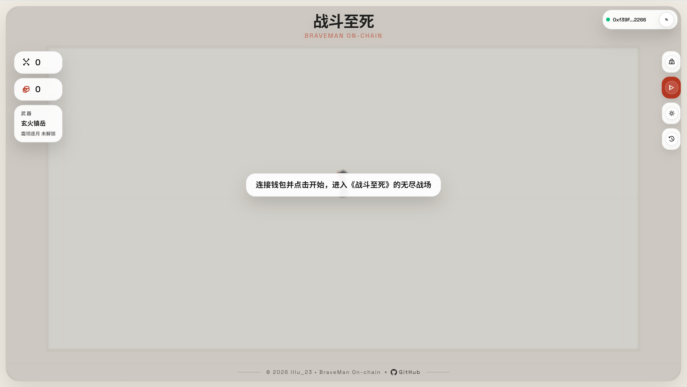
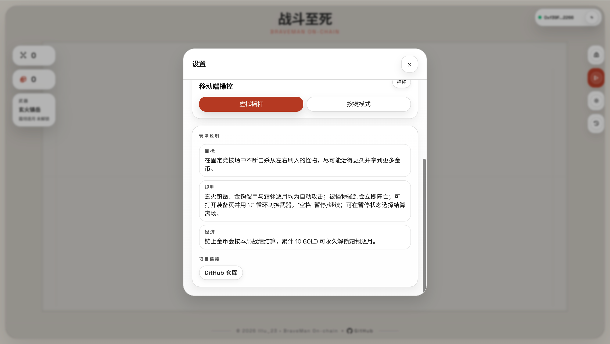
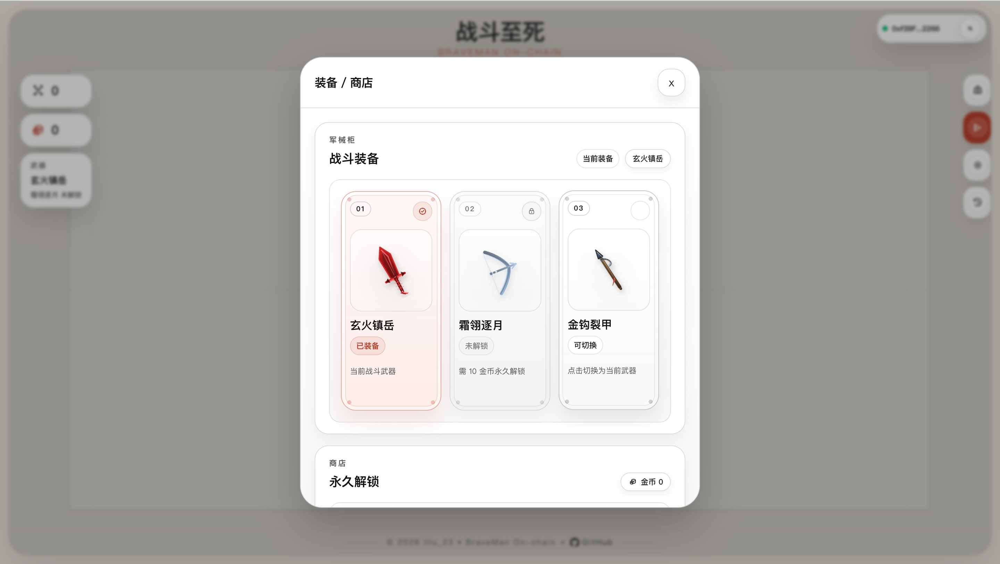
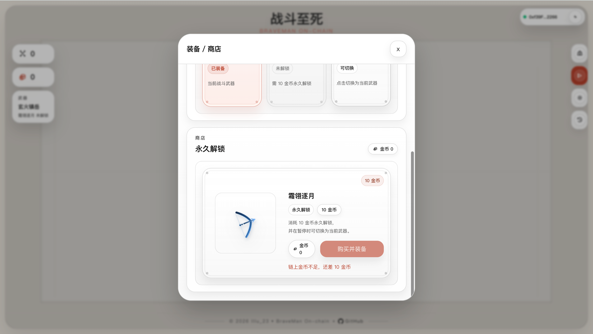
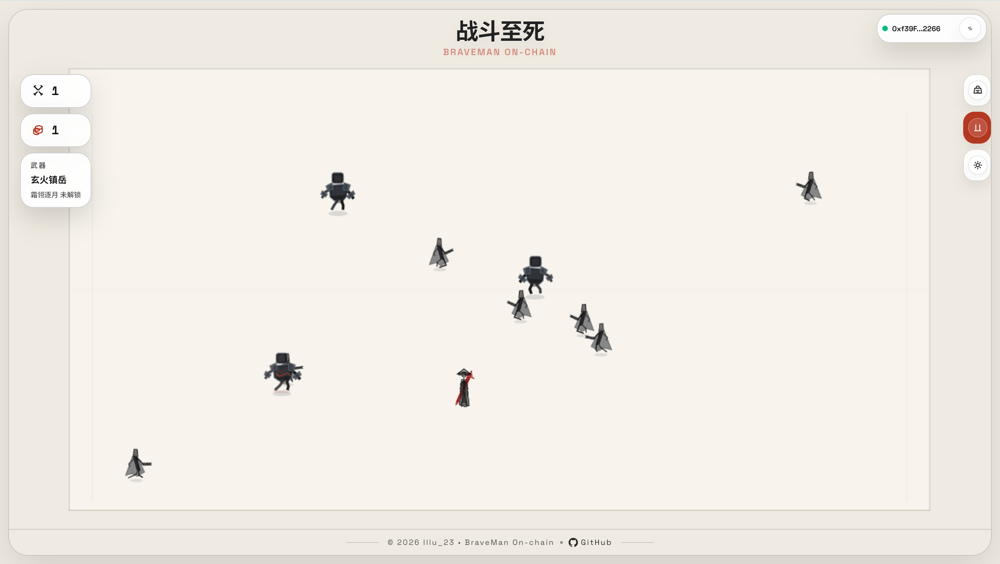
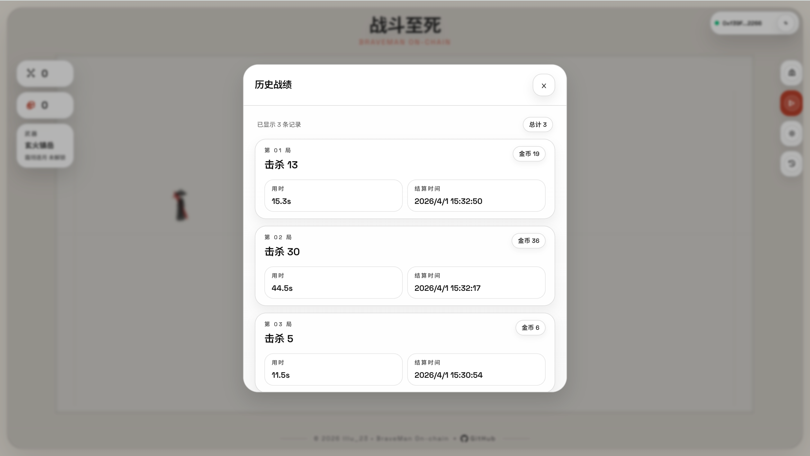

# 14 BraveMan On-chain（braveman-on-chain）

## 项目定位与边界
- 这是“前端实时游玩 + Rust 确定性复盘 + 链上结算”三段式教学样板。
- 前端负责输入和渲染，后端负责 replay 验证与 EIP-712 签名，链上负责资产真值与历史。
- 教学边界：聚焦本地链闭环，不覆盖生产级多节点签名、灾备、审计合规体系。

## 角色与核心对象
| 角色 | 职责 | 核心对象 |
| --- | --- | --- |
| 玩家 | 发起 session、游玩、结算上链 | `sessionId`、`claimSettlement` |
| Rust API | 校验 replay 并签名 settlement | `/api/sessions`、`/api/settlements/verify` |
| 合约 `BraveManGame` | ERC1155 资产与历史真值 | `GOLD_TOKEN_ID`、`BOW_UNLOCK_TOKEN_ID` |
| Owner | 更新 signer 与治理配置 | `updateSigner` |

## 5 分钟跑通
```bash
cd 14_BraveMan-On-chain
cp .env.example .env
cp frontend/.env.local.example frontend/.env.local
cp backend/.env.example backend/.env
make dev
```
- `make dev` 会执行：`restart-anvil -> deploy -> restart-api -> web`。
- `make deploy` 固定链路为：部署合约 -> `scripts/sync-contract.js` -> `make export-rules`。
- `make api` / `make restart-api` 只消费已存在的规则配置与环境变量，不再隐式重生成全部产物。
- 打开 Vite 地址（通常 `http://localhost:5173`），连接 `31337`。
- 最短验收：打一局 -> 结算签名 -> `claimSettlement` 成功 -> GOLD 余额增加。

## 业务主流程
1. 前端调用 `POST /api/sessions` 获取 `sessionId/seed/rulesetMeta`。
2. 玩家本地游玩，记录输入日志与局内摘要。
3. 结算时调用 `POST /api/settlements/verify` 上传日志与摘要。
4. 后端使用 `braveman-core` 复盘，校验规则版本与配置哈希。
5. 通过后后端返回 `settlement + signature`（EIP-712）。
6. 前端调用合约 `claimSettlement(settlement, signature)`。
7. 合约验签与防重放后铸造 GOLD，更新历史与最佳击杀。

## 合约接口与状态
| 接口/事件 | 调用方 | 输入 | 状态变化 | 失败条件 | 前端触发入口 |
| --- | --- | --- | --- | --- | --- |
| `claimSettlement(Settlement,bytes)` | 玩家 | 结算 payload + 签名 | 结算记账、铸造 GOLD、写历史 | session 重放/签名非法/player 不匹配 | 结算弹窗 |
| `purchaseBow()` | 玩家 | 无 | 消耗 10 GOLD，铸造 `BOW_UNLOCK` | 已拥有或 GOLD 不足 | 商店入口 |
| `getUserHistory(player,offset,limit)` | 任意读 | 分页参数 | 无 | 越界返回空 | 历史面板 |
| `bestKillsOf(player)` | 任意读 | 地址 | 无 | 无 | 链上可读接口（当前前端未接入） |
| `SignerUpdated` | owner 发出 | 新旧 signer | 事件日志 | 无 | 运维观测 |

## 代码架构与调用链
**信任边界图**
```text
[Frontend Phaser]
  输入日志(不可信)
      |
      v
[Rust API replay verifier]
  规则与复盘(可信)
      |
  EIP-712 签名
      v
[BraveManGame Contract]
  资产与历史真值(最终可信)
```

**模块到调用链映射**
| 模块 | 职责 | 下游调用 |
| --- | --- | --- |
| `frontend/src/game/*` | 本地游戏循环与日志采集 | `frontend/src/lib/api.ts` |
| `frontend/src/lib/api.ts` | session/verify API 调用 | `backend/braveman-api` |
| `frontend/src/lib/runtime-config.ts` | 统一 runtime config 读取 | `public/contract-config.json` / `.env.local` |
| `backend/braveman-core` | 确定性 replay | 规则与输入日志 |
| `backend/braveman-api` | 对外 HTTP + 签名服务 | `BraveManGame` 验签域 |
| `contracts/src/BraveManGame.sol` | 资产/结算真值层 | EIP-712 验签 + ERC1155 |

**配置生成职责边界**
- `scripts/sync-contract.js`：只负责合约 ABI、地址、前后端运行时配置同步。
- `cargo run -p xtask -- export-config --frontend ../frontend`：只负责规则集导出，不写合约地址。
- `restart-api`：只读取既有规则配置和 `backend/.env`，不承担部署或导出动作。

**deterministic replay 约束清单**
- 同一 `sessionId` 只能 `claim` 一次（`claimedSessionIds`）。
- `settlement.player` 必须等于 `msg.sender`。
- 签名人必须是 `settlementSigner`。
- `rulesetVersion + configHash` 必须与后端导出的规则一致。
- 输入日志必须按原始顺序且不可篡改。

**mismatch 决策树（排错）**
```text
verify 失败?
  ├─ RULESET_MISMATCH -> 重新导出配置并重启服务
  ├─ SESSION_EXPIRED  -> 重新创建 session 开新局
  └─ REPLAY_MISMATCH  -> 检查日志完整性/规则版本/非法状态
```

**一局 Session -> Verify -> Claim 最短验证脚本**
```bash
# 1) 创建 session
curl -s http://127.0.0.1:8787/api/sessions \
  -H 'content-type: application/json' \
  -d '{"player":"0x你的钱包地址"}'

# 2) 提交 verify（把 sessionId 与 logs/localSummary 替换为真实值）
curl -s http://127.0.0.1:8787/api/settlements/verify \
  -H 'content-type: application/json' \
  -d '{"player":"0x...","sessionId":"0x...","rulesetVersion":4,"configHash":"0x...","logs":[],"localSummary":{"kills":1,"survivalMs":1000,"goldEarned":1,"endReason":"death"}}'

# 3) 前端或脚本调用 claimSettlement 上链
```

## 命令与环境变量
**推荐命令（项目根目录）**
```bash
make help
make dev
make deploy
make api
make web
make build-contracts
make test
make test-backend
make test-frontend
make anvil
make stop
make clean
```

**关键环境变量**
- 根目录 `.env`：`PRIVATE_KEY`、`API_SIGNER_PRIVATE_KEY`、`RPC_URL`、`CHAIN_ID`。
- 前端 `.env.local`：`VITE_BRAVEMAN_ADDRESS`、`VITE_API_BASE_URL`。
- 后端 `backend/.env`：`BRAVEMAN_SIGNER_PRIVATE_KEY`、`BRAVEMAN_CONTRACT_ADDRESS`、`BRAVEMAN_RPC_URL`。

**运行时配置优先级**
```text
frontend/public/contract-config.json
  > frontend/.env.local
  > 默认值
```

## 验收与排错
| 症状 | 可能原因 | 修复命令/动作 |
| --- | --- | --- |
| 开局时报 session 失败 | API 未启动或地址错误 | `make api` 或 `make dev` |
| `RULESET_MISMATCH` | 前后端规则文件不一致 | 重新 `make dev` 或 `cargo run -p xtask -- export-config --frontend ../frontend` |
| `SESSION_EXPIRED` | session 超时 | 重新开始新局 |
| `REPLAY_MISMATCH` | 日志被篡改或规则不一致 | 检查日志与规则版本后重试 |
| `claimSettlement` 失败 | 签名地址错误或 payload 不匹配 | 重新 `make deploy` 同步 signer 与合约地址 |

## Demo 展示








## 作者
- `lllu_23`
