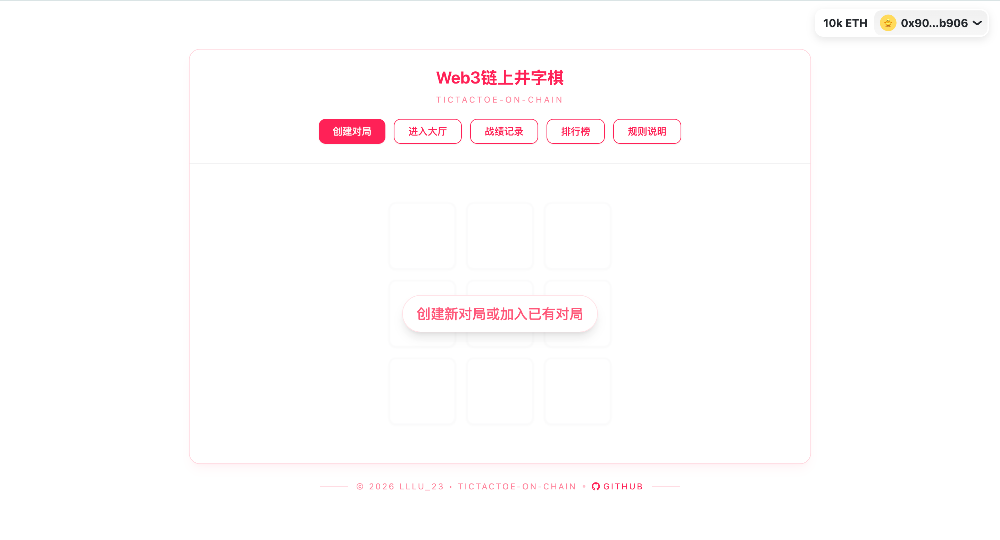
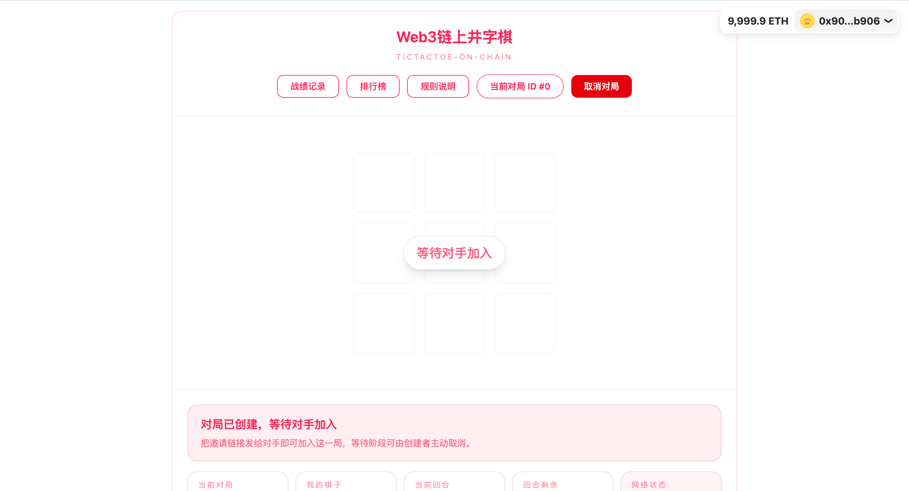
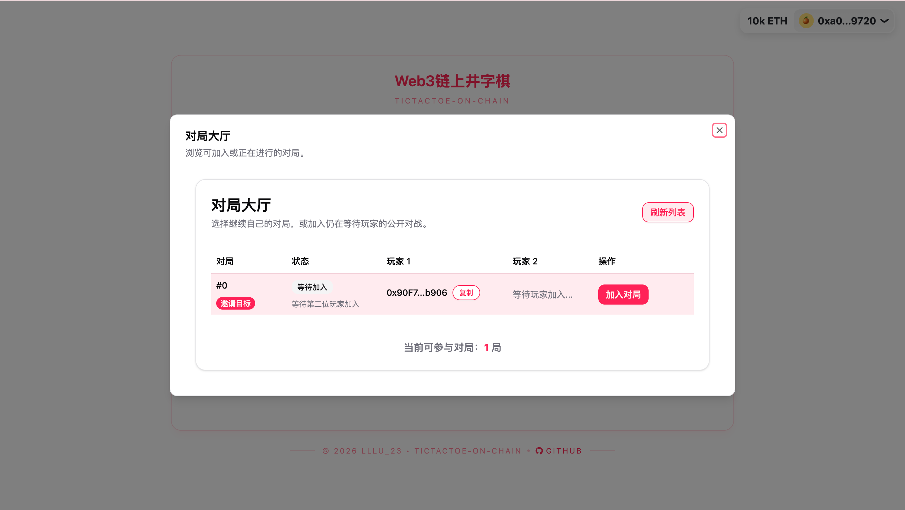
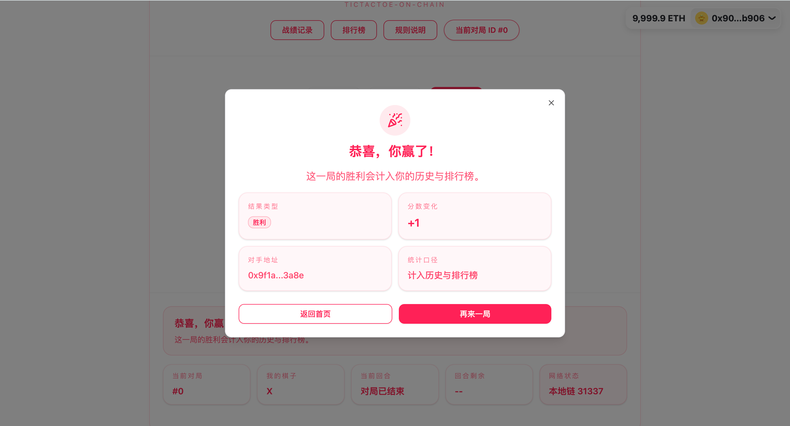
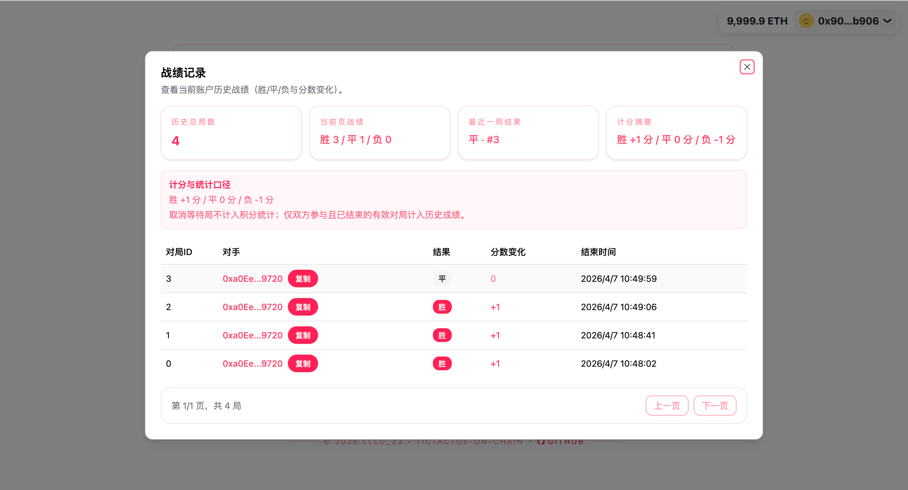
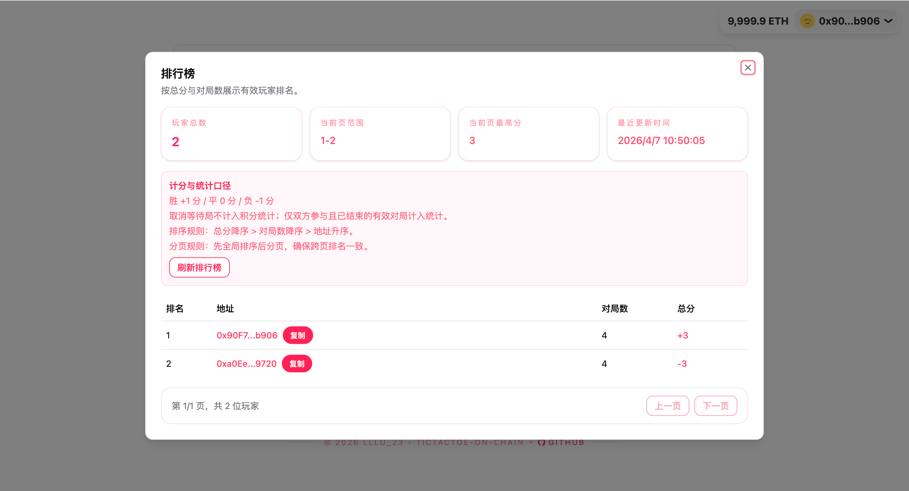
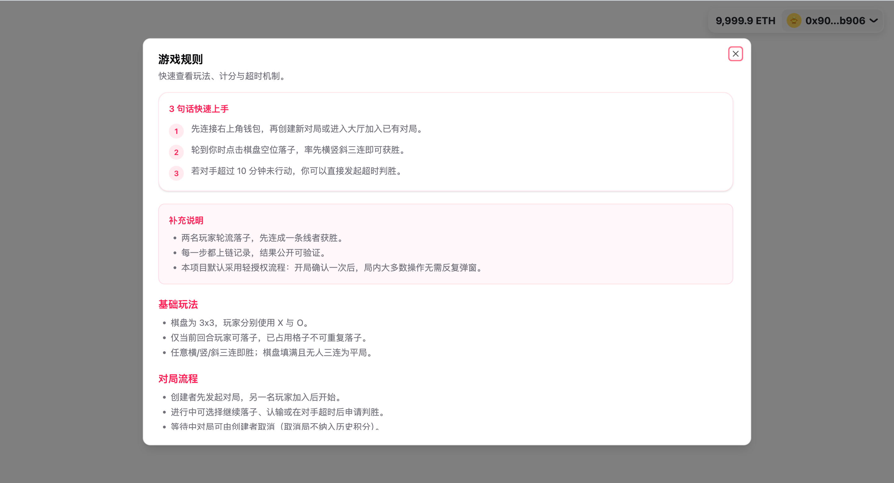

# 15_TicTacToe-On-chain（Web3链上井字棋）

## 项目定位与边界
- 英文项目名：`TicTacToe-On-chain`
- 中文展示名：`Web3链上井字棋`
- 项目类型：`Foundry + Next.js` 链上对战教学项目。
- 核心能力：创建/加入对局、链上落子、历史记录、排行榜、会话免弹窗操作。
- 边界说明：合约标识符保持 `TicTacToe`，当前版本聚焦工程标准化与可运行性，不引入新玩法。

## 技术栈
- Contracts: Foundry / Solidity `^0.8.20`
- Frontend: Next.js App Router / React 19
- Web3: wagmi + viem + RainbowKit + zustand

## 角色与核心对象
| 角色 | 职责 | 核心对象 |
| --- | --- | --- |
| 玩家 | 创建/加入对局并完成链上落子 | EOA 钱包地址、SessionAccount |
| 前端 | 交易状态管理、分页读取、规则展示 | `frontend/store/useGameStore.ts` |
| 合约 `TicTacToe` | 对局状态机、历史与排行榜统计 | `GameState`、`PlayerHistoryEntry`、`LeaderboardEntry` |
| 合约 `SessionAccountFactory` | 回合会话配置与刷新 | `setupRound`、`refreshSession` |

## 5 分钟跑通
```bash
cd 15_TicTacToe-On-chain
make dev
```

- `make dev` 执行链路：`restart-anvil -> deploy -> frontend`。
- `make deploy` 会自动同步 ABI、运行时配置和前端环境变量。
- 默认前端地址：`http://localhost:3000`，默认链：`Anvil 31337`。

## 界面截图

### 首页与建局
首页空状态：支持创建对局、进入大厅、查看战绩、排行榜与规则。



创建对局后会进入等待阶段，页面会展示当前对局状态与邀请提示。



大厅弹窗用于浏览可加入或可继续的对局，并支持刷新列表。



### 对局进行与结果结算
局内页面会同时展示棋盘、当前回合、剩余时间与网络状态，方便判断是否可以继续操作。


对局结束后会弹出结果面板，展示胜负与分数变化，并支持“返回首页”或“再来一局”。



### 历史、排行与规则说明
战绩记录面板会展示历史局数、最近结果和每局的分数变化。



排行榜面板按照有效对局结果统计积分，并支持分页浏览。



规则面板集中说明快速上手、基础玩法和对局流程，便于第一次进入项目的用户理解交互。



## 目录结构（核心）
```text
15_TicTacToe-On-chain/
├── Makefile
├── docs/
├── docs-assets/
├── scripts/sync-contract.js
├── contracts/
│   ├── src/
│   ├── test/
│   ├── foundry.toml
│   └── .env.example
├── frontend/
│   ├── app/
│   ├── components/
│   ├── store/
│   ├── types/
│   ├── abi/
│   ├── public/contract-config.json
│   └── .env.local.example
```

## 业务主流程
1. 前端优先读取 `frontend/public/contract-config.json`，并由 `.env.local` 兜底。
2. 钱包连接后自动识别玩家当前活跃对局（EOA + smart account）。
3. 创建/加入对局时通过 `SessionAccountFactory.setupRound` 完成一次签名授权。
4. 局内操作优先走会话交易（落子/认输/取消/超时判胜），失败时回退常规交易。
5. 对局结束后同步刷新链上状态、历史战绩与排行榜。

## 代码架构与调用链
| 模块 | 主要职责 | 关键文件 |
| --- | --- | --- |
| 部署与同步 | 双合约部署与 ABI/地址同步 | `Makefile`、`scripts/sync-contract.js` |
| 合约层 | 对局状态机、历史与积分统计 | `contracts/src/TicTacToe.sol` |
| 会话账户层 | 会话授权与免弹窗动作执行 | `contracts/src/SessionAccount*.sol`、`frontend/lib/sessionClient.ts` |
| 前端状态层 | 统一管理链读写、分页与弹窗状态 | `frontend/store/useGameStore.ts` |
| 展示层 | 规则说明、历史面板、排行榜面板 | `frontend/components/*`、`frontend/lib/rulesConfig.ts` |

## 前端约定
- 基础 UI 组件统一维护在 `frontend/components/ui/`。
- 前端模块统一使用 `@/components/*`、`@/lib/*`、`@/store/*`、`@/types/*` 别名引用。
- 仓库不保留 shadcn CLI manifest，UI 原子组件按现有目录结构直接维护。

## 运行时配置优先级
```text
frontend/public/contract-config.json
  > frontend/.env.local
```

## 标准化命令（统一模板）
```bash
make help
make dev
make deploy
make web
make frontend
make env
make up
make build-contracts
make test
make anvil
make restart-anvil
make down
make clean
```
- `make test` 会先执行 `frontend-deps`，在 `frontend/node_modules` 缺失时自动完成 `npm ci --no-audit --no-fund`。

**根目录 `.env`（可选）**
- `PRIVATE_KEY`：部署私钥（默认回落到 Anvil 测试私钥）。
- `RPC_URL`：部署时可选覆盖 RPC。
- `CHAIN_ID`：部署时可选覆盖链 ID。

**前端 `.env.local`（由同步脚本写入）**
- `NEXT_PUBLIC_CHAIN_ID`
- `NEXT_PUBLIC_RPC_URL`
- `NEXT_PUBLIC_TICTACTOE_ADDRESS`
- `NEXT_PUBLIC_SESSION_FACTORY_ADDRESS`
- `NEXT_PUBLIC_WALLETCONNECT_PROJECT_ID`

## 验收与排错
| 症状 | 可能原因 | 修复动作 |
| --- | --- | --- |
| 页面能打开但交易失败 | 合约地址为空或未同步 | `make deploy` 或 `make env ...` |
| 排行榜/历史为空 | 尚未产生有效结束对局 | 完成至少一局并等待回执 |
| 会话动作失败 | 会话过期或未初始化 | 重新创建/加入对局，或刷新会话后重试 |
| 前端启动失败 | 依赖缺失 | 直接执行 `make web` 或 `make test`，命令会自动准备前端依赖 |
| 本地链端口占用 | 旧节点未释放 | `make restart-anvil` 或 `make down` |

## 补充资料
- 长文档讲解：`docs/project-walkthrough.md`

## 作者
- `lllu_23`
