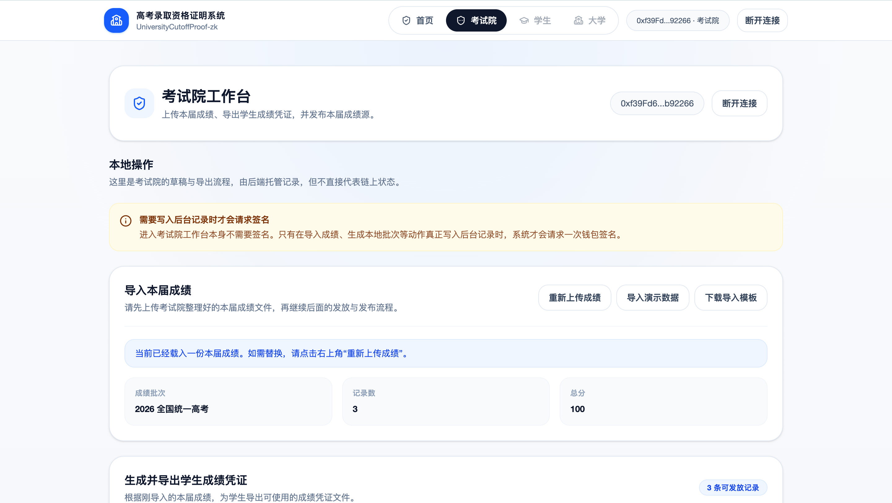
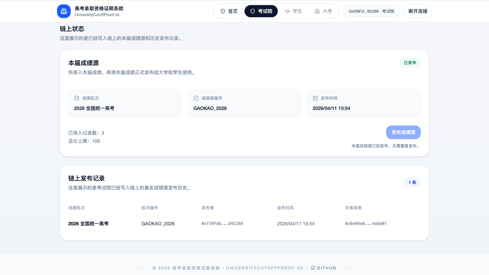
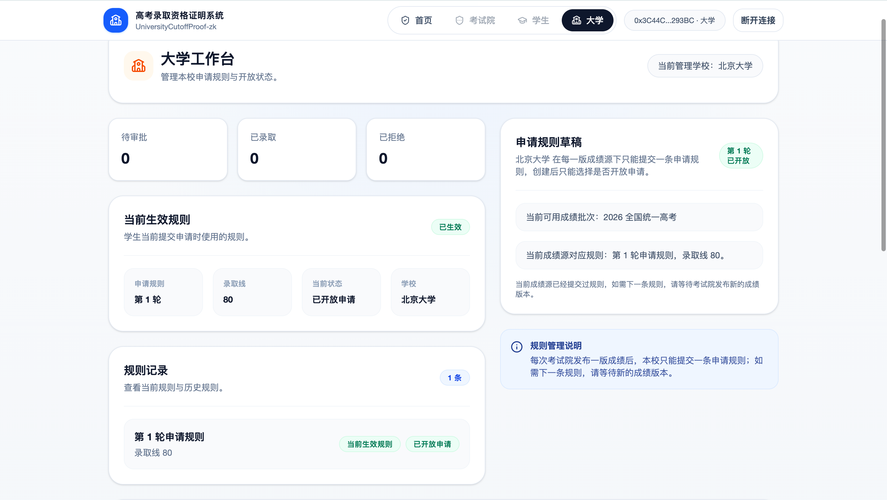
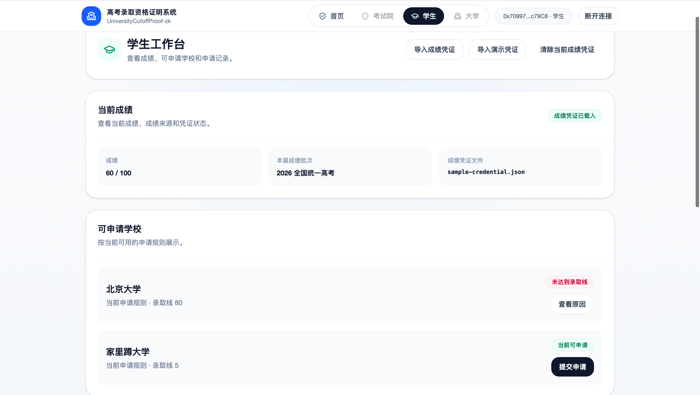
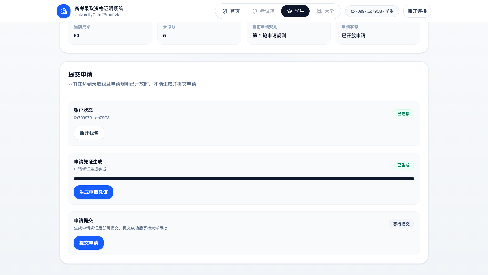
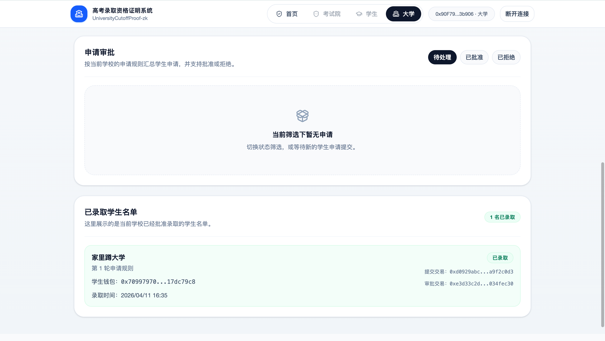

# 高考录取资格证明系统

`16_UniversityCutoffProof-zk` 是一个基于 `Foundry + Circom + snarkjs + Next.js + NestJS` 的“高考录取资格证明系统”。

当前版本已经升级为三层教学增强架构：

- `zk/`：成绩源、样例输入、证明电路、wasm/zkey 和样例凭证产物
- `contracts/`：链上角色、成绩源、大学规则、学生申请和大学审批真相
- `frontend/`：三端工作台、钱包守卫、浏览器内 proving、链上交易
- `backend/`：`NestJS + Prisma + SQLite` 工作台后端，负责事件索引、数据托管和 workbench 聚合 API

## 当前能力

- 考试院手动导入本届成绩 JSON
- 在本地生成成绩树和学生成绩凭证
- 考试院手动把本届成绩源发布到链上
- 大学手动设置录取线、开放申请、审批学生
- 学生手动导入成绩凭证，在浏览器内生成申请证明并提交申请
- 学生首次提交后永久锁定，后续等待大学批准或拒绝
- NestJS 后端托管考试院草稿、发放记录和学生辅助记录
- NestJS 后端投影链上成绩源、规则历史、申请历史和审批历史
- 前端通过 `authority / university / student workbench` API 读取稳定聚合数据
- OpenAPI 输出为前端生成 TypeScript 类型
- 默认本地开发使用 `backend/dev.db`，不需要 PostgreSQL 或 Docker

## 业务流程界面预览

以下截图对应当前默认业务流，按“考试院 → 大学 → 学生 → 审批结果”的顺序排列。  
后续如果页面细节调整，只需要替换同名图片，不需要改 README 路径。

### 1. 考试院导入并发布本届成绩

考试院先导入本届成绩草稿，再把整理完成的成绩源正式发布到链上，作为大学和学生后续流程的统一依据。




### 2. 大学设置录取线并开放申请

大学围绕当前成绩源提交一条申请规则，设置录取线，并把这一轮申请正式开放给学生。



### 3. 学生查看可申请学校并提交申请

学生导入自己的成绩凭证后，可以看到当前可申请学校列表；确认目标学校后，再在浏览器本地生成申请证明并提交申请。




### 4. 大学查看录取结果

大学完成审批后，可以在工作台里查看已经录取的学生名单，形成完整闭环。



## 目录

```text
16_UniversityCutoffProof-zk/
├── backend/
├── contracts/
├── frontend/
├── scripts/
├── zk/
└── docs/
```

## 前置要求

- `node >= 22`
- `npm >= 11`
- `forge`
- `anvil`
- `circom`

## 常用命令

```bash
make dev
make dev-fresh
make build-zk
make test-zk
make build-contracts
make deploy
make test
make web
make backend
make backend-test
make backend-sync-types
make down
```

## 说明

- 第一次 `make build-zk` 会执行本地开发型 trusted setup，耗时会明显更长；后续会复用已生成产物。
- `make dev` 现在会一键拉起：`Anvil + 合约部署 + SQLite 初始化或复用 + NestJS 后端 + OpenAPI 类型同步 + Next 前端`。
- `make dev-fresh` 会额外清空 `backend/dev.db` 和后端存储目录，适合教学演示时从零开始重置。
- `make deploy` 只负责部署链上合约、同步 ABI 和前端运行时配置，不再自动灌入成绩源和大学规则。
- 默认数据库文件是 `backend/dev.db`。只要不手动删除它，考试院草稿、发放记录和学生辅助记录就会被保留。
- 默认教学流程已经改成手动驱动：
  1. 考试院导入成绩并发布成绩源
  2. 大学设置录取线并开放申请
  3. 学生导入凭证、生成证明、提交申请
  4. 大学审批学生申请
- 后端只负责托管和查询，不代替钱包发交易，也不接管浏览器内 proving。
- 本地开发默认零额外安装：不需要 PostgreSQL，也不需要 Docker。
- `contracts/src/UniversityCutoffProofVerifier.sol` 和样例 fixture 仍由 zk 构建流程自动生成。
