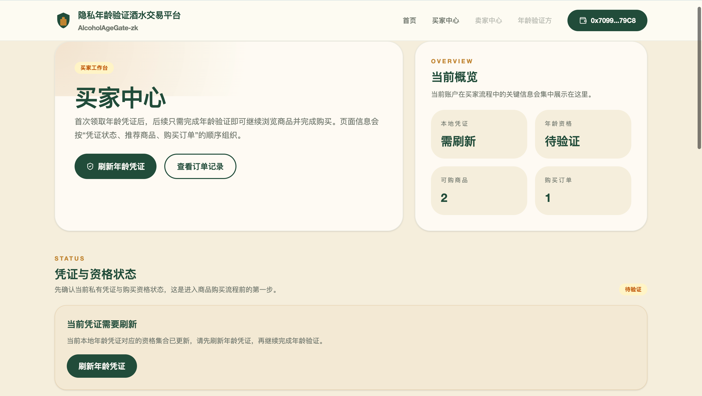
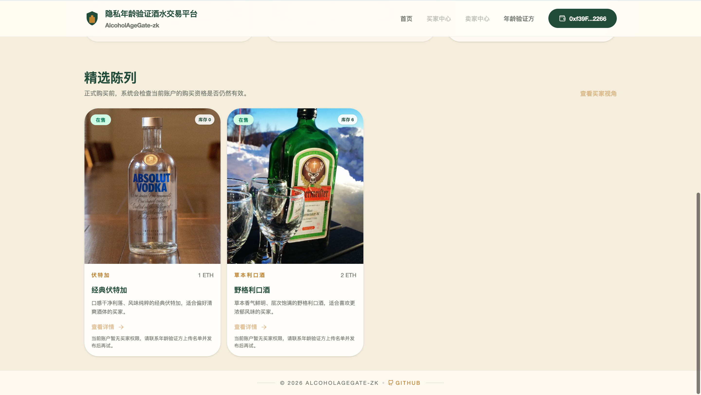
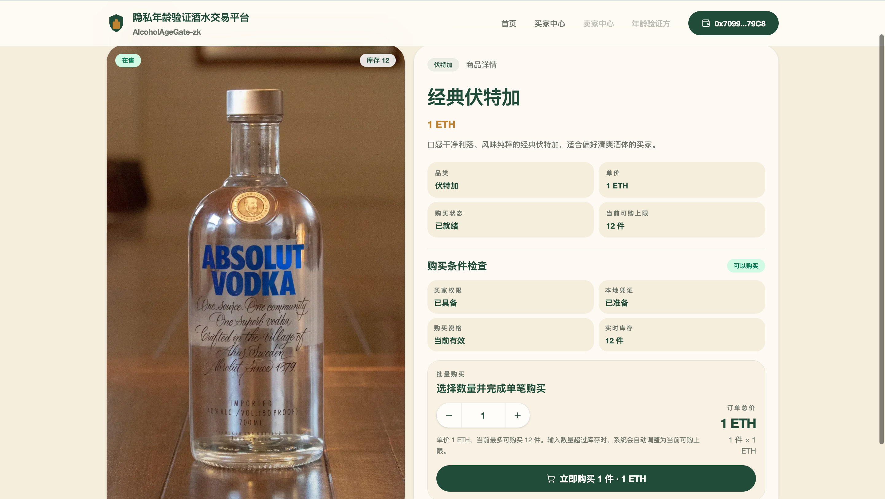
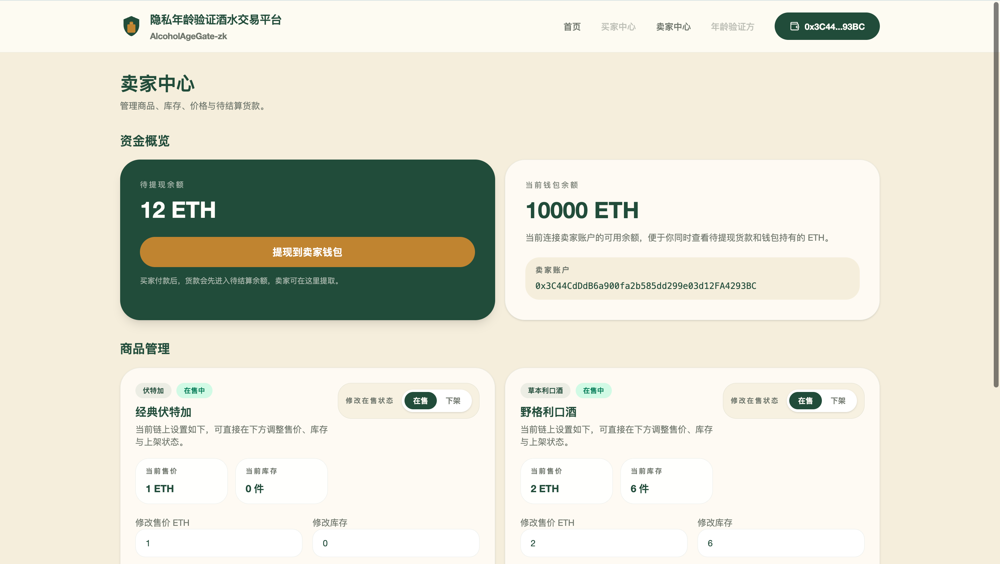
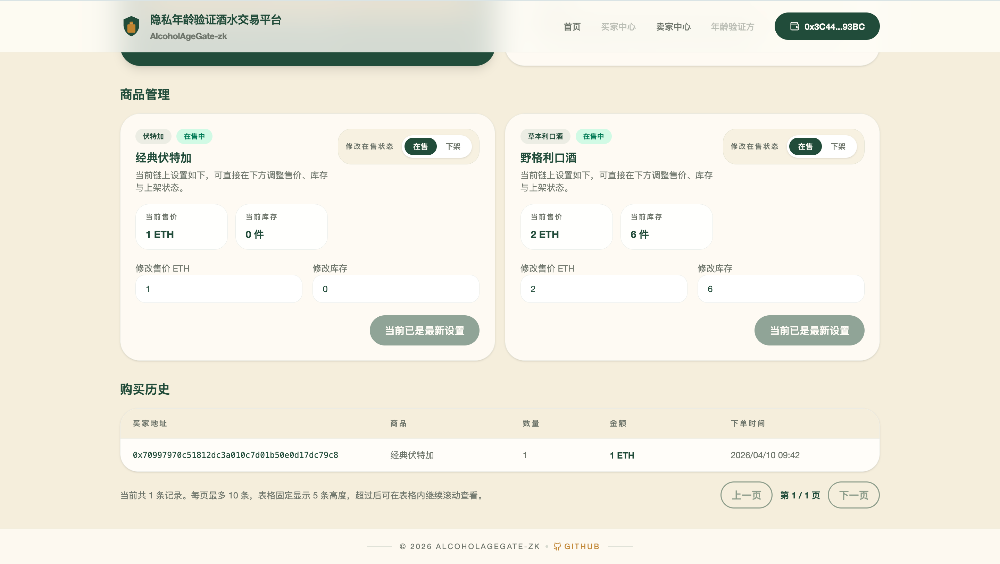
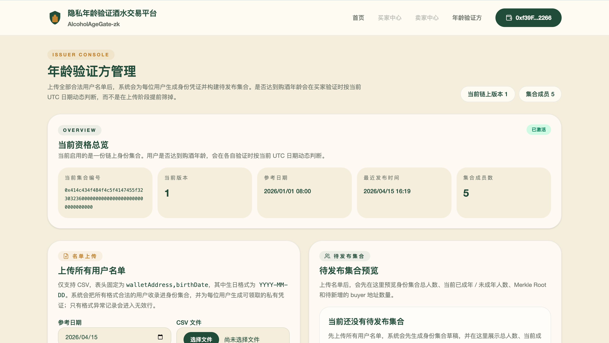
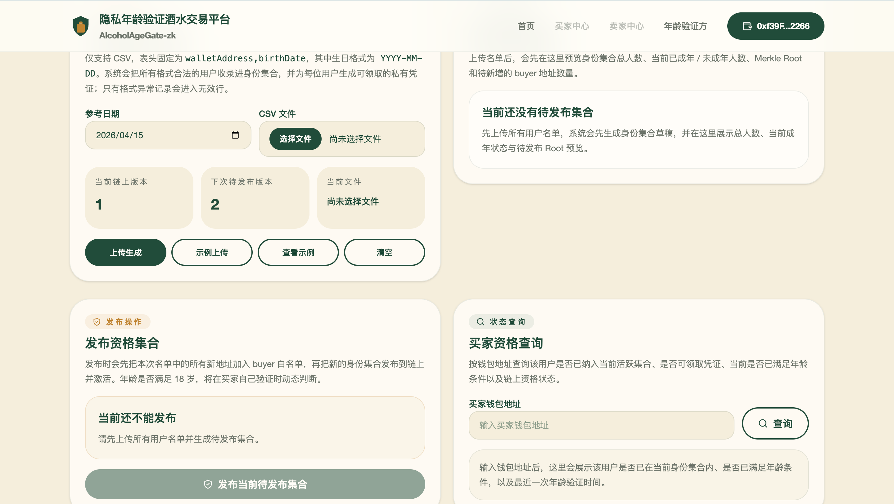

# 隐私年龄验证酒水交易平台

`AlcoholAgeGate-zk` 当前已经交付完整的链上、ZK 和正式 `frontend/` 前端闭环。项目围绕“买家不公开生日和完整身份信息，只证明自己已满法定饮酒年龄，然后才能购买酒水”这一条主线展开。

## 当前交付

- `contracts/`
  - `AlcoholRoleRegistry`
  - `AgeCredentialRootRegistry`
  - `AlcoholAgeProofVerifier`
  - `AlcoholAgeEligibilityVerifier`
  - `AlcoholMarketplace`
- `zk/`
  - `alcohol_age_proof.circom`
  - 公开号召用的资格集合与商品样例数据
  - 服务端私有年龄凭证生成产物
  - 样例 proof/calldata 与 verifier 生成链路
- `frontend/`
  - Next.js App Router + TypeScript 正式前端
  - 7 个正式路由：`/`、`/buyer`、`/buyer/verify`、`/buyer/orders`、`/issuer`、`/seller`、`/products/[id]`
  - `wagmi + viem + worker` 浏览器内 proving 与合约交互
  - `API route + 浏览器加密存储` 的私有凭证领取链路
  - ABI / 地址 / wasm / zkey / 公开样例数据同步链路
- `docs/`
  - 开发方案、产品说明、前端方案与 Prompt 文档

`frontend-demo/` 仍然保留为原型参考，但正式交付和仓库运行入口已经切换到 `frontend/`。

## 业务流程界面预览

以下截图展示当前正式前端的关键页面，按“首页入口 -> 买家 ->
商品购买 -> 卖家 -> 年龄验证方”的顺序排列。后续如果页面细节调整，
只需要替换同名图片，不需要改 README 路径。

### 1. 首页与角色入口

首页展示平台定位、角色入口和精选商品预览，是整个年龄验证交易流程的
起点。


### 2. 买家领取凭证并浏览商品

买家进入工作台后可以先查看本地凭证和年龄资格状态，再继续浏览当前可
购买的精选商品。




### 3. 商品详情与购买门禁

商品详情页会实时检查买家权限、本地凭证、年龄资格和库存状态，只有满
足条件时才允许下单。



### 4. 卖家管理资金、商品与订单

卖家工作台既展示待提现余额，也支持调整商品价格、库存和上架状态，并
查看最近购买记录。




### 5. 年龄验证方上传名单并发布资格集合

年龄验证方先上传 CSV 名单生成待发布集合，再把资格集合发布到链上，供
买家后续完成年龄验证。




## 目录

```text
AlcoholAgeGate-zk/
├── contracts/
├── docs-assets/
├── docs/
├── frontend/
├── frontend-demo/
├── scripts/
└── zk/
```

## 正式前端能力

- 受控首页，展示品牌、角色入口和有限商品预览
- 买家中心，支持首次领取私有年龄凭证，并展示本地凭证、链上年龄资格、推荐商品与最近订单
- 浏览器内年龄证明页，使用 worker 加载 `wasm/zkey` 并提交 `verifyEligibility`
- 买家订单页，展示链上成功订单和本地失败历史
- 发行方页，只负责读取和发布当前资格集合
- 卖家页，读取商品状态、调整价格/库存/上架状态、提现待结算余额
- 商品详情页，根据资格、库存、在售状态决定是否允许购买

## 常用命令

```bash
make build-zk
make build-contracts
make deploy
make web
make test
```

命令语义：

- `make build-zk`：生成电路、verifier 与样例数据
- `make build-contracts`：构建 ZK 产物、编译合约，并同步前端 ABI/配置/样例数据
- `make deploy`：确保本地链可用，部署合约后同步前端运行时资产
- `make web`：启动正式 Next 前端
- `make test`：运行 ZK 测试、Forge 测试、前端检查和前端生产构建

## 前端同步链路

项目新增了 `scripts/sync-contract.js`，在 `make build-contracts` 和 `make deploy` 后自动完成：

- 从 `contracts/out/` 提取正式 ABI 到 `frontend/abi/`
- 从 `contracts/broadcast/.../run-latest.json` 解析部署地址
- 生成 `frontend/public/contract-config.json`
- 生成 `frontend/.env.local`
- 同步 `alcohol_age_proof.wasm` 与 `alcohol_age_proof_final.zkey`
- 同步公开样例数据到 `frontend/public/examples/`
- 同步买家私有年龄凭证到 `frontend/server-data/credentials/`

## 相关文档

- [AlcoholAgeGate-zk前端详细开发方案](./docs/frontend/17_AlcoholAgeGate-zk前端详细开发方案.md)
- [AlcoholAgeGate-zk-GoogleStudio前端生成提示词方案](./docs/frontend/17_AlcoholAgeGate-zk-GoogleStudio前端生成提示词方案.md)
- [AlcoholAgeGate-zk-frontend-demo前端审计与优化建议](./docs/frontend/17_AlcoholAgeGate-zk-frontend-demo前端审计与优化建议.md)

## 验收要点

- 成年样例买家验证成功
- 未成年样例无法生成有效证明
- 换钱包后同一份凭证不能复用
- `version` 更新后旧年龄资格失效
- 买家首次领取私有年龄凭证后，后续可一键完成年龄验证
- `frontend/public/examples/` 中不再暴露 `birthDate / secretSalt / Merkle path`
- 商品下架或库存不足时无法购买
- 成功购买后卖家可以提现
- 正式前端能够读取同步后的 ABI、运行时配置和 ZK 产物
