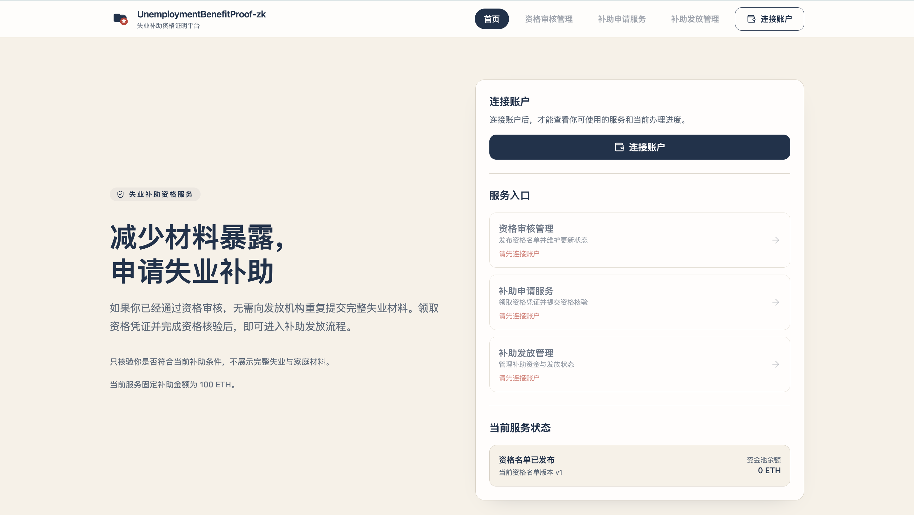
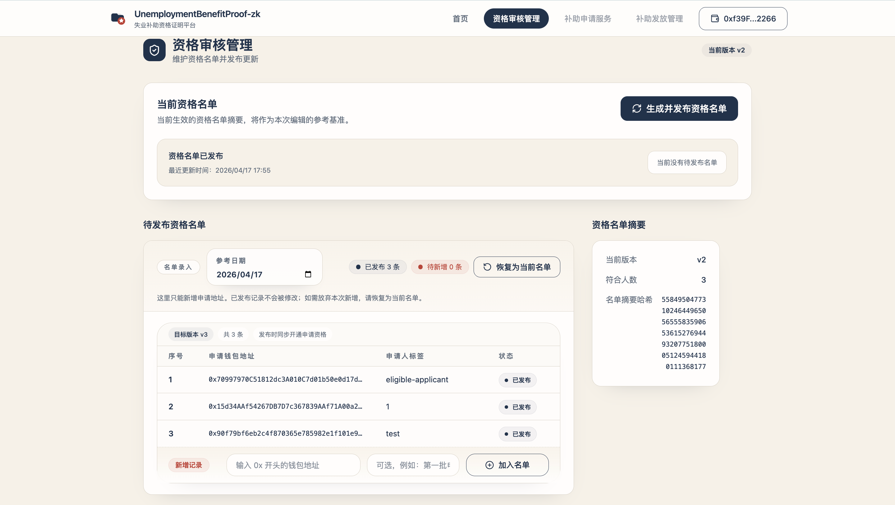
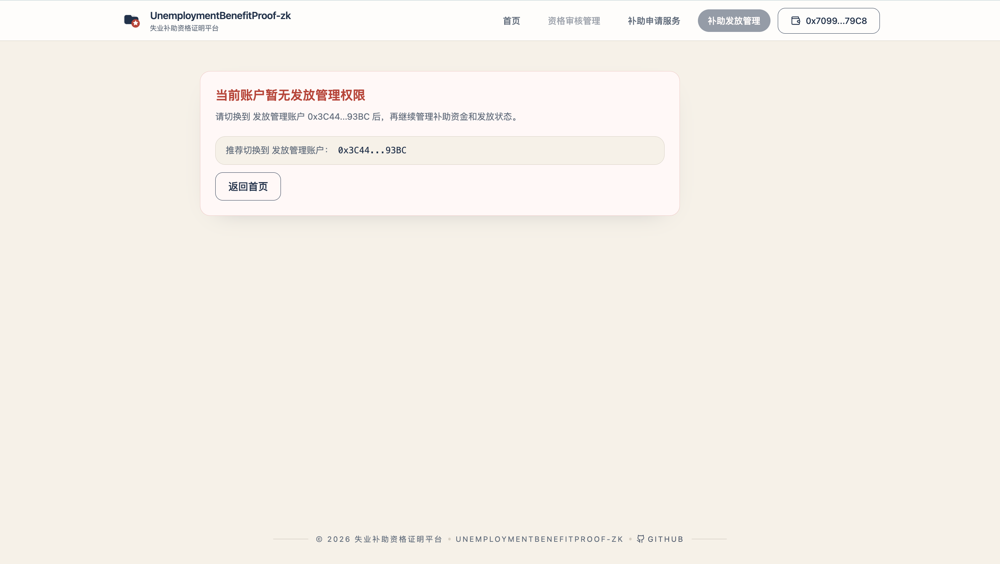
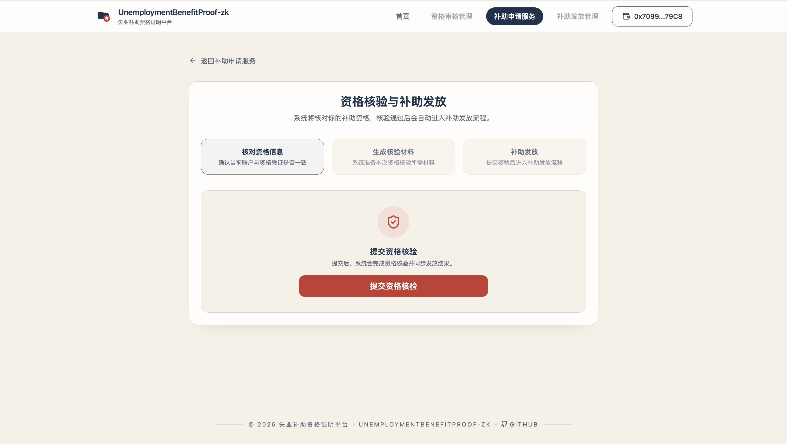
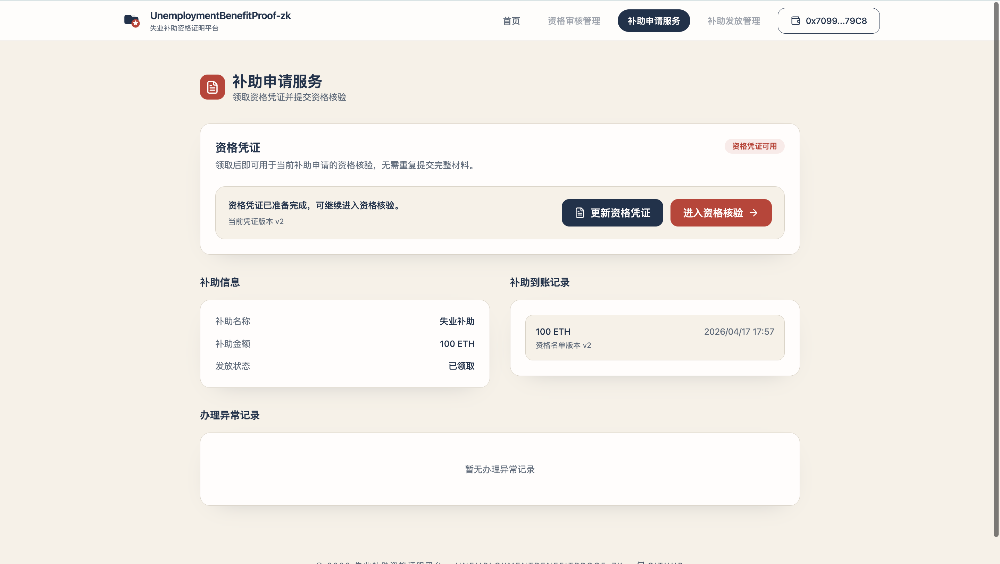
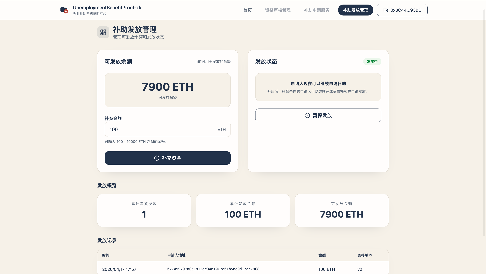
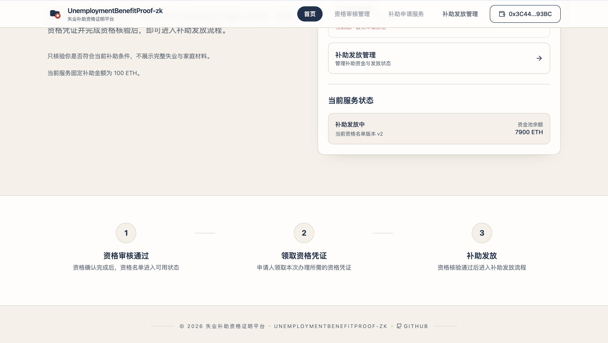

# 失业一次性补助资格证明平台

`18_UnemploymentBenefitProof-zk` 现已从“文档先行”升级为正式工程骨架，包含：

- `contracts/`：角色登记、资格集合根登记、一次性补助发放合约
- `zk/`：失业资格证明电路、样例数据、verifier 与测试脚本
- `frontend/`：正式 `Next.js App Router + TypeScript` 前端
- `frontend-demo/`：保留的高保真视觉原型，仅作参考，不作为正式入口
- `scripts/`：ABI、运行时配置、ZK 产物、公开样例与私有凭证同步脚本

## 当前定位

- 项目编号：`18_UnemploymentBenefitProof-zk`
- 中文定位：`失业一次性补助资格证明平台`
- 项目类型：`Next 业务型 ZK 项目`
- 隐私模式：`政府私发私有失业凭证，申请人本地加密保存，后续一笔 zk 交易验证并领取补助`

## 页面预览

下面这组截图按“首页 -> 政府端 -> 申请人端 -> 发放机构端”的顺序展示当
前正式前端的核心页面，也方便后续继续用统一、可读的文件名维护文档素材。

### 1. 首页服务总览

首页会把角色入口、资格名单状态和补助池状态汇总到一个总览页，帮助用户先
看清当前服务整体运行情况。



### 2. 政府资格管理工作台

政府端工作台负责查看当前资格名单、编辑草稿，并准备后续的资格发布动作。



### 3. 政府发布资格名单流程

政府确认草稿后，会进入发布流程，把新的资格名单版本正式同步到系统里。



### 4. 申请人工作台

申请人进入自己的工作台后，可以先查看当前凭证状态、补助状态和个人记录。



### 5. 申请人资格核验流程

资格核验页会把产证、验证和领取补助这一条最核心的流程串成一个连续操作。



### 6. 发放机构工作台

发放机构工作台主要负责查看项目状态、管理补助池资金，并决定当前是否开放
发放。



### 7. 发放记录与项目状态

发放机构还可以在工作台里查看历史发放记录和当前项目状态，便于确认补助是
否已经按预期发出。



## v1 固定业务闭环

- 固定补助项目：`失业一次性补助`
- 固定教学金额：`100 ETH`
- 固定三方角色：
  - `government`
  - `applicant`
  - `agency`
- 固定 demo 账户：
  - 政府：`0xf39F...2266`
  - 合格申请人：`0x7099...79C8`
  - 发放机构：`0x3C44...93BC`
  - 不合格账户：`0x90F7...3b906`

## 关键特性

- 申请人不公开完整失业证明，只证明自己属于政府当前发布的合格集合
- 私有凭证严格走 `challenge + 签名 + 本地加密存储`
- 同一申请人对同一补助项目只能成功领取一次
- 同一私有凭证绑定当前钱包，换钱包不可复用
- 政府可从 `v1` 刷新到 `v2`，真实演示旧凭证 stale 后必须刷新
- 发放记录、项目状态、资金池余额和领取历史都以链上事件/状态为准

## 目录说明

- [contracts/src](/Users/mac/Desktop/foundry_advanced_turtorial/18_UnemploymentBenefitProof-zk/contracts/src)
- [zk/circuits](/Users/mac/Desktop/foundry_advanced_turtorial/18_UnemploymentBenefitProof-zk/zk/circuits)
- [frontend/app](/Users/mac/Desktop/foundry_advanced_turtorial/18_UnemploymentBenefitProof-zk/frontend/app)
- [docs](/Users/mac/Desktop/foundry_advanced_turtorial/18_UnemploymentBenefitProof-zk/docs)

## 常用命令

```bash
make build-zk
make build-contracts
make deploy
make web
make test
```

## 前端路由

- `/`
- `/government`
- `/applicant`
- `/applicant/verify`
- `/agency`

## 文档

- [详细开发方案](./docs/18_UnemploymentBenefitProof-zk详细开发方案.md)
- [产品方向说明](./docs/product/项目方向说明.md)
- [前端详细开发方案](./docs/frontend/18_UnemploymentBenefitProof-zk前端详细开发方案.md)
- [Google Studio 前端生成提示词方案](./docs/frontend/18_UnemploymentBenefitProof-zk-GoogleStudio前端生成提示词方案.md)

## 当前说明

- 正式前端入口固定为 `frontend/`
- `frontend-demo/` 仅保留为视觉与文案参考
- `build-zk` 会生成：
  - `UnemploymentBenefitProofVerifier.sol`
  - `SampleUnemploymentBenefitFixture.sol`
  - `current-credential-set-v1.json`
  - `current-credential-set-v2.json`
  - `sample-program.json`
  - 私有凭证样例
- `scripts/sync-contract.js` 会把 ABI、`wasm/zkey`、公开样例、私有凭证和 `contract-config.json` 同步到正式前端
