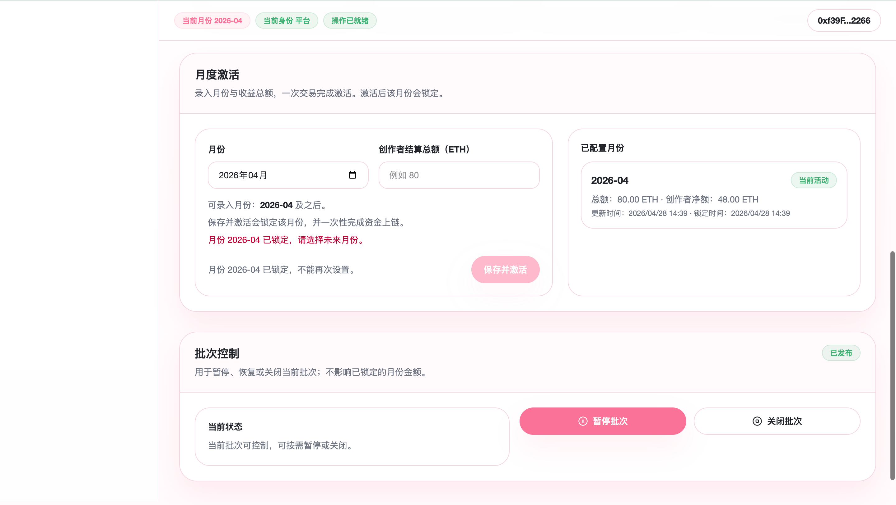
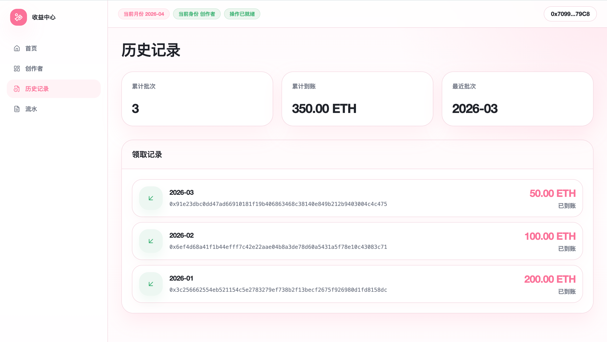
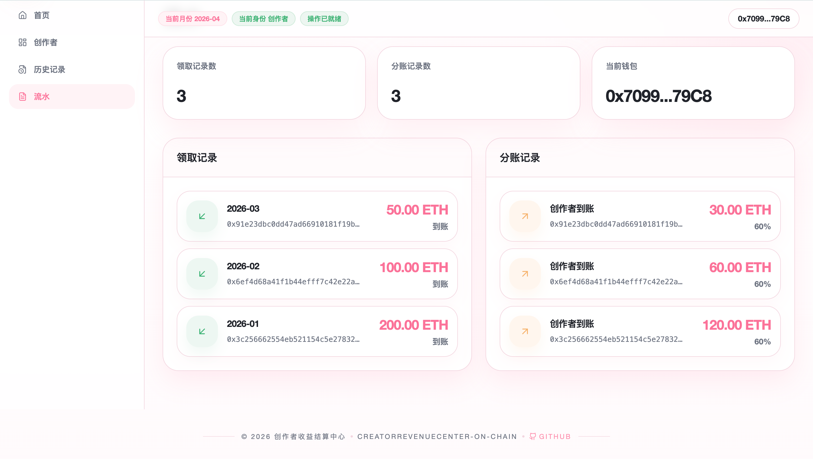

# 19_CreatorRevenueCenter-On-chain

`CreatorRevenueCenter-On-chain` 是一个围绕“创作者月度结算与链上自动分账”构建的 `Next 业务型 + Ponder 索引分支` On-chain Demo。  
它不处理原始广告日志，也不引入 ZK，而是把平台月度结算后的最终结果做成可领取账单，再由合约以 Anvil 原生 `ETH` 完成链上 `claim` 和协作者自动分账。


## 项目定位

- 用户表层体验是“账单、领取、分账、流水”，不是协议控制台。
- 架构采用 `Next.js App Router + TypeScript + wagmi + viem`，不引入 `NestJS`。
- 链上事件索引从 `v1` 开始纳入 `Ponder + PGlite`，但私有账单源数据仍然只保留在 `frontend/server-data/`。
- `/platform` 只做演示控制台，不扩展成完整平台后台。
- `/ledger` 以当前钱包的个人明细延伸为主，不做纯公开透明公告板。

## 核心功能

- 平台单笔激活月度批次：点击“保存并激活”时，同步写入 `batchId / merkleRoot / metadataHash` 并注入当月等额 `ETH`。
- 月份锁定：同一月份只允许录入一次，激活后不能补资或重设。
- 创作者查看账单：前端展示本月账单摘要、分账预览、当前状态。
- 单笔领取：创作者发起一笔必要交易完成本月收益领取。
- 自动分账：同一笔 `claim` 交易内将原生 `ETH` 发送给创作者和 2 个协作者。
- 历史记录：创作者页和流水页展示历史 `claim` 与到账记录。
- 平台动作：平台页支持激活、恢复、暂停、关闭当前批次。
- 本地索引：`services/indexer/` 内的 Ponder 负责链上读模型和后续扩展空间。

## 角色与核心对象

### 角色

- `platform`：平台结算方，预览并激活当月或未来月份批次。
- `creator`：创作者，查看账单与领取收益。
- `collaborator`：被动收款协作者，在分账规则快照中出现。

### 核心对象

- `RevenueBatch`
- `CreatorSettlementBill`
- `CreatorClaimPackage`
- `SplitRuleSnapshot`
- `ClaimRecord`
- `SplitPaymentRecord`

## 业务主流程

1. 平台在链下生成月度账单和单创作者 `Merkle` 输入。
2. 平台在 `/platform` 预览月份数据，并通过一笔“保存并激活”交易完成批次发布和等额资金上链。
3. 创作者在收益中心查看账单摘要和分账预览。
4. 创作者发起一笔 `claim` 交易。
5. `CreatorRevenueDistributor` 校验批次、proof 和重复领取状态。
6. 合约自动把原生 `ETH` 分到创作者与协作者。
7. 前端与索引层同步展示领取记录和到账明细。



## 界面截图






## 5 分钟跑通

### 前置依赖

- 已安装 `Foundry`
- 已安装 `Node.js 22+`
- 已安装 `npm`

### 一键开发

```bash
cd 19_CreatorRevenueCenter-On-chain
make dev
```

默认端口：

- `Anvil`: `8545`
- `Next`: `3000`
- `Ponder`: `42069`

`make dev` 会从这些默认值开始尝试；如果发现端口被占用，会自动切到下一个可用端口，并把本次实际端口写入根目录的 `.dev-session.env`。

如果你希望从自定义起始端口开始继续顺延，也可以这样运行：

```bash
cd 19_CreatorRevenueCenter-On-chain
WEB_PORT=3019 INDEXER_PORT=42079 ANVIL_PORT=8555 make dev
```

## 常用命令

```bash
make build-contracts
make deploy
make web
make indexer
make test
make clean
make stop
```

命令说明：

- `make build-contracts`：编译合约并同步 ABI / runtime config。
- `make deploy`：部署合约、生成动态月份样例（当前月活动批次，前 3 个月历史分别为 `50 / 100 / 200 ETH`），并同步前端和索引配置。
- `make web`：只启动 Next 前端。
- `make indexer`：只启动 Ponder 索引分支。
- `make test`：运行合约、前端、索引层静态检查。

## 目录结构

```text
19_CreatorRevenueCenter-On-chain/
├── Makefile
├── README.md
├── contracts/
│   ├── src/
│   ├── script/
│   ├── test/
│   └── deployments/
├── frontend/
│   ├── app/
│   ├── components/
│   ├── hooks/
│   ├── lib/
│   ├── public/
│   ├── abi/
│   └── server-data/
├── services/
│   └── indexer/
├── scripts/
│   └── sync-contract.js
├── docs-assets/
└── docs/
```

## 代码架构

### 链上层

- `RevenueBatchRegistry.sol`
- `CreatorRevenueDistributor.sol`

### 前端层

- 首页 `/`：收益中心入口页
- 创作者页 `/creator`
- 领取页 `/creator/claim`
- 历史页 `/creator/history`
- 平台页 `/platform`
- 流水页 `/ledger`

### 索引层

- `services/indexer/ponder.config.ts`
- `services/indexer/ponder.schema.ts`
- `services/indexer/src/index.ts`
- `services/indexer/src/api/index.ts`

## 运行时与数据边界

- 公开数据：批次状态、领取结果、分账事件、公开统计卡
- 服务端私有数据：月度账单源文件、Merkle 输入、未发布 claim package
- 用户本地数据：钱包会话、筛选器、最近交互状态
- 链上与索引数据：批次、claim、split 记录及其统计读模型

当前运行时主真相源：

- `frontend/public/contract-config.json`

私有账单输入目录：

- `frontend/server-data/`

## 验收与排错

### 已验证项目

- `forge build`
- `forge test`
- `npm run lint`
- `npm run typecheck`
- `npm run build`
- `npm run test:e2e`
- `services/indexer` 的 `ponder codegen && tsc --noEmit`
- `make deploy`
- `make dev` 烟雾测试

### 已知说明

- `make dev` 会优先使用 `8545 / 3000 / 42069`；若端口被占用，会自动顺延到下一个可用端口。
- `Ponder` 在本地使用 `PGlite`，更适合开发和演示，不是正式生产数据库配置。
- 项目级 `docs/` 是本地工作区资料，不作为公开发布内容的一部分。

## 环境变量

根目录和 `contracts/` 都提供了 `.env.example`。  
默认已经内置本地 `Anvil` 预置账户作为 `platform / creator / collaborators` 的演示配置，通常不需要额外修改就能跑通本地闭环。
