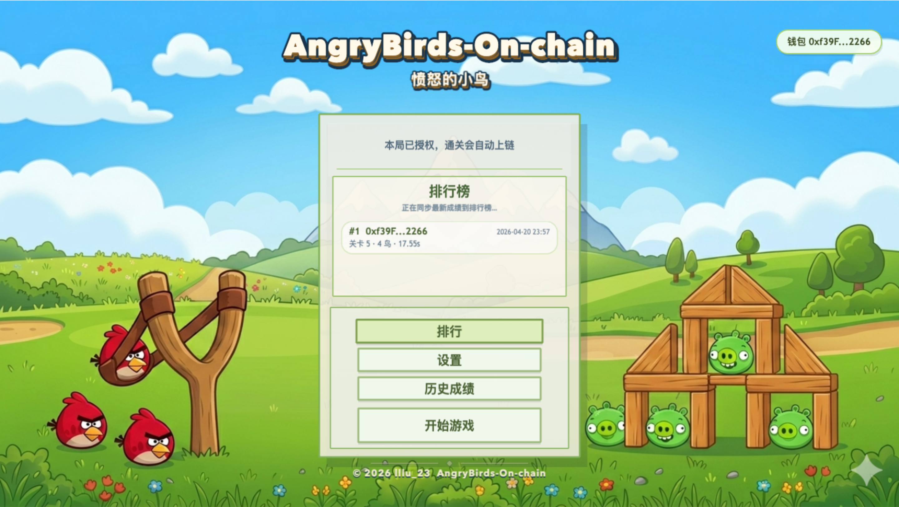
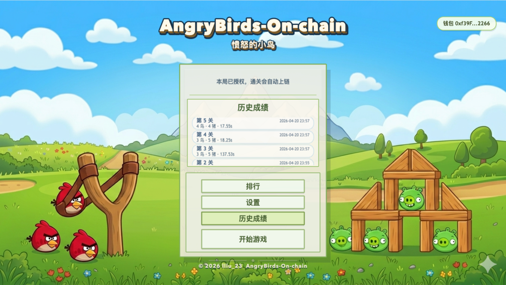
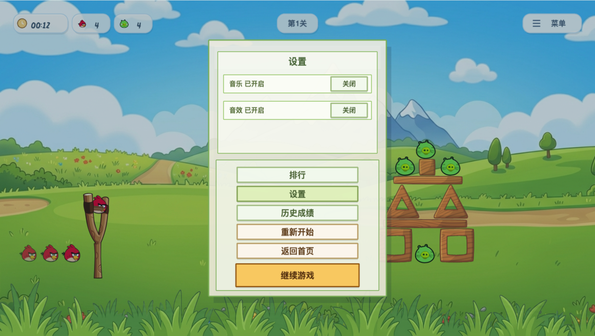
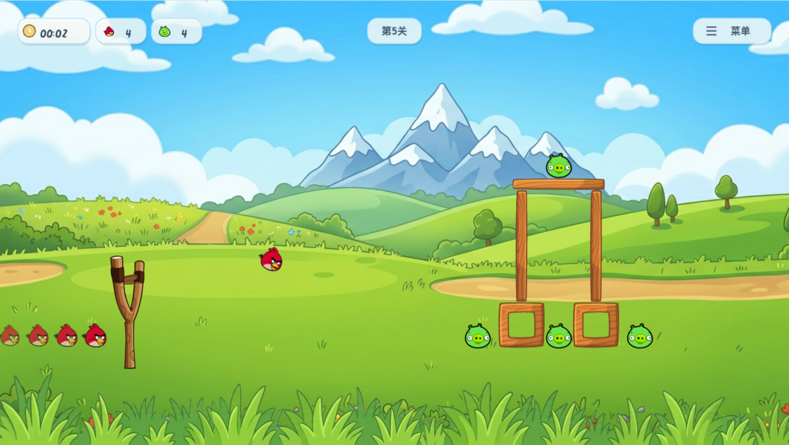
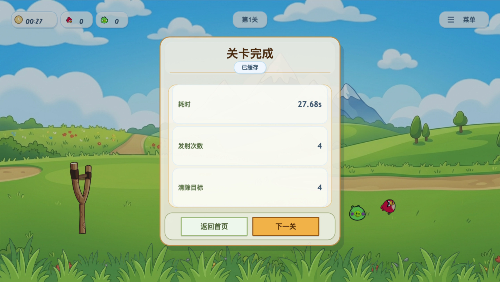
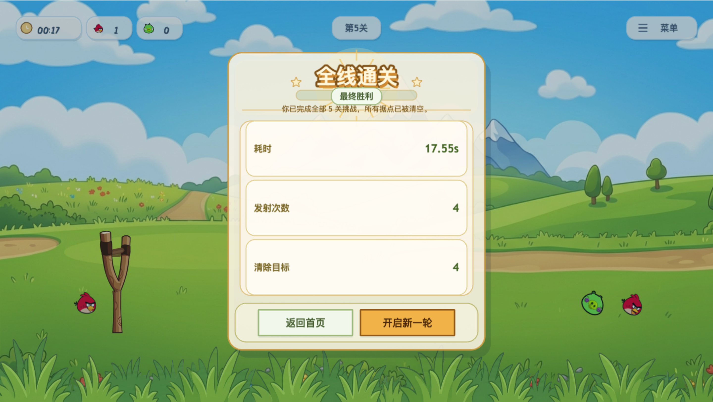

# 20_AngryBirds-On-chain

`20_AngryBirds-On-chain` 是一个基于 `Vite + React + Phaser 3 + Planck
Physics + Foundry + Rust` 的链上小游戏教学项目。当前版本的重点不是把
物理过程搬上链，而是把结算体验改成“用户一次会话授权，Rust backend
校验证据并批量 relay，上链时不再逐关弹钱包签名”。

## 界面截图

下面这些截图对应当前项目的主要游戏与菜单状态，便于你快速理解交互流程。














## 当前架构

这个仓库现在由四层组成，分别负责不同职责。

- 本地玩法层：Phaser + Planck 负责弹弓、小鸟、碰撞、破坏、HUD 和关卡
  结算。
- 前端交互层：React 负责钱包接入、链上查询、会话授权签名、结果状态机和
  本地缓存恢复。
- Rust backend：`axum + sqlx + alloy` 负责签发 `SessionPermit`、校验
  `RunEvidenceV1`、入库和批量 relay。
- 链上最小真值层：合约负责关卡版本、排行榜、玩家历史、`submitVerifiedBatch`
  批量写链和 `runId / batchId / session usage` 去重。

## 提交流程

当前版本使用“前端产出证据，后端验证，批量上链”的提交路径。

1. 前端在每次通关后生成 `RunEvidenceV1`，而不是直接 `writeContract`。
2. 用户首次同步时只签一次 `SessionPermit` typed data。
3. Rust backend 校验证据、记录队列，并在返回主菜单、断开钱包或空闲超时后
   批量提交链上。
4. 合约同时校验玩家 permit 和 backend verifier 签名，再写入排行榜和历史。

## 快速开始

如果你要在本地完整跑起当前版本，先准备环境文件，再执行默认开发命令。

```bash
cd 20_AngryBirds-On-chain
cp .env.example .env
cp frontend/.env.local.example frontend/.env.local
make dev
```

`make dev` 会按顺序执行 `restart-anvil -> deploy -> restart-api -> web`。
部署完成后，`scripts/sync-contract.js` 会把最新 ABI、链地址和
`apiBaseUrl` 同步到前端运行时配置与本地环境文件。

## 常用命令

项目根目录命令以 `Makefile` 为准。下面这些命令是当前版本最常用的入口。

- `make dev`：重启本地链、部署合约、重启 Rust API，并启动前端。
- `make deploy`：构建关卡 manifest、部署合约、注册关卡，并同步 ABI /
  runtime config / env。
- `make api`：以前台方式启动 Rust backend。
- `make restart-api`：以后台方式重启 Rust backend。
- `make web`：启动 Vite 前端。
- `make build-contracts`：重新构建合约并同步 ABI 与运行时配置。
- `make test-backend`：运行 Rust backend 测试。
- `make test-frontend`：运行前端 `lint + typecheck + build + unit tests`。
- `make test`：运行合约、Rust backend 和前端验证。

## 环境变量

根目录 `.env` 负责本地链部署和 Rust backend 运行配置。前端的
`frontend/.env.local` 负责浏览器运行时配置。

后端核心变量包括：

- `ANGRY_BIRDS_API_BIND`
- `ANGRY_BIRDS_DATABASE_URL`
- `ANGRY_BIRDS_RELAYER_PRIVATE_KEY`
- `ANGRY_BIRDS_VERIFIER_PRIVATE_KEY`
- `ANGRY_BIRDS_SESSION_TTL_SECONDS`
- `ANGRY_BIRDS_SESSION_MAX_RUNS`
- `ANGRY_BIRDS_MAX_BATCH_RUNS`
- `ANGRY_BIRDS_AUTO_FINALIZE_IDLE_SECONDS`

前端核心变量包括：

- `VITE_API_BASE_URL`
- `VITE_CHAIN_ID`
- `VITE_RPC_URL`
- `VITE_DEPLOYMENT_ID`
- `VITE_ANGRY_BIRDS_LEVEL_CATALOG_ADDRESS`
- `VITE_ANGRY_BIRDS_SCOREBOARD_ADDRESS`

## 目录概览

如果你要继续迭代这个项目，下面几个目录是最重要的入口。

- `contracts/`：Foundry 合约、部署脚本和测试。
- `backend/angrybirds-core`：typed data、evidence hash、校验规则和批次摘要。
- `backend/angrybirds-api`：HTTP API、SQLite 持久化和 relay worker。
- `frontend/src/game`：Phaser 场景、玩法逻辑和结果 evidence 采集。
- `frontend/src/hooks`：React 侧会话授权、队列同步和 batch finalize 流程。
- `scripts/`：manifest 生成、ABI 同步和运行时配置同步。

## 说明

这个仓库已经切换到 `AngryBirds` 口径，旧的 `SlingSiege` 命名仅可能残留在
个别历史文件或兼容字段里，不再代表当前正式架构。当前版本仍以“后端强校验
+ 链上最小真值层”为主，不承诺逐帧确定性重放。

## 下一步

如果你继续往下迭代，最值得优先做的是这三类工作。

- 补齐 Rust backend 的集成测试和失败重试观测。
- 继续增强 `RunEvidenceV1` 的防作弊强度，例如能力事件和更细粒度 checkpoint。
- 在不破坏现有 batch 提交流程的前提下，扩充关卡和玩法反馈。
