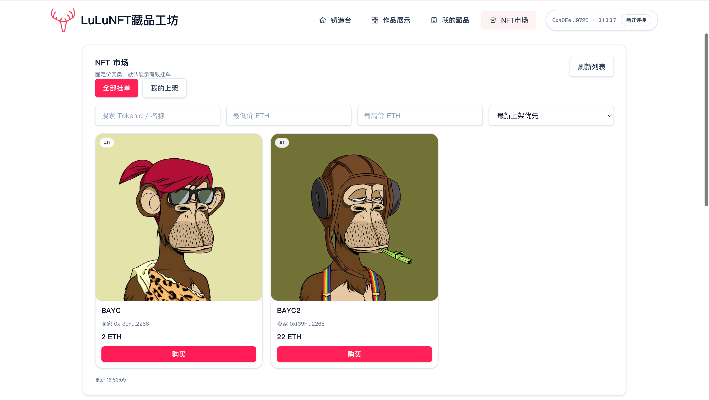
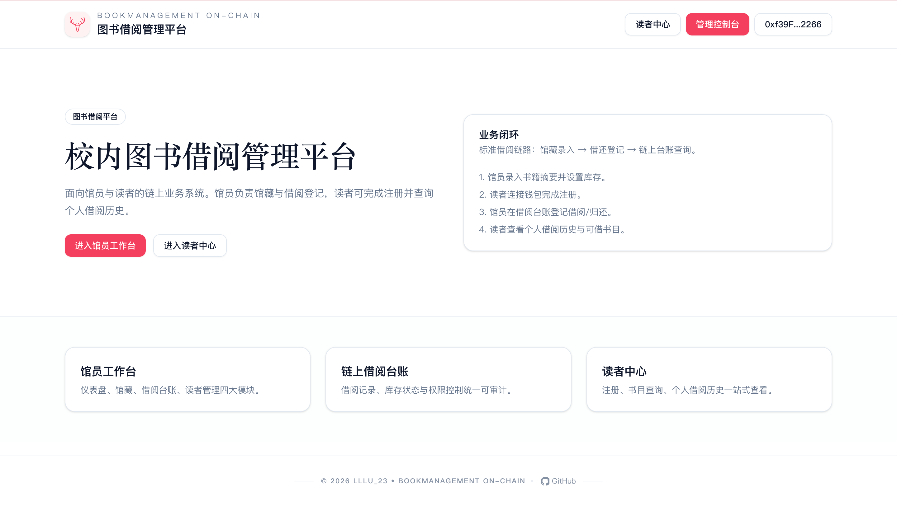
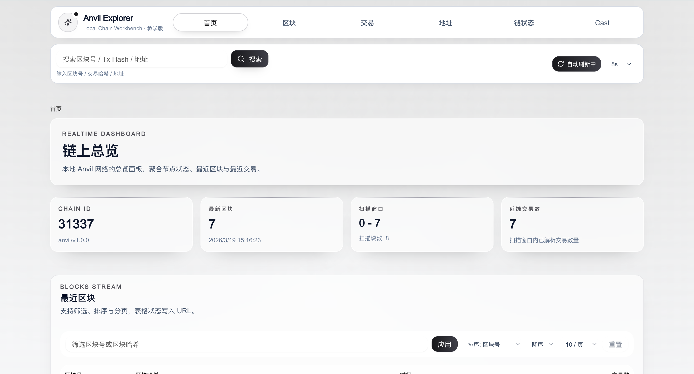
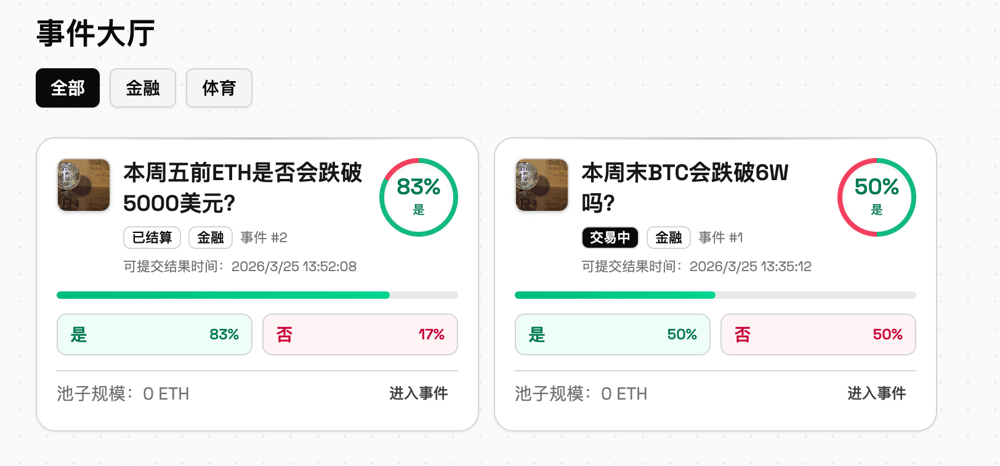
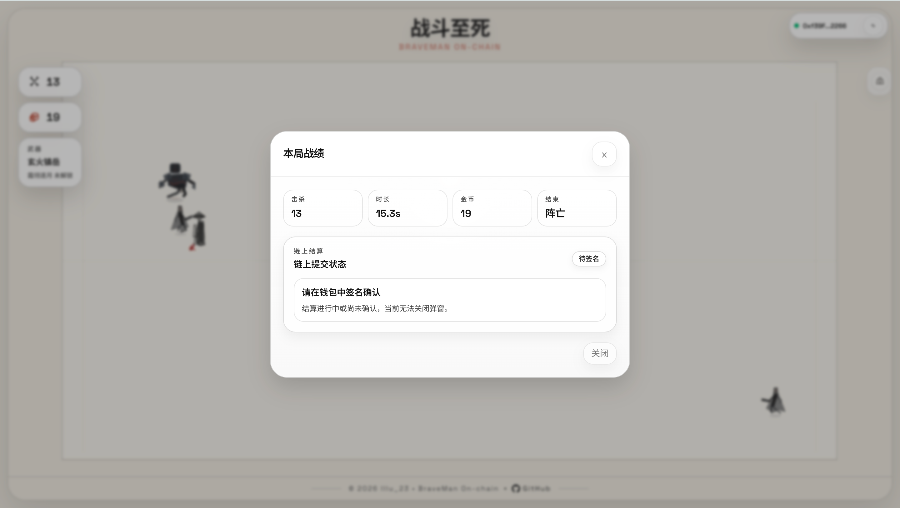
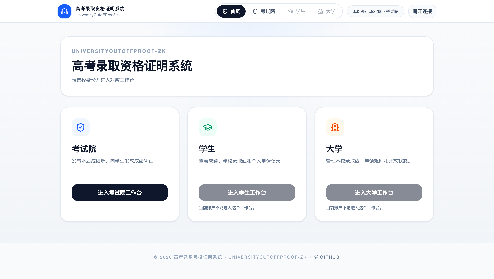
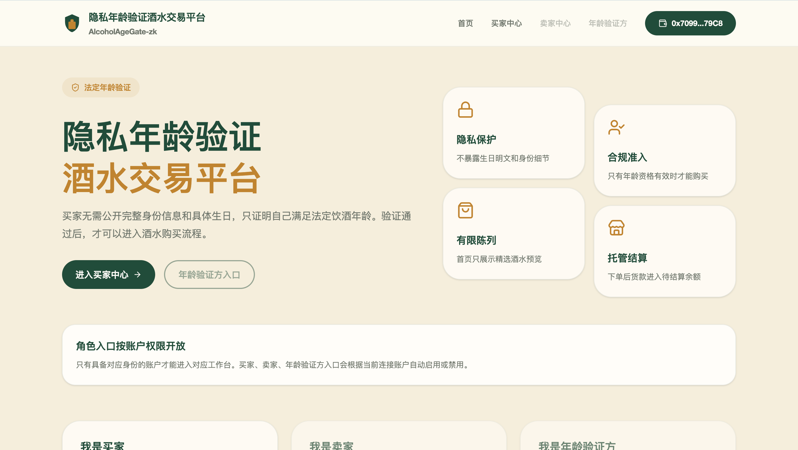

# 2026 年 Foundry 进阶开发教程

学习如何使用 Foundry 进行更深一步的 Solidity 智能合约开发。  
作者：`lllu_23`

> [!WARNING]
> 本教程中构建的所有代码未经过严格审核，仅用于学习交流，禁止在生产环境中直接使用。

# 项目总览

| 项目名称 | 代表性页面 | 功能简介 |
| --- | --- | --- |
| [01_Erc20](01_Erc20/) |  | ERC20 代币铸造 Demo，提供前端铸造页面与 Foundry 合约。 |
| [02_Faucet](02_Faucet/) |  | ERC20 代币水龙头，支持管理员配置与用户领取。 |
| [03_MerkleAirDrop](03_MerkleAirDrop/) |  | 基于 MerkleTree 的空投领取系统，包含白名单配置与领取流程。 |
| [04_FlappyBird-Onchain](04_FlappyBird-Onchain/) |  | Flappy Bird 上链版，集成钱包与链上排行榜。 |
| [05_SnakeGame-On-chain](05_SnakeGame-On-chain/) |  | 贪吃蛇上链版，支持游戏结束自动提交成绩、链上排行榜与历史成绩。 |
| [06_2048Game-On-chain](06_2048Game-On-chain/) |  | 2048 上链版，支持游戏结束自动提交成绩、链上排行榜与链上记录。 |
| [07_LightOut-Game-On-chain](07_LightOut-Game-On-chain/) |  | 关灯游戏上链版，支持通关后链上提交、链上排行榜与对局记录。 |
| [08_LuLuNFT-Minter](08_LuLuNFT-Minter/) |  | NFT 铸造与固定价交易示例，支持上架、购买与二次售卖闭环。 |
| [09_BookManagement-On-chain](09_BookManagement-On-chain/) |  | 图书借阅管理平台，支持馆员端馆藏/借阅/读者管理与读者端注册查询。 |
| [10_AnvilExplorer](10_AnvilExplorer/) |  | 本地 Anvil 链浏览器，支持区块/交易/地址查询、链状态查看与 Cast 调试控制台。 |
| [11_Polymarket-On-chain](11_Polymarket-On-chain/) |  | Polymarket 风格预测市场示例，支持市场创建、交易与结果结算流程。 |
| [12_StoneFall-On-chain](12_StoneFall-On-chain/) |  | StoneFall 躲避上链版，支持结算自动提交成绩、链上排行榜与历史记录。 |
| [13_Down-Man-On-chain](13_Down-Man-On-chain/) |  | Phaser 下落生存上链版，支持结算自动提交、链上排行榜与历史记录。 |
| [14_BraveMan-On-chain](14_BraveMan-On-chain/) |  | BraveMan 三段式教学样板，结合前端实时游玩、Rust 确定性复盘与链上结算。 |
| [15_TicTacToe-On-chain](15_TicTacToe-On-chain/) |  | Web3 链上井字棋，支持创建/加入对局、链上落子、历史战绩与排行榜。 |
| [16_UniversityCutoffProof-zk](16_UniversityCutoffProof-zk/) |  | 高考录取资格证明系统，支持考试院发布成绩源、大学设线审批、学生本地生成 zk 申请证明并提交申请。 |
| [17_AlcoholAgeGate-zk](17_AlcoholAgeGate-zk/) |  | 隐私年龄验证酒水交易平台，支持年龄验证方发布资格集合、买家本地生成 zk 年龄证明并完成酒水购买。 |
| [18_UnemploymentBenefitProof-zk](18_UnemploymentBenefitProof-zk/) |  | 失业一次性补助资格证明平台，支持政府发布资格名单、申请人本地生成 zk 领取证明并完成补助发放。 |

# 开发建议（工程实践清单）

## 1. 环境与版本基线
1. 统一记录核心版本：`solc`、Foundry、Node、npm，并在 README 中同步更新，避免“你能跑我不能跑”。
2. 每个项目提供 `.env.example` 与最小启动命令（如 `make dev`），保证新同学可以一键复现开发环境。
3. 开发前先执行一次环境体检：`forge --version`、`node -v`、`npm -v`，不满足版本再开始编码。

## 2. 合约设计基线
1. 先写权限矩阵和状态迁移：谁可以调用、什么时候必须 revert、状态如何变化。
2. 每个核心动作至少定义一个事件（Event）和一个失败分支（`require` 或 custom error）。
3. 排行榜/缓冲区/排序类逻辑先定义不变量，再落地实现，减少后期返工。
4. 涉及资金或关键状态更新时，优先采用“检查-更新-外部调用”顺序。

## 3. 测试基线（强烈建议）
1. 单元测试至少覆盖：成功路径、参数非法、权限错误、边界值（如 0、最大值、容量上限）。
2. 每个核心合约增加 1-2 个 fuzz/invariant 用例，验证排序稳定性与状态不变量。
3. 合约提交前固定执行：`forge test` + `forge coverage`，先补关键盲区再合并。
4. 事件必须验证参数正确性，而不只是“事件被触发”。

## 4. 前端链交互基线
1. 交易流程至少区分四态：`signing -> pending -> success/error`，让用户知道当前阶段。
2. 常见异常要显式提示：未连接钱包、网络错误、RPC 超时、地址无效、用户拒签。
3. 关键按钮增加门禁：钱包未连接或链错误时禁止操作，并提供可执行引导。
4. 前端提交前执行 `npm run build`，确保类型检查与构建完整通过。

## 5. 安全基线（学习项目也建议）
1. 每个项目至少做一次静态扫描（如 Slither），并将结果转化为测试补洞清单。
2. 人工复核高风险点：权限控制、外部调用、重入风险、签名验证、DoS 路径。
3. 每发现一个问题，必须补“复现测试 + 修复后测试”，形成可追踪闭环。
4. 不提交私钥、助记词、真实生产配置，统一用示例配置与占位符。

## 6. PR / 提交前 Checklist
1. 合约：`forge fmt && forge test && forge coverage`。
2. 前端：`npm run build`（必要时补 `npm run lint`）。
3. 文档：新功能必须同步 README（启动命令、交互说明、截图或示例）。
4. 提交粒度：功能改动、测试改动、文档改动尽量分离，便于回滚和 Code Review。

# 推荐的学习资料

## 1. Solidity 与 EVM 基础
- [Solidity Docs](https://docs.soliditylang.org/en/latest/)
- [Solidity Security Considerations](https://docs.soliditylang.org/en/latest/security-considerations.html)
- [Ethereum Developers](https://ethereum.org/zh/developers/docs/)
- 建议产出/学习目标：能独立解释交易生命周期、`msg.sender`/`msg.value`、事件日志与 Gas 开销关系。

## 2. Foundry 工程化
- [Foundry Docs](https://getfoundry.sh/)
- [Forge Tests](https://getfoundry.sh/forge/tests/overview/)
- [Fuzz Testing](https://getfoundry.sh/forge/advanced-testing/fuzz-testing/)
- [Invariant Testing](https://getfoundry.sh/forge/invariant-testing)
- [Cheatcodes](https://getfoundry.sh/reference/cheatcodes/overview/)
- [Coverage](https://getfoundry.sh/forge/reference/coverage/)
- 建议产出/学习目标：能为核心合约写出成功/失败路径单测，并补 1-2 个 fuzz 或 invariant 测试。

## 3. 标准库与协议规范
- [OpenZeppelin Contracts](https://docs.openzeppelin.com/contracts)
- [EIP-20](https://eips.ethereum.org/EIPS/eip-20)
- [EIP-721](https://eips.ethereum.org/EIPS/eip-721)
- [EIP-1155](https://eips.ethereum.org/EIPS/eip-1155)
- [EIP-4626](https://eips.ethereum.org/EIPS/eip-4626)
- 建议产出/学习目标：开发时优先复用标准接口与实现，减少非必要的自定义协议设计。

## 4. 前端链交互
- [wagmi](https://wagmi.sh/)
- [viem](https://viem.sh/)
- [Next.js Installation](https://nextjs.org/docs/app/getting-started/installation)
- 建议产出/学习目标：能实现钱包连接、网络校验、合约读写、错误提示四件套。

## 5. 安全与审计进阶
- [OWASP SCSVS](https://scs.owasp.org/SCSVS/)
- [Slither Wiki](https://github.com/crytic/slither/wiki)
- [Echidna Docs](https://secure-contracts.com/program-analysis/echidna/index.html)
- 建议产出/学习目标：能输出“风险清单 + 复现步骤 + 修复建议 + 回归测试”四段式审计结果。

# 推荐的视频教程（中文）

1. [北京大学肖臻老师的《区块链技术与应用》公开课](https://www.bilibili.com/video/BV1Vt411X7JF ): 课程内容主要是讲解以太坊和比特币的底层原理，虽然肖臻老师录制该课程的时间为 2018 年，但是课程容并不过时，其中涉及到编程的内容很少，大多数都是对区块链的认真看完会帮助你打下非常坚实的理论基础

2. [B站：梁培利老师 个人空间的所有关于区块链的课程](https://space.bilibili.com/220951871): 成都信息工程大学区块链工程专业教师的课程录制，没有接触过区块链的朋友建议从这位老师的课程开始看，比北大肖臻老师的课程内容更新一些，内容覆盖面也更广

3. [B站 up主：五里墩茶社的《跟我学Solidity》系列](https://space.bilibili.com/615957867/channel/collectiondetail?sid=1067760 )这是我看过讲解 `Solidity` 最为详细的中文教程博主，从最基础的知识一直讲到实际的合约编写，所有使用 `Solidity` 开发智能合约，需要的基础知识都囊括其中了，其视频配套使用的` WTF 学院`发布的一系列区块链相关课程我在上面也有提到，输入入门必看系列！！！

4. 如果你已经了解了 `Solidity` 的相关基本知识，接下来应该开始学习框架从而进入到实际开发中，目前主流的 `Solidity` 开发框架有两个： `Hardhat` 与 `Foundry`，这两个课程都是由 `Patrick Collins` 老师讲授的，
- Hardhat 框架的课程链接：[（32 小时最全课程）区块链，智能合约 & 全栈 Web3 开发](https://www.bilibili.com/video/BV1Ca411n7ta)
- Foundry 框架的课程链接：[【人工精翻】B站最新Solidity智能合约Foundry框架零基础教程1-12课（已完结)](https://www.bilibili.com/video/BV13a4y1F7V3)（这个链接经常会出现点不进去的问题，遇到稿件消失可以去我的B站主页置顶视频找到这个课程）
**这个课程也是我在 2023 年断断续续花了 100 多个小时翻译的，我个人认为在视频教程里面非常优质的课程了，学完这个 Foundry 课程基本就不用再看其他任何教程了！！！**

5. 学完长达 21 小时的框架课程之后，你就应该已经完全具备独立开发基本的 DeFi、NFT 相关智能合约的能力了，这个时候我会建议你补充一下智能合约审计相关的知识，同样是由 `Patrick Collins` 老师讲授，此外，还有更为详细的智能合约审计相关课程由 `Owen` 老师讲授。
入门基本的智能合约安全审计课程：[2024年智能合约安全审计课程（第1-5课）](https://www.bilibili.com/video/BV1B94y1M71V) 
进阶的智能合约安全审计课程： [21 小时智能合约安全审计课程（基础知识+案例实战）](https://www.bilibili.com/video/BV1qK4y1i7Zw) 

# 非常优质的 Web3 开发者社区
- [Chainlink预言机](https://space.bilibili.com/482973600)
- [DappLearning](https://space.bilibili.com/2145417872/)
- [DoraHacks](https://space.bilibili.com/445312136/)
- [登链社区](https://space.bilibili.com/581611011)
- [TinTinLand](https://space.bilibili.com/1152852334)

# 如何解决你在编程学习当中遇到的问题

## 1. 搜索引擎
当你遇到了编译错误或者无法解决的问题时，可以先把核心报错片段放进搜索引擎，看一看是否有人遇到过类似问题。对于常规错误，大部分时候靠搜索引擎就能解决。

**Tips**：
不要将错误代码整段整段的复制到对话框中，这样搜索引擎通常会无法检索到正确的信息
- 正确做法：选择较为核心的错误提示进行搜索

推荐的搜索引擎：
- [百度](https://www.baidu.com/)
- [谷歌](https://www.google.com/)

## 2. 论坛
Stack Exchange 是一个专注于以太坊生态的论坛，里面有很多开发者提出问题，也有很多经验丰富的开发者帮忙解答。如果你在搜索栏中找不到类似的解决办法，可以发帖并附上详细代码和错误提示。

- [Stack Exchange Ethereum](https://ethereum.stackexchange.com/)

## 3. 免费的 AI 助手
这一类人工智能工具的使用方式就不展开了。需要注意的是，很多时候即使不开通会员，也足够帮你解决大部分开发问题；按自己的习惯选择顺手的工具即可，我个人更偏爱 ChatGPT 和 Phind。

- [DeepSeek](https://chat.deepseek.com/)
- [ChatGPT](https://chat.openai.com/)
- [Phind](https://www.phind.com/)：与 ChatGPT 类似，但可以结合提问内容进行网页搜索
- [Gemini](https://gemini.google.com/)
- [Claude](https://claude.ai/)

## 4. GitHub Copilot
**我不推荐新手朋友在学习的过程中使用 Copilot，Copilot 会自动帮你完成很多本应你自己完成的代码，相信我，自己跟着视频教程敲一遍代码，一定能让你学到更多**

- [GitHub Copilot](https://github.com/features/copilot)

# 测试网水龙头

## 推荐使用 [Amoy](https://amoy.polygonscan.com/)
Polygon 的测试网，之前的名字叫 `Mumbai`，后来改为了 `Amoy`。

1. [Alchemy Faucet (Amoy)](https://www.alchemy.com/faucets/polygon-amoy)
2. [QuickNode Faucet (Amoy)](https://faucet.quicknode.com/polygon/amoy)
3. [Chainlink Faucet (Amoy)](https://faucets.chain.link/polygon-amoy)
- **Tips**：现在的水龙头基本都需要你在主网钱包中有少量代币余额，才可以领取测试币。

# 推荐安装的 VSCode 插件

## 常规使用
- 图标优化:(选择自己喜欢的图标即可)
  1. VSCode Icons
  2. Material Icon Theme
- VSCode 主题:(选择自己喜欢的主题即可)
  1. One Dark Pro
  2. Dracula Theme Official
  3. Shades of Purple
- Error Lens: 优化错误提示
- TODO Highlight: TODO 高亮
- indent-rainbow: 缩进显示优化
- Prettier - Code formatter: 代码格式化
- Path Intellisense: 自动补全文件路径
- Code Snap: 代码截图工具
- Peacock: 用于区分不同主题的工作区
- Code Spell Checker: 检查单词错误
- Markdown All in One: 用于编写合约的 `README.md` 文档
 
## 智能合约开发的 VSCode 插件
- Solidity: 以太坊官方插件
- Foundry Test Explorer: 直接在 VSCode 的 test explorer 中运行 Foundry 的 Solidity 测试
- Even Better Toml: 静态分析`.toml`文件主要用于便捷查看 `foundry.toml` 文件

## 前端开发相关的 VSCode 插件
- Auto Rename Tag: 自动重命名标签配对
- Eslint: 用于 JS 和 TS 代码的静态分析
- Next.js Snippets: 提供常用的 Next.js 代码片段
- Tailwind CSS IntelliSense: 智能提示与自动补全
- Css Peek: 快速查看 CSS 样式
- LiveServer: 实时预览 HTML 文件

# 编程过程中可能会用到的网页工具

- [Ethereum Unit Converter](https://eth-converter.com/): 以太坊的单位转换工具，因为实际在 Solidity 中编程，默认的计量单位为 Wei, 与 ether 之间存在 10 ** 18 的换算，编程时不确定换算是否正确可以使用此工具进行核验

- [OpenZeppelin官网](https://www.openzeppelin.com/): 内有 Solidity 中最全的标准库，官方文档中包含不同操作系统的安装方式，以及查看标准库中一些合约的源代码，同时主页有一个简易的合约定制工具，可以快速生成 ERC-20, ERC-721 等合约的模板

- [Alchemy](https://www.alchemy.com/): 在一定限额内免费的多条公链 API 的工具，同时也支持实时数据分析以及交易监听的

- [Infura](https://www.infura.io/zh): 与 Alchemy 提供的服务差不多，选自己用的顺手的就行

# 智能合约安全相关的学习资料

## 推荐的学习资料
- 入门合约安全审计必读文章: [如何成为智能合约审计员](https://cmichel.io/how-to-become-a-smart-contract-auditor/) Christoph Michel 大佬的博文，这哥们曾经靠合约安全审计一年赚了一百万美元，同时也在文章里分享了自己的一些心得

**@TODO**
这部分内容还有很多学习资料，后面有时间了抽空补上...

## 智能合约安全审计比赛
- [Code4rena](https://code4rena.com/): 相较于其他两个，我个人比较喜欢的平台，可以很方便的查看过往比赛的审计报告，数量很多，选择自己感兴趣的报告查看学习即可。同时也有不定期的公开审计比赛，没有什么门槛限制，有闲暇时间可以参与一下，看看自己的审计能力

- [Immunefi](https://immunefi.com/): 审计比赛平台，同时也有一些合约安全审计的学习资料

- [Sherlock](https://audits.sherlock.xyz/contests): 审计比赛平台,比赛也很多

- [CodeHawks](https://codehawks.cyfrin.io/): Cyfrin 官方推出的审计平台，主要是以其过往的审计报告为主，赏金较少


# 一些 Web3 招聘网站
## 中文招聘网站
- [SmartDeer](https://www.smartdeer.work/zh): 在 IOS/Android 端的应用商店都能自己搜索到，将求职意向选择到 Web3 相关的岗位，会跳转出很多的 Web3 项目方，缺点是 HR 回复速度慢或不回复，需要自己找到联系方式后，通过写邮件或其他方式再次投递简历。
- [abetterweb3](https://abetterweb3.notion.site/abetterweb3-7ce334dcf8524cb79a5894bdd784ddb4): 华人自制的以 `Notion` 形式发布的招聘网页，可以在上面发布自己的简历，也可以根据项目方贴出来的联系方式直接与项目方联系
- Boss 直聘, 智联招聘, 猎聘这些传统的招聘网站也有很多 Web3 的招聘信息，大家注意甄别，和项目方沟通时记得多留几个心眼，不要踩坑就行

## 海外招聘网站
- [web3.career](https://web3.career/)
- [remote3.co](https://remote3.co/)
- [remoteok.com](https://remoteok.com/)
- [cryptojobslist.com](https://cryptojobslist.com/)
- [useweb3.xyz](https://www.useweb3.xyz/)
- [cryptojobs.com](https://www.cryptojobs.com/)
- [blockchain.works-hub.com](https://blockchain.works-hub.com/)
- [abetterweb3](https://abetterweb3.notion.site/abetterweb3-7ce334dcf8524cb79a5894bdd784ddb4)

# 环境配置
1. 安装并配置 `git` 所需的环境
    - [git](https://git-scm.com/book/en/v2/Getting-Started-Installing-Git)
        - 安装成功后可以运行 `git --version`，如果安装成功则显示 `git version x.x.x`，截止 2026 年 2 月，当前我使用的版本为 `2.53.0`。

2. 安装并配置 `node` 运行所需的环境
    - [node.js](https://nodejs.org/zh-cn)
        - 安装成功后可以运行 `node -v` 如果安装成功则显示 `node version x.x.x`，截止 2026 年 2 月，当前我使用的版本为 `24.13.0`。然后运行 `npm -v`，查看 `npm` 包管理器的版本，截止 2026 年 2 月，当前我使用的版本为 `11.9.0`，如果需要更新 `npm` 的版本，可以运行 `npm install -g npm`
        - 国内建议切换到淘宝镜像源，下载速度会快很多

## 合约部分的环境配置
1. 安装 `Rustup`：Foundry 运行所需的基础环境之一
   - [rust](https://www.rust-lang.org/tools/install)
        - 安装成功后可以运行 `rustc --version` ，如果安装成功则显示 `rustc x.x.x`，截止 2026 年 2 月，当前我使用的版本为 `rustc 1.93.0 (2026-01-22)`

2. 安装 `HomeBrew`, 很好用的包管理工具
   - [homebrew](https://brew.sh/)
        - 安装成功后可以运行 `brew --version` ，如果安装成功则显示 `Homebrew x.x.x`，截止 2026 年 2 月，当前我使用的版本为 `Homebrew 5.0.9`

3. 安装并配置 `Foundry`
    - [foundry](https://getfoundry.sh/)
        - 安装成功后可以运行 `forge --version` ，如果安装成功则显示 `forge x.x.x`，截止 2026 年 2 月，当前我使用的版本为 `forge 1.0.0-stable (e144b820 2025-02-13T20:02:34.979686000Z)`

## 前端项目的环境配置
1. 安装 [Next.js](https://nextjs.org/): 作为项目的前端框架，当然你也可以选择 React、Vue，因人而异，选择自己顺手的即可。截止 2026 年 2 月，当前我使用的版本为 `15.5.12`。
  - 在终端运行 `npx create-next-app@latest` 初始化一个 Next.js 项目，并根据自己的需求选择所需要的附加插件
  
2. 安装 [Tailwind CSS](https://tailwindcss.com/docs/installation)
  - 在终端运行 `npm install -D tailwindcss`，然后根据官网文档进行配置
  
3. 安装 [Ethers](https://docs.ethers.org/v6/): 用于前端与合约之间的交互（新手更推荐 Ethers）

4. 安装 [wagmi](https://wagmi.sh/): 用于前端与合约之间的交互

5. 安装 [RainbowKit](https://www.rainbowkit.com/zh-CN): 主要用于前端和钱包交互
  - 在终端运行 `npm init @rainbow-me/rainbowkit@latest`

# 常见的 Foundry 指令

## 运行一个本地的 `anvil` 节点
```
anvil
```
`anvil` 非常好用，结合 `cast` 基本可以在本地完成全部的链上操作

## 编译合约
这将默认在本地节点部署智能合约。为了成功部署，你需要在另一个终端中运行 `anvil`。
```
forge compile
```
需要注意的是，确保你合约内标注的 `solc` 版本与安装的版本一致，如果你想指定特定的编译器版本，可以在 `foundry.toml` 中使用
```
solc-version = ["0.x.x"]
```
进行设置

## 构建合约
编译合约并在本地生成字节码和 `ABI` 文件
```
forge build
```

## 部署合约
这将默认在本地节点部署智能合约。为了成功部署，你需要在另一个终端中运行 `anvil`。
**必须要提的是，当前的 `Foundry` 不需要编写部署脚本进行合约部署，可以使用 `forge create` 命令进行快速部署，具体代码如下**
```
forge create <contract_address> --constructor-args <args> --private-key <private_key> --rpc-url <rpc_url>
```

# 常见的 Foundry Test 中会使用的 `CheatCodes`

1. `vm.prank()`: 模拟一个不同的交易发起者，即将当前交易的发送者地址更改为 `_sender`
```solidity
 function prank(address _sender) public; 
 ```
- _sender: 需要模拟的地址

2. `vm.deal()`: 将指定数量的以太币 `_amount` 发送到 `_recipient` 地址
```solidity
 function deal(address _sender) public; 
 ```
- _amount: 指定以太币的数量
- _recipient: 目标地址
  
3. `vm.addr()`: 指定一个私钥来返回与之对应的以太坊地址
```solidity
function addr(uint256 privateKey) external returns (address);
```
- privateKey: 256 位的私钥，用于生成相应的地址，可以指定任何私钥来生成对应的地址。

4. `vm.hoax()`: 模拟地址并且向其中存入指定数量的以太币,可以认为是 `prank` 和`deal` 的结合
```solidity
 function hoax(address _sender, uint256 _amount) public; 
 ```
- _sender: 需要模拟的地址。
- _amount: 交易发送的以太币数量（可选）。

5. `vm.roll()`: 模拟链上的区块高度，允许将区块号设置为 ` _blockNumber`
```solidity
function roll(uint256 _blockNumber) external;
```
- _blockNumber: 目标区块高度

6. `vm.warp()`: 模拟区块时间，将当前的区块时间（block.timestamp）设置为 `_timestamp`
```solidity
function warp(uint256 _timestamp) external;
```
- _timestamp: 目标区块时间

7. `vm.expectRevert()`: 设置一个断言，期望下一次的操作会 revert,如果操作没有 revert，则测试失败。
```solidity
function expectRevert(bytes memory _data) public;
```
- _data: 表示期望 revert 时抛出的错误信息。如果不需要特定的错误信息，可以传递空字节数组。

8. `vm.expectEmit()`: 检查事件是否被正确地发出,可以选择检查最多四个事件的主题
```solidity
function expectEmit(
    bool checkTopic1,
    bool checkTopic2,
    bool checkTopic3,
    bool checkData,
    address emitter
) external;
```
- checkTopic1: true 为检查, false 为不检查
- checkTopic2: true 为检查, false 为不检查
- checkTopic3: true 为检查, false 为不检查
- checkData: 检查事件的 data 部分
- emitter: 事件的触发者（合约或者地址）

9. `vm.setBlockGasLimit(uint _gasLimit)`: 设置当前区块的 `gasLimit`
```solidity 
function setBlockGasLimit(uint _gasLimit) public;
```
- _gasLimit: 目标 gas 限制


# 使用 `cast` 与合约进行交互
一般使用 `cast send` 和 `cast call` 与智能合约进行交互，详细用法可以在 [Foundry 官方文档](https://book.getfoundry.sh/cast/?highlight=cast#how-to-use-cast) 的 cast 概览中找到。


# 零知识证明（ZK）开发总览

## 1. 什么是零知识证明
零知识证明（Zero-Knowledge Proof，简称 `ZK`）最核心的价值，可以概括为一句话：
**我不把原始隐私数据直接交给你，但我仍然可以向你证明“某个条件是真的”。**

最常见的理解方式，可以先看下面这几个例子：
- 我不公开完整成绩单，但我可以证明“我的分数达到了某条录取线”
- 我不公开生日和身份证信息，但我可以证明“我已经成年”
- 我不公开完整失业凭证，但我可以证明“我满足某项补助领取资格”

从工程角度看，`ZK` 项目并不是“给普通 DApp 多装一个库”，而是把“本地持有隐私数据、生成证明、链上或服务端验证、执行后续业务动作”串成一条新的开发链路。

## 2. ZK 项目通常在解决什么问题
传统链上项目里，常见做法往往是：
- 把用户数据直接提交到后端或链上
- 后端或合约再根据这些数据判断用户是否满足条件

而 `ZK` 项目更适合处理下面这些场景：
- 数据本身很敏感，不适合直接公开
- 业务真正关心的不是“全部原始数据”，而只是“你是否满足某个资格”
- 需要防止同一份资格被重复使用
- 需要把“验证结果”与钱包地址、链上状态、业务流程绑定起来

所以很多 `ZK` 项目的重点并不是“加密一切”，而是：
**尽量少暴露数据，只把业务真正需要验证的结论交给系统。**

## 3. 一次完整的 ZK 验证流程是什么样的
从开发流程来看，一次典型的 `ZK` 验证通常会经过下面这些阶段：

1. 先明确业务规则，也就是“你到底想证明什么”
2. 把这个规则写成电路约束（`circuit`）
3. 使用工具链编译电路，生成 `wasm`、`zkey`、`verifier` 等产物
4. 准备好业务侧需要公开的公共输入，例如资格集合根、项目编号、版本号等
5. 在前端或服务端根据私有数据生成 `proof`
6. 把 `proof + public signals` 提交给链上合约或验证服务
7. 由 `verifier` 验证证明是否成立
8. 验证通过后，才允许进入后续业务动作，比如注册、申请、购买、领取补助、铸造资格等

如果你是第一次接触这类项目，最需要先建立下面这三个认知：
- 原始隐私数据通常不会直接上链
- 链上更关心的是“证明有没有通过”
- `proof` 只是在证明你满足条件，不是在替代完整业务逻辑

## 4. 初学者最容易混淆的几个概念

### `circuit`
电路就是你要证明的规则本身，可以把它理解为“隐私业务逻辑的数学表达”。

### `witness`
`witness` 一般指生成证明时使用的私有输入，它往往来自本地持有的敏感数据。  
很多初学者会把 `witness` 当成 `proof` 本身，这是不对的，`witness` 更像是生成证明时喂给电路的数据。

### `public input / public signals`
这些是验证方允许公开看到的输入或输出。  
比如版本号、项目 ID、Merkle root、当前绑定的钱包地址、某些公开结果等，都可能作为 `public signals` 出现。

### `proof`
`proof` 就是最终生成出来的证明结果。  
验证方不需要知道你的全部原始数据，只需要拿到 `proof` 和对应的公共输入，就可以判断你是否满足电路约束。

### `verifier`
`verifier` 是验证证明是否成立的程序或合约。  
在链上项目里，通常会把 `verifier` 生成成一个 Solidity 合约，然后由业务合约去调用它。

### `wasm`
很多浏览器内 proving 场景，会把电路编译后的 `wasm` 产物交给前端使用。  
前端在本地加载 `wasm` 后，就可以配合私有输入计算 `witness` 或生成证明。

### `zkey`
`zkey` 是生成证明时会用到的关键产物。  
如果你走的是 `Groth16` 这类常见路线，前端或服务端通常都要依赖 `zkey` 才能完成正式 proving。

### `trusted setup`
`trusted setup` 可以理解为某些证明系统在正式 proving 之前需要准备的一组可信参数。  
对于 `Groth16` 来说，这一步非常关键，所以很多开发者第一次接触 `ZK` 时都会在这里花很多时间。

### `Merkle root`
很多资格证明项目不会把全部用户数据逐条公开验证，而是先把资格集合组织成一棵 Merkle Tree。  
链上或验证方只需要持有 `Merkle root`，用户再通过路径证明自己属于这个集合即可。

### `nullifier`
`nullifier` 最常见的用途是防止同一份资格被重复使用。  
它不是简单的用户 ID，而是一个专门服务于“防重复提交 / 防重复领取 / 防重复验证”的工程设计。

### `wallet binding`
很多业务会把证明结果和当前钱包地址绑定。  
这样做的好处是，即使别人拿到了你的某份本地凭证，也不能轻易换个钱包地址重新复用。

## 5. 开发 ZK 项目通常需要掌握的技术

### 电路与证明层
- `Circom`：用来描述电路约束，是很多 JavaScript 生态 `ZK` 项目的常见入口。
- `snarkjs`：负责 trusted setup、proof 生成、proof 验证、calldata 导出等核心流程。
- `circomlib / circomlibjs`：提供常见电路组件和对应的 JavaScript 辅助能力，能少写很多基础模板。
- `ffjavascript`：负责有限域相关运算，是很多 `snarkjs` / `circom` 周边工具依赖的底层库。
- `Groth16`：当前非常常见的一条工程路线，优点是链上验证成本和产物形态都比较成熟。

### 链上验证层
- `Solidity verifier`：把证明验证能力带到链上，是业务合约能否真正消费 `proof` 的关键。
- `Foundry`：非常适合管理 verifier、业务合约、部署脚本和测试流程。
- `Anvil`：适合本地快速搭一条链，把 proving、部署、验证、前端交互整条链路跑通。

### 前端交互层
- `Next.js`：适合承载正式业务前端、路由、API route 和静态产物同步。
- `React`：用于组织复杂的多角色界面、交易流程状态和本地凭证管理。
- `TypeScript`：在 `ZK` 项目里尤其重要，因为 proof 输入、公共信号、ABI 配置、角色状态这些数据结构都很容易出错。
- `wagmi + viem`：用于钱包连接、链上读写、交易状态处理与前端合约交互。
- 浏览器内 proving：很多隐私项目希望让用户在本地完成证明，这样私有数据就不用先上传到后端。
- `wasm / zkey` 产物加载：前端 proving 能不能跑起来，很大程度上取决于这两类产物能否正确同步、加载和缓存。

### 后端与服务层
- 事件索引：把链上事件投影成更容易查询的业务数据。
- 数据聚合 API：把链上状态、链下草稿、本地流程说明、角色视图统一成稳定接口。
- 数据库存储：托管草稿、辅助记录、发放记录、历史快照等链下状态。
- 类型同步 / OpenAPI：避免前后端各写一套接口类型，减少联调错误。
- `NestJS + Prisma + PostgreSQL`：这是目前很常见的一套工程组合，适合把复杂业务状态和链上事件聚合起来。

### 工程协作层
- 构建脚本：把 `build-zk`、`build-contracts`、`deploy` 这样的动作收敛成稳定入口。
- 部署脚本：负责 verifier、业务合约、运行时配置、地址同步等流程。
- ABI / 运行时配置同步：让前端可以稳定拿到最新地址、ABI、`wasm`、`zkey` 和公开样例。
- 测试与环境管理：把电路测试、合约测试、前端构建、角色流程校验收成一套可以重复执行的流程。

**总结一下：**
真正的 `ZK` 项目，本质上是“电路 + 合约 + 前端 + 数据约束 + 业务规则 + 工程同步”一起工作的结果。

## 6. 一个完整 ZK 项目通常如何落地
如果你以后要自己做一类 `ZK` 项目，我建议按下面这个顺序思考和落地：

1. 先定义业务里的“资格条件”，例如是否成年、是否在某个名单里、是否达到某个阈值
2. 再定义哪些数据必须私有，哪些数据可以公开，这一步没想清楚，后面电路和前端都会反复返工
3. 把资格规则抽象成电路输入、约束和输出，明确哪些是私有输入，哪些是公共输入
4. 编译电路并生成核心产物，包括 `wasm`、`zkey`、验证相关产物以及测试样例
5. 部署 verifier 与业务合约，让链上具备“接收 proof 并判断它是否成立”的能力
6. 准备公共状态，例如资格集合根、版本号、项目 ID、角色配置、业务参数等
7. 在前端或服务端完成 proof 生成，如果强调隐私，很多时候会选择在浏览器内完成 proving
8. 把 proof 接进真实业务动作，例如验证成功后允许提交申请、购买受限商品、领取权益或完成登记
9. 最后补上防重放、防重复提交和版本失效机制，例如 `nullifier`、版本号、钱包绑定、资格集合刷新等

你会发现，`ZK` 项目的难点往往不只是“电路能不能写出来”，还在于：
- 电路设计是否真的贴合业务
- 前端 proving 是否稳定
- 公共输入是否设计合理
- 链上验证和业务状态机能不能闭环

## 7. 如果你想开始做 ZK 项目，建议先补哪些能力

### 第一阶段：先建立最小认知
- 先理解零知识证明到底在解决什么问题
- 先理解 Merkle Tree、commitment、nullifier 这些常见结构在工程里的作用
- 先把 `circuit / witness / proof / verifier / public input` 这几个概念彻底分清楚

### 第二阶段：学会本地跑通最小闭环
- 学会写一个最小 `Circom` 电路
- 学会编译电路
- 学会生成 `proof`
- 学会本地验证 `proof`
- 学会把 verifier 合约部署到本地链上

### 第三阶段：再进入前端与业务集成
- 学会前端加载 `wasm / zkey`
- 学会处理 proving 过程中的耗时、报错和用户交互状态
- 学会把 proof 和钱包地址、业务参数、链上状态绑定起来
- 学会设计“验证成功之后到底允许做什么”

### 第四阶段：最后补工程化能力
- 统一构建脚本和运行入口
- 管理环境变量、部署地址、ABI、公开样例和运行时配置
- 补自动化测试
- 补可信设置、版本切换、产物同步、性能与安全性问题

**我的建议是：**
不要一开始就去追最复杂的证明系统，也不要一上来就把精力全部放在论文和数学推导上。  
对于大多数想做业务型 `ZK` 项目的人来说，先把“本地 build -> prove -> verify -> 链上调用 -> 前端交互”这条最小链路跑通，收益会更大。

## 8. 推荐的 ZK 学习资料与工具

### 基础概念
- [Circom 2 Documentation](https://docs.circom.io/)：非常适合作为 `Circom` 生态总入口，其中也包含 `Background in ZK`、电路编译、witness 计算和 proving 流程说明。
- [Proving circuits with ZK](https://docs.circom.io/getting-started/proving-circuits/)：如果你想快速建立“trusted setup -> prove -> verify -> smart contract verify”的全流程认知，这一页非常值得反复阅读。
- [OpenZeppelin MerkleProof](https://docs.openzeppelin.com/contracts/5.x/api/utils#MerkleProof)：理解 Merkle proof、资格集合、路径验证时非常有帮助。

### Circom / snarkjs
- [snarkjs](https://github.com/iden3/snarkjs)：最核心的 JavaScript `zkSNARK` 工具之一，常见的 `Groth16 fullprove / verify / powers of tau` 都绕不开它。
- [circomlib](https://github.com/iden3/circomlib)：常见电路模板与哈希、比较器、签名等基础组件库。
- [circomlibjs](https://github.com/iden3/circomlibjs)：很多前端或脚本侧的 witness 辅助、哈希与工具函数都会依赖它。
- [ffjavascript](https://github.com/iden3/ffjavascript)：有限域计算相关底层库，虽然偏底层，但很多时候排查问题会看到它。

### 链上验证与 Solidity 集成
- [Foundry Docs](https://www.getfoundry.sh/)：如果你要把 verifier 和业务合约结合起来，这是最值得长期看的文档之一。
- [OpenZeppelin Contracts](https://docs.openzeppelin.com/contracts) ：在权限控制、Merkle proof 校验、角色管理、标准接口复用方面都非常有帮助。

### 前端与工程化
- [Next.js Docs](https://nextjs.org/docs)：适合搭建正式业务前端、路由、API route 和产物同步链路。
- [wagmi](https://wagmi.sh/)：适合处理钱包连接、合约读写与 React 侧的链交互状态。
- [viem](https://viem.sh/)：适合做类型更清晰的链上读写、编码解码和客户端管理。
- [NestJS Docs](https://docs.nestjs.com/)：如果你的 `ZK` 项目需要稳定的后端聚合层、事件索引或工作台 API，这套文档很值得系统学习。
- [Prisma Docs](https://www.prisma.io/docs)：如果你要托管链下记录、凭证草稿、历史状态或管理后台数据，Prisma 的上手门槛相对友好。
- [PostgreSQL Docs](https://www.postgresql.org/docs/)：做正式业务型项目时，理解数据库本身仍然很重要。
- [OpenAPI Specification](https://swagger.io/specification/)：如果你想把后端接口类型稳定同步到前端，这是一套很值得补的标准。

### 进阶方向
- [snarkjs Trusted Setup / Powers of Tau 说明](https://github.com/iden3/snarkjs)：如果你后面想真正理解 `ptau`、Phase 2、trusted setup 这些关键词，建议直接回到 `snarkjs` 官方仓库学习。
- [Circom Background in ZK](https://docs.circom.io/)：适合回头补概念背景，把“会用工具”升级成“知道自己在做什么”。
- [OWASP SCSVS](https://scs.owasp.org/SCSVS/)：虽然它不是专门写给 `ZK` 的，但对合约安全、权限控制、输入验证和系统边界思考很有帮助。

**最后的建议：**
如果你是第一次正式接触 `ZK`，不要急着把资源一口气全部看完。  
最有效的方式通常是：
- 先看一遍概念
- 再跑一遍最小样例
- 遇到卡点时回到官方文档定点补知识

这样学习速度通常会比“先把所有资料完整看完再动手”更快一些。
---

感谢你阅读全文，希望这篇文档能给你带来一些帮助！

- 作者：`lllu_23`
- 联系方式：`lllu238744@gmail.com`
- 最后一次更新时间：`2026-04-17`

搬运转载请注明出处。
